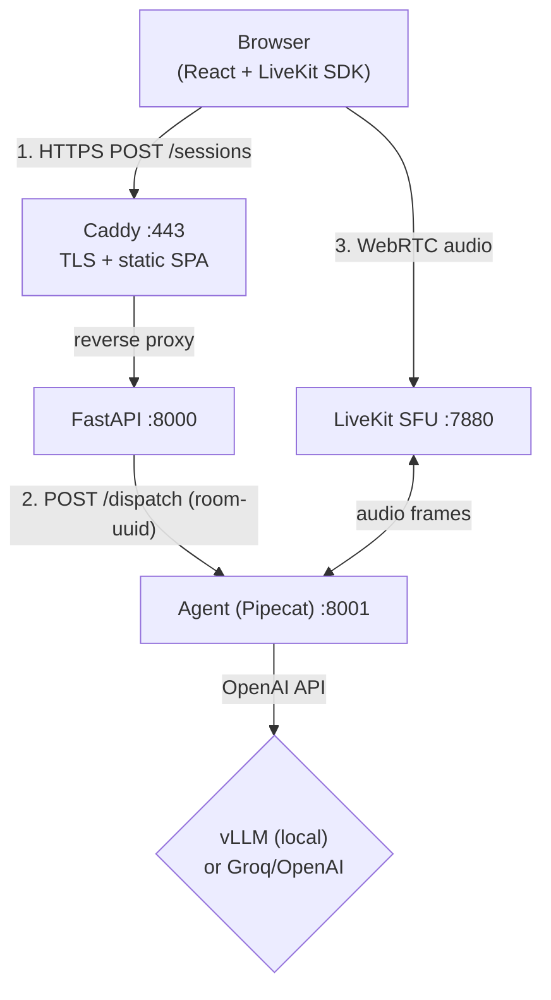
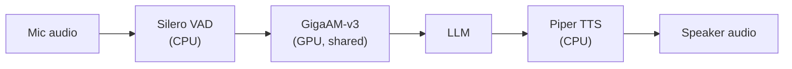

# project-800ms

Self-hosted, low-latency voice assistant. Target: first audio out within 800ms after end-of-speech.
Works with local models (vLLM) or external APIs (Groq, OpenAI, etc.).

## Architecture

**System overview:**



**Agent pipeline (per room):**



## How it works

1. User opens `https://coastalai.ai` and clicks **Start call**
2. Browser `POST /sessions` to the API, which creates a unique room and dispatches an agent
3. Agent spawns an isolated Pipecat pipeline for that room (GigaAM model is pre-loaded, so startup is instant)
4. Browser joins the room via LiveKit WebRTC, publishes mic audio
5. Agent pipeline: VAD detects speech end, GigaAM transcribes, LLM generates response, Piper synthesizes speech
6. Audio streams back to the browser in real-time

## Prerequisites

- Docker + Compose v2
- NVIDIA Container Toolkit installed and configured
- `nvidia-smi` works on the host
- GPU with 16GB+ VRAM (RTX 5080 / L4 / A10G / L40S)

## Bring-up

```bash
# 1. Configure
cp infra/.env.example infra/.env
# edit infra/.env — set passwords, API keys

# 2. Start
docker compose --env-file infra/.env -f infra/docker-compose.yml up -d

# 3. Watch the slow one (vLLM downloads ~5GB on first run)
docker compose -f infra/docker-compose.yml logs -f vllm
# Wait for: "Uvicorn running on http://0.0.0.0:8000"
```

## Verify

```bash
# API health
curl http://localhost:8000/health

# vLLM models
curl http://localhost:8001/v1/models

# LiveKit signaling (404 = server is up)
curl -i http://localhost:7880
```

## Layout

```
apps/
  api/        FastAPI — sessions, LiveKit token minting, agent dispatch
  web/        React SPA (LiveKit voice UI)
services/
  agent/      Pipecat worker — HTTP dispatcher on :8001, spawns pipelines per room
infra/
  docker-compose.yml       Base stack
  docker-compose.prod.yml  Prod overlay (GHCR images)
  docker-compose.tls.yml   TLS overlay (Caddy + web SPA)
  Caddyfile.prod           Caddy config (SPA + API + LiveKit reverse proxy)
  terraform/               AWS GPU spot instance + VPC + SSM secrets
  .env.example             Secrets template
```

## Using an external LLM

By default the agent uses the local vLLM container. To use an external
OpenAI-compatible provider (e.g. Groq), add these to `infra/.env`:

```env
LLM_BASE_URL=https://api.groq.com/openai/v1
LLM_MODEL=llama-3.3-70b-versatile
LLM_API_KEY=gsk_your_key_here
```

Then recreate the agent:

```bash
docker compose --env-file infra/.env -f infra/docker-compose.yml up -d agent
```

Remove or comment out the `LLM_*` lines to switch back to local vLLM.

## Development

```bash
# Install pre-commit hooks
pre-commit install

# Python services use uv
cd apps/api && uv sync && uv run pytest
cd services/agent && uv sync && uv run pytest

# Web client
cd apps/web && bun install && bun run dev
```

## Teardown

```bash
docker compose -f infra/docker-compose.yml down           # stop
docker compose -f infra/docker-compose.yml down -v        # stop + wipe volumes
```
