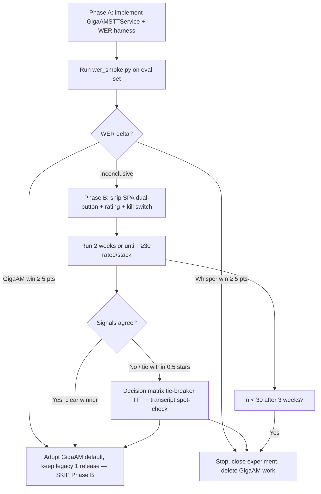

# feat: STT A/B experiment — Whisper vs GigaAM-v3 (hybrid WER + blinded subjective)

## Overview

Ship a one-time, two-phase STT-isolation experiment to validate whether GigaAM-v3 (Sber, MIT, Nov 2025) should replace Faster-Whisper `large-v3` as the default STT for Russian voice sessions. Phase A is an offline WER smoke test with ~100 labeled Russian utterances — decisive in either direction short-circuits the experiment. Phase B is a blinded subjective A/B (neutral "Stack A / B" labels, post-submit mapping reveal) that only runs if Phase A is inconclusive. Cleanup is conditional on whether WER and rating signals agree.

Phase A is the critical work. If the published GigaAM numbers hold on our eval set, Phase B never needs to ship.

## Problem Frame

Current STT is `FilteredWhisperSTTService` wrapping faster-whisper `large` at `int8_float16` on GPU. Published 2025–2026 benchmarks claim GigaAM-v3 cuts Russian WER by ~50%. We want to validate this on our own audio without committing to an irreversible swap, and preserve the legacy path for side-by-side comparison during the experiment window. The mechanism for validation is: objective WER first (cheap, high-signal), then blinded subjective evaluation (expensive, bias-aware) only if the first signal is ambiguous.

See origin: `docs/brainstorms/2026-04-19-voice-stack-ab-experiment-requirements.md`.

## Requirements Trace

- **R1** — Decide within ~3 weeks whether GigaAM-v3 replaces Faster-Whisper (origin: Goal 1).
- **R2** — Use a hybrid rigorous/directional design: objective WER pre-gate → blinded subjective A/B if inconclusive (origin: Goals 1–2).
- **R3** — Keep the decision reversible when signals disagree; winner becomes default, loser kept one release (origin: Goal 3).
- **R4** — Leave a durable, auditable evidence trail: WER scores, transcripts, star ratings, all tagged by stack (origin: Goal 4).
- **R5** — Both STT models preloaded at agent startup; agent fails hard if either loader fails (origin: Agent section).
- **R6** — In-experiment partial rollback via `DISABLE_STACK_GIGAAM` env var on the API (origin: Agent section).
- **R7** — Blinded A/B: neutral "Stack A / B" labels, randomized per-rater-session, mapping revealed only post-submit (origin: Demo SPA section).
- **R8** — Rating endpoint tenant-scoped, rate-limited, 404-before-409 check ordering, comment ≤ 2000 chars (origin: API section).
- **R9** — `sessions.stack NOT NULL DEFAULT 'legacy'` with backfill; `session_ratings` inherits tenant via `session_id` (origin: Data model).
- **R10** — Filter parity pinned as explicit second variable: same reject semantics on both stacks, thresholds tuned on the eval set (origin: Agent section).
- **R11** — New agent-layer `stt_duration_seconds{stack, phase}` histogram; not a label on the API-level histogram (origin: Agent section).
- **R12** — Conditional cleanup: decisive agreement → delete loser after one release; disagreement → delete GigaAM immediately; no-decision → Whisper default, delete GigaAM path (origin: Cleanup plan).

## Scope Boundaries

- **No LLM swap** — both stacks use Groq Llama-3.3-70b.
- **No TTS swap** — both stacks use Piper `ru_RU-denis-medium`.
- **Not tenant-facing** — demo UI toggle only. `tenants.preferred_stack` is not introduced.
- **No full benchmark harness** — `wer_smoke.py` is one-shot, committed to the repo as evidence, not productized as a reusable tool. (Ideation idea #6 remains a separate future commit.)
- **No per-component toggles beyond STT** — LLM and TTS stay pinned.
- **No fine-tuning, no LoRA** — this is model-swap validation, not training.

### Deferred to Separate Tasks

- **Full WER/BLEU/TTFT benchmark harness** (ideation idea #6): separate future commit, independent of this experiment's outcome.
- **F5-TTS and T-Lite swaps**: separate experiments, each with their own brainstorm.
- **Admin-scoped ratings summary UI**: a SQL query + `/v1/admin/*` endpoint if/when needed during the 1–2 week window; not shipped now.
- **Tenant-level `preferred_stack` setting**: explicit non-goal from the brainstorm.

## Context & Research

### Relevant Code and Patterns

- **Pipecat STT service pattern:** `services/agent/stt_filter.py` — `FilteredWhisperSTTService` subclasses `WhisperSTTService`, overrides `_load()` for preload-once-share semantics, wraps transcribe output with statistical filter. New `GigaAMSTTService` subclasses `pipecat.services.stt_service.SegmentedSTTService` instead (GigaAM has no Whisper-style segment stats).
- **Pipeline wiring:** `services/agent/pipeline.py::build_task` — currently instantiates `FilteredWhisperSTTService` unconditionally; the branch point for `stack` routing goes here.
- **Agent dispatch + overrides:** `services/agent/overrides.py::PerSessionOverrides`, `services/agent/main.py::handle_dispatch` — already threads per-session fields from the API; `stack` is a new field with agent-side whitelisting.
- **Model preload pattern:** `services/agent/main.py::load_whisper()` called in `main()` before HTTP server starts. `load_gigaam()` follows the same shape; startup fails if either raises.
- **FastAPI tenant-scoped endpoint pattern:** `apps/api/routes/sessions.py::get_session` — select by `room` AND `tenant_id`, 404 indistinguishably for "not owned" and "not found." Copy this into the rating handler.
- **Dispatch-from-api to agent pattern:** `apps/api/routes/sessions.py::_dispatch_agent` — forwards extra fields via JSON; already accepts arbitrary keys. Add `stack` as an explicit forwarded field.
- **Pydantic request schema pattern:** `apps/api/schemas.py::CreateSessionRequest` — `extra="forbid"`, `Field(max_length=...)`, optional literals. `stack: Literal["legacy", "gigaam"] | None = None` follows this shape.
- **Alembic migration pattern:** `apps/api/migrations/versions/0003_transcripts.py` — add column + new table + indexes + check constraints in one file; `DATETIME(timezone=True)` on timestamps; FK with `ON DELETE CASCADE`. 0004 mirrors the shape.
- **Prometheus histogram pattern:** `apps/api/observability.py` — `Histogram("name", "help", labelnames=[...])` instantiated at module scope, `.labels(...).observe(...)` called at measurement time. Agent-side equivalent goes in `services/agent/` — probably a new `services/agent/observability.py` with a tiny `/metrics` HTTP endpoint on a side port (or inlined into the existing aiohttp server).
- **Pipecat Docker image:** `services/agent/Dockerfile` — currently CUDA 12.9.1 base, ctranslate2 for Whisper. Adding PyTorch via `gigaam[torch]` extra is ~2–3 GB additional layer; needs ABI compat with existing libcublas/libcudnn.
- **SPA Start button + session POST:** `apps/web/src/App.tsx` — single `startCall` callback, error display, `CreateSessionResponse` parse, LiveKitRoom mount. Dual-button + rating modal expands this file or splits into a `<StartScreen>` component.
- **SPA error parsing:** existing `parseError(res)` helper reads the error envelope; reuse it for rating POST failures.

### Institutional Learnings

- `docs/solutions/` is empty as of 2026-04-19 — no prior experiments of this shape to mirror.

### External References

- GigaAM v3: `https://github.com/salute-developers/GigaAM` — install via `pip install git+https://github.com/salute-developers/GigaAM@<sha>[torch]`. Weights on HF: `ai-sage/GigaAM-v3`.
- Pipecat `SegmentedSTTService`: `https://reference-server.pipecat.ai/en/latest/api/pipecat.services.stt_service.html` — expects `run_stt` that returns a `TranscriptionFrame` per utterance.
- Silero VAD v5 latency characteristics: per Phase 1 research, already in use; not touched by this plan.
- Prometheus Python client patterns: already in `apps/api/observability.py`; mirror for the agent.

## Key Technical Decisions

- **Hybrid design (Option C from brainstorm):** WER pre-gate short-circuits the SPA work if decisive. This is the highest-leverage decision in the plan — if Phase A is decisive, ~70% of the implementation units never ship.
- **GigaAM acquired via `git+https` pinned SHA, not PyPI:** PyPI `gigaam 0.1.0` is v1/v2-only; v3 requires git source. HF weights baked into the Docker image at build time (eliminates first-run download latency as a confound).
- **`GigaAMSTTService` subclasses `SegmentedSTTService`:** matches GigaAM's utterance-level API; `WhisperSTTService` is the wrong base (it's Whisper-specific). Hallucination filter pins behavioral parity (same reject semantics: min duration 300ms, min 2 tokens) rather than signal parity (Whisper's per-segment stats are not available on GigaAM).
- **Blinded labels with per-rater-session randomization:** Stack A/B labels stored in `localStorage.stack_ab_mapping`; mapping revealed post-submit. Consistent within a browser, different across browser-data clears. Rating is blinded; reveal is informational.
- **`DISABLE_STACK_GIGAAM` env var on the API, not the agent:** silent coercion of `stack="gigaam"` → `"legacy"` with warning log. Agent stays untouched; both models stay loaded. Rollback without a restart.
- **`stt_duration_seconds{stack, phase}` in the agent, not a label on `http_request_duration_seconds`:** the API histogram times the FastAPI request; the STT layer is inside the agent and needs its own measurement surface. Phases: `decode`, `filter`, `total`.
- **`sessions.stack NOT NULL DEFAULT 'legacy'` with backfill:** schema-enforced invariant beats prose-level "NULL means legacy." Analytics queries can never silently undercount.
- **Rating endpoints: `POST` for create + `PATCH` for correction:** 409-on-duplicate combined with no-correction-path is a usability trap (misclicks permanent). `PATCH` same-tenant rewrite keeps the "one rating per session" invariant while allowing correction. History is not retained — the rewrite overwrites.
- **Filter parity pinned as second variable:** documented explicitly as "this is not strictly STT-model vs STT-model; it's pipeline vs pipeline with filters normalized." Avoid the adversarial reviewer's "GigaAM wins but the filter did the work" confound.

## Open Questions

### Resolved During Planning

- **Pipecat base class:** `SegmentedSTTService`. Whisper's base is the wrong fit.
- **GigaAM dep:** `git+https://github.com/salute-developers/GigaAM@<sha>[torch]` in `services/agent/pyproject.toml`; weights baked into image.
- **Histogram layer:** new agent-side metric; not a label on the API-level histogram.
- **`stack` nullability:** `NOT NULL DEFAULT 'legacy'` with backfill in 0004.
- **Skip-rate threshold:** decision only honored at ≥ 30 rated sessions per stack.
- **In-experiment rollback:** `DISABLE_STACK_GIGAAM` env on the API container.
- **Rating blinding:** neutral labels + per-rater randomization + post-submit reveal. No in-call badge.
- **Misrating correction:** `PATCH /v1/sessions/{room}/rating` (same-tenant overwrite, no history).
- **Minimum session length:** rating aggregate excludes sessions with < 20 seconds of caller speech (computed from transcript count as a proxy — see Unit 7).
- **Rating modal UX:** spec in Unit 8 below (dismiss behavior, loading state, error handling).
- **A11y:** spec in Unit 8 below.
- **Comment retention:** inherits `session_transcripts` retention policy via `session_id` FK cascade.

### Deferred to Implementation

- **Exact filter thresholds for `GigaAMSTTService`:** min-duration and min-token values are tuned during Unit 3 (WER gate) against the eval set; target is "both stacks reject roughly the same proportion of false-positive utterances."
- **Eval-set composition:** Unit 3 author curates ~100 utterances spanning clean/noisy/game-specific/stress-mark-sensitive categories. Exact sourcing (self-recorded vs Common Voice RU vs mixed) is an implementation call; the commit includes the truth transcripts and the audio files (or a reproducible pointer to them).
- **VRAM margin:** day-1 `nvidia-smi` measurement against a 22 GB ceiling on 24 GB L4. If the ceiling is breached, the plan pauses and re-evaluates (drop to `faster-whisper distil-v3` or delay the experiment until TRT/ONNX quantization of GigaAM is done).
- **Mapping reveal copy:** exact microcopy for the post-submit stack reveal is an SPA detail decided during Unit 8.

## High-Level Technical Design

> *This illustrates the intended approach and is directional guidance for review, not implementation specification. The implementing agent should treat it as context, not code to reproduce.*

**Experiment flow (decision gating):**



**Session flow (Phase B, live traffic):**

```mermaid
sequenceDiagram
    participant SPA as apps/web
    participant API as apps/api
    participant LK as LiveKit SFU
    participant Agent as services/agent
    participant DB as Postgres

    SPA->>SPA: user picks Stack A or B (blinded, local randomization)
    SPA->>API: POST /v1/sessions {stack: "legacy"|"gigaam"}
    alt DISABLE_STACK_GIGAAM is set
        API->>API: coerce stack="gigaam" → "legacy" (warn log)
    end
    API->>DB: INSERT sessions(stack=...)
    API->>Agent: POST /dispatch {room, stack, ...}
    Agent->>Agent: build_task branches on stack → FilteredWhisperSTTService or GigaAMSTTService
    Agent->>LK: join room as bot
    API-->>SPA: 201 {room, token, url, identity, session_id}
    SPA->>LK: connect (caller)
    Note over Agent,LK: STT → LLM → TTS loop; stt_duration_seconds emitted per utterance
    SPA->>SPA: user ends call
    SPA->>SPA: rating modal (blinded)
    SPA->>API: POST /v1/sessions/{room}/rating
    API->>DB: INSERT session_ratings
    API-->>SPA: 201
    SPA->>SPA: reveal stack mapping (post-submit)
```

## Implementation Units

### Phase A — WER pre-gate (runs first; decisive outcome can skip all of Phase B)

- [ ] **Unit 1: Add GigaAM dependency + verify VRAM on dev L4**

**Goal:** Land the `gigaam` package + PyTorch extras in the agent Docker image with baked HF weights, and verify the combined resident footprint (Whisper + GigaAM + Silero VAD + vLLM Qwen-7B-AWQ) stays under 22 GB on L4.

**Requirements:** R5, VRAM risk from brainstorm.

**Dependencies:** None.

**Files:**
- Modify: `services/agent/pyproject.toml` (add `gigaam[torch] @ git+https://github.com/salute-developers/GigaAM@<pinned-sha>`)
- Modify: `services/agent/Dockerfile` (bake `ai-sage/GigaAM-v3` HF weights into image at build time via `huggingface-cli download`; ensure ABI compat with existing CUDA 12.9 / cuDNN 9 base)
- Create: `services/agent/scripts/verify_vram.py` (load Whisper + GigaAM + VAD + vLLM client stub; report `nvidia-smi` peak)
- Test: (none — this unit is pure infra; the verify script *is* the test)

**Approach:**
- Pin a specific GigaAM commit SHA — do not follow `main`.
- Bake weights at build-time via `huggingface-cli download ai-sage/GigaAM-v3 --cache-dir /home/appuser/.cache/huggingface` in the Dockerfile; the resulting image layer is ~1 GB. Document the expected image size delta (~2–3 GB total).
- Verify uv lock updates cleanly. `uv sync` must succeed in the build stage.
- Run `verify_vram.py` on a fresh L4 VM (production or staging clone). Record the peak VRAM. If > 22 GB, fail the unit and escalate (drop to distil-whisper or pause the experiment).

**Patterns to follow:**
- `services/agent/Dockerfile` — current stage structure for layer caching.
- `services/agent/models.py::load_whisper()` — the "pre-download-at-build, load-at-start" split pattern already established for faster-whisper.

**Test scenarios:**
- Happy path: `docker build` completes successfully; image is `<X> GB` (measure).
- Verification: `verify_vram.py` reports < 22 GB peak with all four GPU tenants resident.
- Error path: if GigaAM download from HF fails during Docker build, the build step fails loudly (no silent skip).

**Verification:**
- `docker build` green on CI.
- `nvidia-smi` peak memory on verified run is within ceiling.
- `uv tree` shows `gigaam` and `torch` in the agent lock file.

---

- [ ] **Unit 2: Build `GigaAMSTTService` wrapper with parity filter**

**Goal:** New Pipecat service class that wraps GigaAM-v3 in the same shape as `FilteredWhisperSTTService`, with a hallucination filter that matches Whisper's filter *behavior* (not its signals).

**Requirements:** R5, R10.

**Dependencies:** Unit 1.

**Files:**
- Create: `services/agent/gigaam_stt.py` (new `GigaAMSTTService` class + `load_gigaam()` singleton loader)
- Modify: `services/agent/main.py` (add `load_gigaam()` call before `web.run_app`; fail startup on exception)
- Test: `services/agent/tests/test_gigaam_stt.py` (mocked-audio unit tests — no real GPU required; the CI runner has no GPU)

**Approach:**
- Subclass `pipecat.services.stt_service.SegmentedSTTService`. Override `run_stt(audio: bytes) -> AsyncGenerator[Frame, None]` to yield a `TranscriptionFrame` per utterance.
- Preload the model once in `load_gigaam()`, store as module-level singleton, share across pipeline instances (same pattern as `get_whisper()`).
- Parity filter: reject utterance if duration < 300ms OR token count < 2. Thresholds will be tuned in Unit 3 against the WER eval set. Document the default values as "initial; tuned in Unit 3."
- Fail agent startup hard if `load_gigaam()` raises. Use `sys.exit(2)` pattern matching `load_whisper()` error handling.

**Patterns to follow:**
- `services/agent/stt_filter.py::FilteredWhisperSTTService` — class shape, filter placement, hallucination-reject log format.
- `services/agent/models.py::get_whisper()` / `load_whisper()` — singleton loader pattern.

**Test scenarios:**
- Happy path: feeding a synthetic Russian utterance frame yields a `TranscriptionFrame` with non-empty text (mock the gigaam model to return a fixed string).
- Edge case: utterance < 300ms → rejected; log emitted, no frame yielded.
- Edge case: utterance with 1 token → rejected.
- Edge case: empty audio → rejected without exception.
- Error path: if the underlying gigaam model raises, the service emits an error frame (or re-raises per Pipecat convention) rather than silently swallowing.
- Integration: verifies the service's frame output matches the shape that `build_task`'s downstream aggregator expects (comparable to the Whisper output shape).

**Verification:**
- `uv run pytest services/agent/tests/test_gigaam_stt.py` green.
- Agent starts with both models preloaded; startup log shows `load_whisper ok`, `load_gigaam ok`.
- Killing GigaAM's HF cache before startup causes startup to fail with a clear error.

---

- [ ] **Unit 3: WER smoke harness + eval set + first run (DECISION GATE)**

**Goal:** Curate a ~100-utterance Russian eval set with truth transcripts, implement a one-shot WER harness that feeds both stacks offline, and commit the results. Decide Phase A outcome.

**Requirements:** R2, R4.

**Dependencies:** Unit 2.

**Files:**
- Create: `services/agent/scripts/wer_smoke.py` (loads eval set, runs both STT services, computes WER per stack + per utterance category, prints table, writes CSV)
- Create: `services/agent/eval/russian_eval_set/` (directory of WAV files + `truth.jsonl` with per-file transcripts + category tags; ~100 utterances)
- Create: `services/agent/eval/results/2026-MM-DD-wer-smoke.csv` (committed alongside the initial run)
- Create: `docs/experiments/2026-04-19-stt-ab/phase-a-results.md` (WER numbers, decision, filter threshold tuning notes)
- Test: (the harness itself is the test; no unit tests for the script — it's a one-shot committed artifact)

**Approach:**
- Eval-set composition: ~30 clean speech (game-adjacent vocabulary), ~20 noisy (background music, room ambiance), ~25 game-specific terms (character names, items, quest keywords), ~15 stress-mark sensitive words, ~10 short utterances (<2s, tests the min-duration filter). Hand-label truth once; version-control everything.
- Harness reads eval set, feeds each audio through `FilteredWhisperSTTService.run_stt` and `GigaAMSTTService.run_stt` offline (mocked VAD — just feed the whole utterance as one segment), captures transcripts, computes WER via `jiwer` (add as dev dep).
- Tune `GigaAMSTTService`'s filter thresholds until both stacks reject a similar proportion of non-speech utterances (within 10% of each other on the same ground truth). Commit the tuned values.
- Produce a results table (per-stack WER, per-category breakdown, per-stack filter rejection rate, TTFT from local timing).
- Write `phase-a-results.md` with the decision:
  - **Decisive GigaAM win (Δ WER ≥ 5 pts, no per-category regression):** adopt GigaAM default, skip Phase B, go directly to cleanup Unit 9.
  - **Decisive Whisper win:** stop, close experiment, open cleanup ticket to remove GigaAM work (Unit 1 + Unit 2).
  - **Inconclusive:** proceed to Phase B.

**Patterns to follow:**
- `apps/api/scripts/smoke.py` — one-shot script pattern with exit codes, committed results as evidence.

**Test scenarios:**
- *Test expectation: none — this unit produces an artifact + decision, not behavioral code.* The artifact IS the test of Units 1–2.

**Verification:**
- `services/agent/eval/results/*.csv` committed to the repo.
- `docs/experiments/2026-04-19-stt-ab/phase-a-results.md` committed with a pinned decision.
- If the decision is "skip Phase B," update this plan's frontmatter to `status: completed-phase-a-only` and open the Unit 9 cleanup ticket.

---

### Phase B — Blinded subjective A/B (only runs if Unit 3 is inconclusive)

- [ ] **Unit 4: Alembic migration 0004 — `sessions.stack` + `session_ratings` table**

**Goal:** Schema additions that support `stack` tagging + rating persistence.

**Requirements:** R4, R8, R9.

**Dependencies:** None (schema is independent of the STT wrapper).

**Files:**
- Create: `apps/api/migrations/versions/0004_stack_and_ratings.py`
- Modify: `apps/api/models.py` (add `Session.stack` field + new `SessionRating` ORM class)
- Test: `apps/api/tests/test_db_models.py` (add assertions for `sessions.stack` NOT NULL default + rating CHECK constraint + tenant-inherited FK cascade)

**Approach:**
- Migration steps, in order:
  1. `ALTER TABLE sessions ADD COLUMN stack TEXT NULL;` (nullable first to avoid blocking an existing dataset)
  2. `UPDATE sessions SET stack = 'legacy' WHERE stack IS NULL;` (backfill)
  3. `ALTER TABLE sessions ALTER COLUMN stack SET DEFAULT 'legacy'; ALTER COLUMN stack SET NOT NULL;`
  4. `CREATE TABLE session_ratings (...)` with `id UUID PK gen_random_uuid()`, `session_id UUID NOT NULL REFERENCES sessions(id) ON DELETE CASCADE`, `rating SMALLINT NOT NULL CHECK (rating BETWEEN 1 AND 5)`, `comment TEXT NULL`, `created_at TIMESTAMPTZ NOT NULL DEFAULT now()`, `updated_at TIMESTAMPTZ NOT NULL DEFAULT now()`
  5. `CREATE UNIQUE INDEX session_ratings_session_id_uniq ON session_ratings(session_id);`
- Downgrade: reverse everything, including dropping the `session_ratings` table.

**Patterns to follow:**
- `apps/api/migrations/versions/0003_transcripts.py` — same FK cascade + unique index shape.
- `apps/api/models.py::SessionTranscript` — tenant-inheritance-via-session_id pattern for ratings.

**Test scenarios:**
- Happy path: migration applies cleanly against a fresh test DB and against a DB populated with pre-migration session rows. All pre-existing sessions end up with `stack = 'legacy'`.
- Edge case: attempting to insert `rating = 6` violates the CHECK constraint (DB layer, not Pydantic).
- Edge case: deleting a parent session cascades to its `session_ratings` row.
- Edge case: attempting two ratings for the same `session_id` violates the unique index → IntegrityError.
- Integration: `alembic downgrade -1` + `alembic upgrade +1` round-trips cleanly.

**Verification:**
- `uv run alembic upgrade head` on the migrate container completes without error on an existing DB (verified via the `migrate` compose service).
- DB models match the migration on re-import.

---

- [ ] **Unit 5: API — `stack` field on `CreateSessionRequest`, `DISABLE_STACK_GIGAAM` kill switch, dispatch forwarding**

**Goal:** Accept `stack` on session creation, forward to agent, and honor the API-side kill switch for in-experiment rollback.

**Requirements:** R6.

**Dependencies:** Unit 4.

**Files:**
- Modify: `apps/api/schemas.py` (add `stack: Literal["legacy", "gigaam"] | None = None` to `CreateSessionRequest`)
- Modify: `apps/api/settings.py` (add `disable_stack_gigaam: bool = False`)
- Modify: `apps/api/routes/sessions.py` (persist `stack` to `Session.stack`; forward to agent dispatch payload; apply kill-switch coercion with warning log)
- Modify: `apps/api/tests/test_v1_sessions.py` (new cases — see below)
- Modify: `infra/docker-compose.yml` (pass `DISABLE_STACK_GIGAAM` env through to the `api` service; document in `infra/.env.example`)
- Test: `apps/api/tests/test_v1_sessions.py` (extended)

**Approach:**
- Default for `stack` on the server side: `"legacy"`. If the Literal is `None` or missing from the request, coerce to `"legacy"` before DB insert.
- Kill switch: if `settings.disable_stack_gigaam` is true, and `body.stack == "gigaam"`, overwrite with `"legacy"` and emit a `logger.warning("stack_gigaam_killed", extra={"session_id": ...})`. The client is not told — kill switch is a silent coerce by design (matches the origin doc).
- Forward `stack` in the dispatch POST body alongside persona/voice/etc.

**Patterns to follow:**
- `apps/api/routes/sessions.py::_dispatch_agent` — existing conditional-field forwarding pattern.
- `apps/api/settings.py` — `Settings` class with typed defaults, already-established shape.

**Test scenarios:**
- Happy path: POST with `stack="gigaam"` persists as `"gigaam"` on `sessions.stack`.
- Happy path: POST without `stack` persists as `"legacy"` (server default).
- Edge case: POST with `stack="nonsense"` rejected by Pydantic with 422.
- Kill switch: when `DISABLE_STACK_GIGAAM=1` is set, POST with `stack="gigaam"` persists as `"legacy"` and emits a warning log. Client response still 201.
- Integration: `stack` makes it into the agent dispatch payload.

**Verification:**
- Existing `/v1/sessions` tests still green (default coercion preserves backward compat).
- New kill-switch behavior covered.

---

- [ ] **Unit 6: Agent — stack routing + `stt_duration_seconds` histogram**

**Goal:** Agent branches between Whisper and GigaAM based on `PerSessionOverrides.stack`; emits per-stack STT latency histogram.

**Requirements:** R5, R11.

**Dependencies:** Unit 2, Unit 5.

**Files:**
- Modify: `services/agent/overrides.py` (add `stack: str | None` with whitelist fallback in `PerSessionOverrides.from_dispatch`)
- Modify: `services/agent/pipeline.py::build_task` (branch on `overrides.stack`: `"gigaam"` → `GigaAMSTTService`, else → `FilteredWhisperSTTService`)
- Create: `services/agent/observability.py` (new Prometheus `Histogram` for `stt_duration_seconds{stack, phase}`; small aiohttp route for `/metrics`)
- Modify: `services/agent/gigaam_stt.py` + `services/agent/stt_filter.py` (both wrap their `run_stt` with timing → histogram)
- Modify: `services/agent/main.py` (mount `/metrics` on the existing aiohttp app)
- Test: `services/agent/tests/test_overrides.py` (stack whitelist fallback), `services/agent/tests/test_observability.py` (new)

**Approach:**
- `PerSessionOverrides.from_dispatch`: if `stack` is missing or not in `{"legacy", "gigaam"}`, default to `"legacy"` with `logger.warning("unknown_stack", raw=...)`. Do not fail the dispatch.
- `build_task`: single `if overrides.stack == "gigaam": stt = GigaAMSTTService(...)` else existing Whisper construction. Pass `stack=overrides.stack` into the service constructor so it can label its histogram observations correctly.
- `stt_duration_seconds` phases: `decode` (model inference), `filter` (hallucination check), `total` (end-to-end). Wrap the existing `run_stt` body with a context manager that records.
- `/metrics` on the agent: reuse the existing aiohttp handler; add a new route that returns `prometheus_client.generate_latest()` with the right content type.

**Patterns to follow:**
- `apps/api/observability.py` — Prometheus histogram instantiation + `/metrics` endpoint shape.
- `services/agent/main.py::handle_dispatch` — existing aiohttp route pattern; mount `/metrics` the same way.

**Test scenarios:**
- Happy path: dispatch with `stack="gigaam"` builds a pipeline wired to `GigaAMSTTService`.
- Happy path: dispatch with `stack="legacy"` (or unset) builds a pipeline wired to `FilteredWhisperSTTService`.
- Edge case: dispatch with `stack="nonsense"` coerces to `legacy` and logs a warning.
- Happy path: `/metrics` endpoint returns valid Prometheus exposition format with `stt_duration_seconds_bucket{stack="legacy",phase="total"}` present after one utterance through the Whisper path.
- Integration: histogram labels are cardinality-bounded — only two `stack` values and three `phase` values.

**Verification:**
- Agent tests green: 53 existing + new cases.
- Curling the agent's `/metrics` after a test dispatch shows the new metric families.

---

- [ ] **Unit 7: Rating endpoints (POST + PATCH) + GET shape update**

**Goal:** Write + correct ratings with tenant-scoped auth, idempotent-by-design behavior, and aggregate surfaces.

**Requirements:** R4, R8.

**Dependencies:** Unit 4.

**Files:**
- Modify: `apps/api/schemas.py` (add `RatingCreate`, `RatingUpdate`, `RatingOut`)
- Create: `apps/api/routes/ratings.py` (new router — `POST /v1/sessions/{room}/rating`, `PATCH /v1/sessions/{room}/rating`)
- Modify: `apps/api/routes/sessions.py::get_session` response (include `stack`, `rating`, exclude `comment`)
- Modify: `apps/api/main.py` (include the new ratings router)
- Create: `apps/api/tests/test_ratings.py` (comprehensive — see scenarios)

**Approach:**
- `POST /v1/sessions/{room}/rating` flow: `enforce_tenant_rate_limit` → `SELECT session WHERE room = ? AND tenant_id = identity.tenant_id` (404 if not found OR cross-tenant — same no-leak pattern as `get_session`) → check uniqueness (409 if a rating already exists; mention the `PATCH` endpoint in the 409 message) → INSERT.
- `PATCH /v1/sessions/{room}/rating` flow: same tenant-scoped lookup → `UPDATE session_ratings SET rating = ?, comment = ?, updated_at = now() WHERE session_id = ?` → 200 with updated shape, 404 if no existing rating for this session.
- `comment` has `Field(max_length=2000)` at the Pydantic layer. Raw-string storage; note in docstring "must be HTML-escaped by any renderer."
- `get_session` response: `stack` and `rating` (int 1–5 | null) exposed; `comment` intentionally not.
- Minimum session length check happens at **analysis time**, not at rating-acceptance time — we still accept ratings on short sessions, but the aggregate query in the decision writeup filters to sessions with ≥ 20 seconds of caller speech (approximated by transcript count ≥ 5 user-role entries, per existing `session_transcripts` table).

**Patterns to follow:**
- `apps/api/routes/sessions.py::get_session` — tenant-scoped lookup with 404-for-both-"not-found"-and-"cross-tenant" pattern.
- `apps/api/routes/transcripts.py` — router structure, response schema shape, rate-limit dep wiring.
- `apps/api/rate_limit.py::enforce_tenant_rate_limit` — rate-limit dep that all `/v1/*` routes use.

**Test scenarios:**
- Happy path: POST with valid rating persists a row; response includes the rating id + session_id + created_at.
- Happy path: PATCH rewrites the rating; `updated_at` bumps, `created_at` unchanged.
- Edge case: POST with `rating=6` → 422 validation_error (Pydantic) before DB.
- Edge case: POST with `comment` > 2000 chars → 422.
- Edge case: POST with empty `comment` → persists null.
- Error path: POST without `X-API-Key` → 401.
- Error path: POST for a room owned by a different tenant → 404 (not 403 — no cross-tenant existence leak).
- Error path: POST for a room that has a rating → 409 with a message pointing at `PATCH`.
- Error path: POST check-order — tenant check fires before uniqueness check (verify by probing another tenant's rated room; expect 404, not 409).
- Error path: rate-limited after bucket exhausted → 429.
- Happy path: PATCH for a rating that exists → 200.
- Error path: PATCH for a room with no rating → 404.
- Integration: `GET /v1/sessions/{room}` after POST shows `rating` but not `comment`.
- Integration: session cascade — deleting the parent session removes the rating row.

**Verification:**
- `uv run pytest apps/api/tests/test_ratings.py` green.
- Existing `apps/api/tests/test_v1_sessions.py` still green.
- All new error shapes use the `{error: {code, message, request_id}}` envelope.

---

- [ ] **Unit 8: SPA — dual-stack buttons with blinded A/B, rating modal, post-submit reveal, a11y**

**Goal:** Demo SPA surfaces the two stacks behind neutral labels with per-rater randomization; collects a rating per call; reveals the mapping only after submit.

**Requirements:** R7.

**Dependencies:** Unit 5, Unit 7.

**Files:**
- Modify: `apps/web/src/App.tsx` (new `<StartScreen>`, `<CallView>`, `<RatingModal>` — or inline in `App.tsx`, dealer's choice; keep the LiveKit mount unchanged)
- Create: `apps/web/src/lib/stack-mapping.ts` (localStorage-backed random mapping of `Stack A | Stack B` ↔ `legacy | gigaam`; one-time per browser until clear)
- Modify: `apps/web/src/styles.css` (rating modal + star picker + two-button idle layout)
- Create: `apps/web/src/components/RatingModal.tsx` (extracted for testability + a11y hygiene)
- Create: `apps/web/tests/rating-modal.test.tsx` (one-component React testing library test; add `@testing-library/react` + `happy-dom` as dev deps if absent)

**Approach:**
- **Stack mapping:** on first render, `localStorage.stack_ab_mapping` is seeded with a random `{A: "legacy"|"gigaam", B: the-other}`. Reused across reloads; reset when localStorage clears. A `useStackMapping()` hook returns `(label, stackValue)` pairs for each button.
- **Idle screen:** two primary buttons, equal visual weight. Labels: "Start call (Stack A)" / "Start call (Stack B)". No other copy references Whisper or GigaAM.
- **Session POST:** on click, POST `/v1/sessions` with `stack` field set to the mapped value. On 503 or non-2xx, show the error envelope's `error.message` in an inline error block below the buttons; buttons re-enable so the user can retry or switch. The neutral label is used in the error message ("Stack B session failed..."), not the real stack name.
- **In-call:** no stack badge. The `<CallView>` is identical to today except for the "Stack A" / "Stack B" tag near the identity line (neutral only).
- **Rating modal on End:**
  - Triggers when user clicks End *or* when `onDisconnected` fires cleanly. Does not trigger on network-failure disconnects (those go straight back to idle with an error).
  - Focus trap (`role="dialog"`, `aria-labelledby`, `aria-describedby`).
  - Star picker as a radio group (`role="radiogroup"`, arrow-key nav, Space/Enter to select) — not click-only divs.
  - Comment textarea: max length 2000 chars, client-side counter, optional.
  - **Submit states:** idle → loading (button disabled + spinner) → success (dismiss + reveal) | 409 (already rated — treat as success, still reveal; server's no-duplicate invariant holds) | 404/5xx (inline error with Retry; stay in modal).
  - **Dismiss behaviors:** Esc = Skip; backdrop click = Skip; tab close = implicit Skip (`rating: null`); network disconnect before modal = Skip.
  - **Skip:** dismisses without POST; no row written.
  - **Post-submit reveal:** small text block above the Skip button: "You rated Stack A — this was Faster-Whisper." Revealed only after 201/409 resolves.
- **A11y checklist:**
  - Rating modal: focus trap, aria-labelledby, aria-describedby, Esc to close, backdrop click to close, radio-group star picker with arrow-key nav.
  - Start buttons: descriptive text content; screen readers announce "Start call, Stack A, button" without visual-only cues.
  - Mic permission: pre-flight check on Start click. If denied, show inline error "Microphone access required to start a call." Do NOT create a session in that case — avoid rating-null pollution.
  - Color contrast AA minimum on the star picker.

**Patterns to follow:**
- `apps/web/src/App.tsx::startCall` — existing error parsing via `parseError()`; reuse.
- Existing Tailwind-adjacent class names (verify against the current stylesheet shape).

**Test scenarios:**
- Happy path: click "Start call (Stack A)" → `stack_ab_mapping` resolves to a real stack value → POST `/v1/sessions` fires with the right `stack` → session opens.
- Happy path: End call → rating modal → submit 4 stars → POST 201 → mapping reveal shows the actual stack.
- Edge case: submit 5 stars with a comment > 2000 chars → inline error block in the modal (client-side length check matches server side).
- Error path: POST rating returns 404 (session not owned by caller somehow — shouldn't happen in practice but defensively handled) → inline error + Retry button.
- Error path: POST rating returns 409 → treat as success (server says it's already rated), still reveal mapping.
- Error path: End call via network disconnect → skip modal, no POST, idle screen with a "call dropped" note.
- Edge case: mic permission denied at Start → error block, no session created.
- A11y: Tab key cycles inside the modal (focus trap verified). Esc dismisses. Star picker navigable by arrow keys.
- Integration: `stack_ab_mapping` in localStorage persists across page reloads (same browser, same mapping).
- Integration: clearing localStorage re-randomizes the mapping on next load.

**Verification:**
- `bun run test` green (or equivalent — confirm the current test runner).
- Manual smoke: open the SPA, complete two calls (one per label), confirm ratings persist in `session_ratings` with the right `stack` → via `sessions.stack`.
- Lighthouse a11y score ≥ 95 on the idle + in-call screens.

---

- [ ] **Unit 9: Cleanup (conditional, post-decision)**

**Goal:** Remove experiment scaffolding after the decision. Branch logic follows the brainstorm's cleanup plan.

**Requirements:** R12.

**Dependencies:** All prior units + a committed decision in `docs/experiments/2026-04-19-stt-ab/`.

**Files (decisive GigaAM win):**
- Modify: `services/agent/pipeline.py` (delete the `FilteredWhisperSTTService` branch; GigaAM becomes default)
- Delete: `services/agent/stt_filter.py`
- Modify: `services/agent/main.py` (delete `load_whisper()` + the whisper HF cache bake step in the Dockerfile)
- Modify: `apps/web/src/App.tsx` (delete dual-button UI; revert to single Start)
- Modify: `apps/api/schemas.py` (remove `stack` field)
- Modify: `apps/api/routes/ratings.py` (delete — no longer needed once decision lands; transcripts + session row are enough evidence)
- Create: `apps/api/migrations/versions/0005_drop_stack_and_ratings.py` (drop `sessions.stack` + `session_ratings` table)
- Delete: `docs/brainstorms/...requirements.md` stays (historical record); `docs/experiments/...` stays

**Files (decisive Whisper win OR no-decision):**
- Delete: `services/agent/gigaam_stt.py`
- Modify: `services/agent/pyproject.toml` (remove `gigaam` + PyTorch extras)
- Modify: `services/agent/Dockerfile` (remove HF weight bake step for GigaAM)
- All SPA, API, migration cleanup as above.

**Approach:**
- Open the cleanup ticket the same day the decision is committed to `docs/experiments/`.
- Cleanup PR target: +4 weeks from decision (calendar reminder).
- If no decision within 3 weeks: scenario-2 cleanup (delete GigaAM, keep Whisper) runs the next week regardless.

**Patterns to follow:**
- The cleanup mirrors Unit 4's migration in reverse.

**Test scenarios:**
- *Test expectation: none — this unit is pure deletion; existing test suites catch regressions.* The full test suite (API + agent + web) must remain green after the cleanup PR.

**Verification:**
- Post-cleanup: `sessions.stack` column gone; `session_ratings` table gone.
- `/v1/sessions/{room}/rating` endpoints return 404.
- CI green; no references to the deleted stack remain (grep `stack\|GigaAM\|legacy` across the repo to confirm).

## System-Wide Impact

- **Interaction graph:**
  - API `POST /v1/sessions` → agent `/dispatch` → LiveKit room → agent pipeline → LiveKit webhook → API `/v1/livekit-webhook` (updates `sessions.ended_at`, `audio_seconds`, `status`). The new `stack` field threads through the entire path.
  - API `POST /v1/sessions/{room}/rating` → `session_ratings` INSERT (idempotent via unique index + `PATCH`).
- **Error propagation:**
  - Agent startup failure (GigaAM load error) → agent exits non-zero → compose healthcheck fails → API continues to accept `POST /v1/sessions` but dispatch POST to agent returns 503 agent_unavailable → client sees error envelope.
  - API kill switch (`DISABLE_STACK_GIGAAM=1`) is silent at the client boundary but logged at the API and shows in `sessions.stack` as `"legacy"` for all traffic during the kill window.
- **State lifecycle risks:**
  - Mid-experiment agent restart with only Whisper loaded (e.g., GigaAM HF download failure on image rebuild): sessions dispatched as `gigaam` during the degraded window get routed to legacy via the agent-side whitelist fallback. `sessions.stack` still says `"gigaam"` — this is a data-integrity gap. Mitigation: agent emits a new log field `served_stack` distinct from `requested_stack`; phase-B analysis filters on both being equal.
  - `session_ratings` rows can outlive the experiment if Unit 9 is delayed. FK cascade on `sessions` handles session deletion cleanly.
- **API surface parity:**
  - `GET /v1/sessions/{room}` gains `stack` and `rating` fields. OpenAPI doc auto-regenerates; no manual `openapi.json` check-in.
- **Integration coverage:**
  - Cross-layer: POST `/v1/sessions` with `stack="gigaam"` + API kill switch enabled → DB shows `stack="legacy"`. Covered in Unit 5's kill-switch test.
  - Cross-layer: End call → rating modal POST → `session_ratings` row written with correct `session_id` FK. Covered in Unit 7's integration test + Unit 8's manual smoke.
- **Unchanged invariants:**
  - X-API-Key auth flow, `enforce_tenant_origin`, `enforce_tenant_rate_limit`, error envelope shape, request_id propagation — all unchanged.
  - Existing `/v1/sessions`, `/v1/livekit-webhook`, `/v1/sessions/{room}/transcripts`, `/v1/usage`, `/v1/admin/*` behavior unchanged except for the new optional `stack` field on `CreateSessionRequest` (server default preserves backward compat).

## Risks & Dependencies

| Risk | Mitigation |
|------|------------|
| GigaAM git install + PyTorch adds ~2–3 GB to the agent Docker image; CI build time increases measurably | Pin the SHA; use build cache layers aggressively. Accept the CI time hit for the experiment window; cleanup (Unit 9) reverts either way. |
| VRAM envelope on L4 too tight with both STT models + vLLM co-loaded | Day-1 `verify_vram.py` gate with 22 GB ceiling. If breached, pause the experiment and either drop to distil-whisper or run Phase A only. |
| `wer_smoke.py` eval set not representative of real player audio | Mix categories (clean, noisy, game-specific, stress-sensitive, short). Commit the audio + truth transcripts so future runs against the same set are reproducible. Accept that the eval set may need extension if Phase A is inconclusive. |
| Rating bias despite blinding (rater knows "the new one is Stack B because it was assigned that way this browser session") | Per-rater-session randomization means each browser's A/B assignment is independent. Still, the solo-rater failure mode is partially mitigated, not eliminated. Accept; document in the Phase B writeup. |
| Skip rate > 50% — dataset effectively unusable for the subjective half | Hard floor at n ≥ 30 rated (non-skipped) per stack. Auto-extend if below. 3-week ceiling triggers no-decision path. |
| Agent crash mid-experiment with only Whisper reloaded | Agent fails startup hard if GigaAM loader fails — no partial-degraded state. Served-vs-requested stack logged per session for post-hoc filtering. |
| Cleanup never happens | Ticket opened on decision day; +4-week calendar reminder; 3-week no-decision ceiling triggers automatic scenario-2 cleanup. |
| Rating PATCH abused to rewrite history | Rewrite is last-write-wins; `updated_at` tracks. Acceptable for a solo-eval experiment; not acceptable for a tenant-facing product (non-goal). |

## Documentation / Operational Notes

- **CI impact:** the `Docker build (services/agent)` job will slow down measurably once Unit 1 lands. Expected: +2–4 min on fresh cache, +30s on warm cache. Worth communicating to the team before Unit 1 merges.
- **Secrets / env vars:** `DISABLE_STACK_GIGAAM` (optional, default false) on the API container. Document in `infra/.env.example` and in the `terraform-gcp` variables if we want it GCP-reachable (probably yes — the forcing function for partial rollback is "set the env and restart the container"; easier if it's a tfvar than an SSH-then-edit).
- **Observability:** Grafana / GMP (if configured) should pick up `stt_duration_seconds` automatically once the agent exposes `/metrics`. If the agent doesn't currently expose `/metrics` publicly, the scrape target needs to be added — document in the GCP module's README.
- **Writeup:** `docs/experiments/2026-04-19-stt-ab/phase-a-results.md` (Phase A) + `.../phase-b-results.md` (Phase B, if run) are the durable evidence. These outlive the experiment; they're how we justify the decision in 6 months when someone asks "why did we pick GigaAM?"

## Sources & References

- **Origin document:** [`docs/brainstorms/2026-04-19-voice-stack-ab-experiment-requirements.md`](../brainstorms/2026-04-19-voice-stack-ab-experiment-requirements.md)
- **Current Pipecat STT wrap:** `services/agent/stt_filter.py`, `services/agent/pipeline.py`
- **Current dispatch path:** `apps/api/routes/sessions.py::_dispatch_agent`, `services/agent/main.py::handle_dispatch`
- **Alembic pattern:** `apps/api/migrations/versions/0003_transcripts.py`
- **Prometheus pattern:** `apps/api/observability.py`
- **GigaAM source:** `https://github.com/salute-developers/GigaAM` (install via `git+https[torch]`)
- **GigaAM weights:** `https://huggingface.co/ai-sage/GigaAM-v3`
- **Pipecat STT base class docs:** `https://reference-server.pipecat.ai/en/latest/api/pipecat.services.stt_service.html`
- **Doc-review findings:** inline in the origin document's "Doc-review resolution summary" section.
