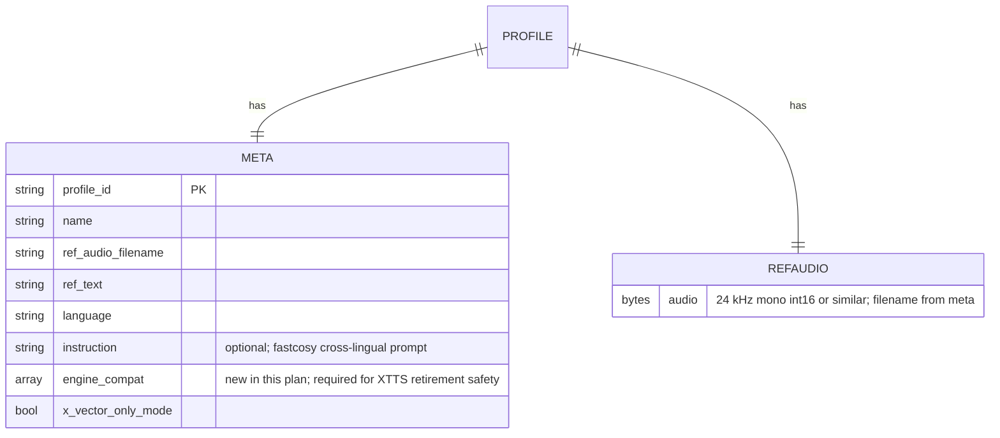

# feat: FastCosyVoice as fifth TTS engine via vendored sidecar

## Overview

Add `fastcosy` as a fifth selectable TTS engine alongside the existing Piper / Silero / Qwen3 / XTTS set. The engine is [Brakanier/FastCosyVoice](https://github.com/Brakanier/FastCosyVoice) — a ground-up re-implementation of `FunAudioLLM/Fun-CosyVoice3-0.5B-2512` with TensorRT optimization, `silero-stress` integration, Cyrillic normalization fixes, and Apache 2.0 weights. The motive is capability-completion: a single Apache-2.0 engine with zero-shot voice control (generic-voice-only in v1 due to upstream issue #1790) and streaming, so a future voice-identity product move isn't blocked on XTTS's CPML license.

Structural shape is forced by dependency pins: FastCosyVoice targets Python `>=3.10,<3.12` and CUDA 12.8 wheels; the agent runs Python 3.12 + CUDA 13.2. Integration must therefore use the **vendored sidecar pattern** already established by `infra/qwen3-tts-wrapper/` (OpenAI-compat HTTP + `AgentConfig` fields + `clone:<profile>` voice convention + named-volume weight cache). The sidecar exposes `POST /v1/audio/speech`; the agent-side adapter subclasses Pipecat's `OpenAITTSService` with a ~85-line `run_tts` override mirroring `services/agent/qwen3_tts.py`.

v1 is gated on **five pre-commit Go/No-Go measurements** (Q1–Q5 from the origin doc): L4 latency spike, R21 blind-listen audition, `auto_stress` LLM-output corpus probe, 3-way GPU cohabitation test, and a managed-API alternatives comparison. Any gate failure defers v1.

## Problem Frame

Per origin (see `docs/brainstorms/2026-04-23-fastcosyvoice-fifth-tts-engine-requirements.md`), no current engine combines streaming output at L4 RTF budget + Apache-2.0 commercial license + <800 ms TTFB + zero-shot voice control. FastCosyVoice is the candidate that satisfies all four axes on paper; measurement-first gates will decide whether it satisfies them in practice on the actual target hardware.

Framed as a **voice-assistant feature, not TTS-platform expansion** — the engine count is incidental; acceptance bar is user outcome on a single voice. This plan delivers the fifth engine with explicit kill-switches (if gates fail or quality regresses, v1 is deferred; the four existing engines stay untouched).

## Requirements Trace

Each implementation unit maps to one or more requirements from the origin. **Requirement numbering note**: the origin doc's R1–R23 has gaps at R4, R10, R11 (consolidated into R3 and R9 during brainstorm pass 2); gaps are intentional and do not represent missing requirements.

- **R1–R3** (surface/integration) → Units 5, 6, 7
- **R5–R7** (voice model and content) → Units 2, 10 + Unit 1's Q2 gate
- **R8–R9** (sidecar-internal configuration: FASTCOSY_LLM_WEIGHTS, FASTCOSY_MODE) → Units 3, 4
- **R12–R15** (startup, caching, operator experience) → Units 3, 4, 7
- **R16–R19** (safety, testing, documentation) → Units 3, 8, 10
- **R20–R23** (reliability and fallback) → Units 6, 7, 8
- **Portfolio Posture** (XTTS retirement rule) → Unit 12
- **Q1–Q5** (Resolve-Before-Planning gates, origin) → Unit 1
- **Success Criteria** (latency, quality, barge-in, no-regression, build reproducibility) → Unit 11

## Scope Boundaries

Carried from origin:

- **Not in v1**: Mode C (TensorRT-LLM fast path). `trt-llm` is a reserved enum value; promotion gated on measured Mode B data per Q1.
- **Not in v1**: voice cloning of a specific Russian speaker with a Russian reference audio. Blocked on `FunAudioLLM/CosyVoice#1790`.
- **Not in v1**: retiring any existing engine within the same PR. XTTS retirement is a **conditional follow-up** (see Unit 12), not a v1 requirement — a 2-week prod bake is required first so a rollback window exists.
- **Not in v1**: UI changes beyond the existing three-button engine selector in `apps/web/`.
- **Not in v1**: a dedicated `bench_tts` multi-engine scorecard harness. Manual R21 run for v1.
- **Not in v1**: Russia-native managed APIs (Yandex SpeechKit, SaluteSpeech). Distinct work track.
- **Not in v1**: multi-session concurrency beyond the single-room invariant (R21 in-flight = 1).

### Deferred to Separate Tasks

- **XTTS retirement PR** (Unit 12 conditional): contingent on 2-week post-ship bake passing, AND R21 showing `fastcosy ≥ xtts` on RU quality. Written in planning but executed in a follow-up PR within 2 weeks of fastcosy ship.
- **`bench_tts` multi-engine harness**: separate ideation survivor; referenced but not implemented here.
- **SaluteSpeech / Yandex SpeechKit sidecar**: separate work track; Q5 comparison (Unit 1) feeds that decision but does not implement it.
- **Observability / alerting production wiring**: Unit 8 adds the agent `/metrics` surface and Prometheus counters; **alertmanager config and SIEM routing** is scheduled as a post-ship infra PR with runbook handoff (see Unit 10).

## Context & Research

### Relevant Code and Patterns

**TTS adapter precedent** — three reference files in `services/agent/`:
- `services/agent/qwen3_tts.py` — the most direct precedent: `OpenAITTSService` subclass, `_NETWORK_EXCEPTIONS` list (excludes `HTTPStatusError` intentionally so 5xx reach Pipecat), `@traced_tts` decorator on `run_tts`, `clone:` prefix bypass before `VALID_VOICES[...]` lookup, redacted `ErrorFrame("TTS synth failed")` on network exceptions, `async with self._client.audio.speech.with_streaming_response.create(**create_params)` as the HTTP pattern. Currently ships non-streaming on L4 (RTF ~3x caused browser buffer underruns; regression-pinned by `test_stream_flag_not_sent`).
- `services/agent/silero_tts.py` — in-process engine pattern; documents `push_start_frame=True, push_stop_frames=True` + eager `__init__` + module-level `asyncio.Lock()` + `_stream_audio_frames_from_iterator` helper. The non-streaming barge-in rule (`services/agent/silero_tts.py:33-39`) applies to fastcosy's non-streaming fallback path.
- `services/agent/xtts_tts.py` — voice-library path resolution with traversal guards (`.resolve().relative_to(voice_library_dir.resolve())`), `meta.json` parsing, `clone:<profile>` semantics.

**Factory dispatch** — `services/agent/tts_factory.py::build_tts_service` uses lazy imports per engine (`# noqa: PLC0415`). Per-field validation with distinct error messages (tested at `services/agent/tests/test_tts_factory.py::test_qwen3_missing_base_url_raises` etc). `clone:` prefix bypasses voice whitelist.

**Engine whitelist lives in FIVE places**, not four:
- `services/agent/pipeline.py::_VALID_TTS_ENGINES` (frozenset, `__post_init__` validator)
- `services/agent/overrides.py::_VALID_TTS_ENGINES` (frozenset, duplicated for import-safety without pipecat/CUDA)
- `apps/api/schemas.py::TtsEngine` (Literal; comment documents cross-service sync-by-hand)
- `apps/api/routes/engines.py::_ENGINE_METADATA` (list of `(id, voice_format, description)` tuples consumed by the UI `/v1/engines` endpoint)
- `services/agent/tests/test_engine_parity.py` (regex-parses `apps/api/schemas.py` source; auto-passes when all sites synchronize)

**Preload + dispatch-refusal pattern** — `services/agent/main.py`:
- Module-level `_preload_engines: frozenset[str]` rebuilt at startup (`main.py:399`)
- XTTS-ENOSPC graceful degrade: `preload_engines.discard("xtts")` + frozenset rebuild (`main.py:445-467`) on `OSError.errno == errno.ENOSPC`. Precedent for fastcosy preload-failure behavior.
- `handle_dispatch` early-validates engine against `_preload_engines` → HTTP 409 with `{"error", "requested_engine", "available_engines"}` body (`main.py:252-266`)
- Hard-fail (`sys.exit(3)`) vs graceful-degrade decision is per-engine: GigaAM / Silero always hard-fail; XTTS hard-fails on code bug, graceful-degrades on resource constraint.
- `GET /engines` endpoint at `main.py:281-309` returns `{available, default}`.

**Sidecar vendoring playbook** — `infra/qwen3-tts-wrapper/`:
- `README.md` provenance section (upstream URL + pinned SHA + `Vendored on` date + license)
- Selective-copy rule (kept: `api/`, `config.yaml`, `Dockerfile`, `LICENSE`, `MANIFEST.in`, `pyproject.toml`, `requirements.txt`; skipped: `.git/`, `examples/`, `finetuning/`, `bench_*`, `test_*`, `.github/`, alt Dockerfiles).
- `api/security.py` bearer-token auth dependency applied to the whole `/v1/audio/*` router.
- `api/routers/openai_compatible.py::_load_voice_profile` — matches `meta.get("profile_id")` OR case-insensitive `meta.get("name")`; caches ref-audio reads in a dict.
- `Dockerfile`: `FROM pytorch/pytorch:2.6.0-cuda12.6-cudnn9-runtime`, apt `ffmpeg libsndfile1 git`, `pip install -r requirements.txt`, `pip install flash-attn --no-build-isolation || echo "WARNING..."`, healthcheck `start_period: 90s`.
- `config.yaml` carries model aliasing + optimization knobs; overrides upstream's hardcoded paths.
- **Local patches section** (lines 156-166 of wrapper README): 7 numbered patches, each with rationale and a link to the issue that motivated it. Same discipline applies here.

**Docker-compose precedent** — `infra/docker-compose.yml:145-233` (qwen3-tts service), `infra/docker-compose.yml:308-446` (agent service):
- `profiles: [tts-qwen3]` opt-in (matches `tts-fastcosy` for the new service)
- `<<: *gpu` YAML anchor (defined `infra/docker-compose.yml:28-35`) reserves 1 NVIDIA GPU
- Named volumes `hf_cache_<service>` never shared across services (UID conflicts)
- `depends_on.<service>.condition: service_healthy, required: false` for optional sidecars
- `start_period: 300s` precedent for sidecar torch.hub download — fastcosy needs 600s for TRT-compile + model-load

**Test patterns** — `services/agent/tests/test_qwen3_tts.py` is the shape to mirror:
- `_make_service()` helper uses `Qwen3TTSService.__new__(Qwen3TTSService)` to bypass openai-sdk client init
- `_mock_streaming_response(status_code, body_chunks)` returns `(response, async_context_manager)` with `iter_bytes` side-effect-driven async generator
- `_attach_client(svc, cm)` stitches `svc._client.audio.speech.with_streaming_response.create = MagicMock(return_value=cm)`
- Five test classes: `TestQwen3RequestBody`, `TestQwen3ErrorResponses`, `TestQwen3NetworkErrorRedaction`, `TestQwen3ExceptionPassthrough`, `TestQwen3Metrics`
- No `pytest-asyncio` — `asyncio.run(async_body())` inside sync tests
- `sys.modules.setdefault("gigaam", MagicMock())` at module scope before `from models import ...`

### Institutional Learnings

- `docs/solutions/tts-selection/r21-protocol.md` — blind-listen methodology. **Voting rule needs revision** from Piper-vs-Silero-vs-Qwen3 3-way to a fastcosy-inclusive rule ("fastcosy strictly preferred over Piper on ≥ 7 of 10, OR MOS ≥ 4.0 on ≥ 6 of 10" per origin Success Criteria). Per-utterance `a/b/c` shuffle extends to `a/b/c/d` for 4-way.
- `docs/solutions/tts-selection/silero-spike-findings.md` — `TTSService` contract (`push_start_frame=True`, `_stream_audio_frames_from_iterator`, ErrorFrame redaction), non-streaming barge-in rule (`asyncio.to_thread` is uncancellable → 200–400 ms uncancellable GPU time after VAD interrupt), `start_period: 300s` precedent.
- `docs/solutions/tts-selection/wrapper-license.md` — vendoring + license-record template. Apache 2.0 of wrapper **does not retroactively license weights**; separate weight-license check at `Fun-CosyVoice3-0.5B-2512` HF card before deploy. SHA256 of LICENSE in provenance for drift detection.
- `docs/solutions/build-errors/transformers-v5-isin-mps-friendly-coqui-tts.md` — post-build runtime-stage smoke test pattern. `python -c "from <pkg> import <entrypoint>"` in Docker runtime stage catches import-time failures that lockfile resolution + CPU-only CI miss.
- `docs/solutions/build-errors/torchcodec-codec-extra-pytorch-29.md` — PyTorch 2.9+ audio I/O split; `[codec]` extras or explicit `torchcodec` pin required. Same class of failure could bite fastcosy's ref-audio load path.
- `docs/solutions/build-errors/libpython-shared-lib-missing-ubuntu-apt.md` — Ubuntu 24.04 ships `python3.X` statically linked; any native extension that dlopens `libpython3.X.so` needs `libpython3.10` in the sidecar's runtime apt install.

### External References

Captured in the origin doc's web research (preserved here for continuity):
- CosyVoice 3 paper `arxiv.org/abs/2505.17589` — CV3-Eval Table 5 lists 3.79 % RU WER for 0.5B + DiffRO, 4.11 % for 1.5B + DiffRO
- FastCosyVoice fork `github.com/Brakanier/FastCosyVoice` — pyproject pins `requires-python = ">=3.10,<3.12"`, `torch>=2.7.1`, `tensorrt-llm==1.0.0`, `silero-stress>=1.3`, `modelscope`. Benchmarks (author, RTX 3090): basic `run_basic.py` 1.767 s TTFB; TRT-Flow + `torch.compile` `run.py` 0.797 s; full TRT-LLM `run_fast.py` 0.470 s.
- Upstream issue `FunAudioLLM/CosyVoice#1790` — RU same-language clone bug, closed-as-stale. Maintainer `aluminumbox` provided a Chinese-ref + RU-target workaround pattern.

## Key Technical Decisions

- **Sidecar (mandatory), not in-process.** FastCosyVoice's `requires-python = ">=3.10,<3.12"` and CUDA 12.8 wheels conflict with the agent's Python 3.12 + CUDA 13.2. In-process would require either a fork-of-a-fork with the pin patched or regressing the agent's Python/CUDA versions. Sidecar mirrors the proven `infra/qwen3-tts-wrapper/` pattern. (see origin: `docs/brainstorms/2026-04-23-fastcosyvoice-fifth-tts-engine-requirements.md#Key Decisions`)
- **Sidecar base image: `pytorch/pytorch:2.7.1-cuda12.8-cudnn9-runtime`.** Smaller than `nvidia/cuda:12.8.0-cudnn-runtime-ubuntu22.04`, PyTorch-team maintained, satisfies FastCosyVoice's torch pin, aligns with Qwen3 wrapper's PyTorch-base convention.
- **OpenAI-compat server: port Qwen3 wrapper's `api/` skeleton, don't write from scratch.** Reuses `api/security.py` bearer-auth dep, `api/routers/openai_compatible.py` endpoint structure, `api/structures/schemas.py` `OpenAISpeechRequest`. Minimizes net-new code, proven pattern, test fixtures in `services/agent/tests/test_qwen3_tts.py` reusable.
- **Startup readiness polling at agent boot (not first-dispatch).** When `"fastcosy" in preload_engines`, agent polls sidecar `GET /health/ready` at startup with 600 s total budget (15 s poll interval). On timeout or persistent failure: `preload_engines.discard("fastcosy")` + rebuild `_preload_engines` frozenset. Dispatches for fastcosy subsequently return 409 via `handle_dispatch` precedent (`services/agent/main.py:252-266`). Mirrors XTTS-ENOSPC graceful degrade. **Rejected alternative**: first-dispatch polling would leave a caller waiting up to 600 s on a fresh LiveKit token (15 min TTL → 2/3 consumed).
- **Fallback default: `FASTCOSY_FALLBACK_ENGINE=none` (fail-closed).** A silent swap to Piper mid-session changes voice identity audibly — that's a product-identity regression, not graceful degradation. Fail-closed surfaces an `ErrorFrame` the caller can see; opt-in fail-open (`=piper | silero | qwen3`) is available for operators who explicitly choose that tradeoff. XTTS is excluded as a fallback target (will be retired; CPML license).
- **5-site whitelist sync (not 4 as origin stated).** The fifth site is `apps/api/routes/engines.py::_ENGINE_METADATA` (list of `(id, voice_format, description)` tuples). `VoiceFormat = Literal[..., "clone_only"]` already accommodates fastcosy (shared with XTTS). Parity test at `services/agent/tests/test_engine_parity.py` auto-passes when all five synchronize.
- **`llm.rl.pt` is the default model weight.** 3.79 % RU WER vs 6.77 % for `llm.pt` (CV3 paper Table 5). Same Apache 2.0 license, same size.
- **Cross-lingual-only voice strategy.** One default profile `fastcosy_default` with Chinese reference clip + RU target. RU-speaker same-language clone is blocked on upstream #1790; operators who need it are pointed at Qwen3 or XTTS.
- **TRT cache strategy: first-boot-cache-to-named-volume.** `trt_cache_fastcosy` volume mounted at `/opt/fastcosy/trt-cache` (separate from `hf_cache_fastcosy` for HF weights) — arch-specific binaries lifecycle-isolated from host-independent weights. `FASTCOSY_CACHE_BUSTING_TOKEN` (defaulted to hash of Dockerfile SHA + model SHA) prefixed on cache path so Dockerfile or model bumps auto-invalidate.
- **Agent Prometheus endpoint is new infrastructure.** The agent currently has no `/metrics` surface. R23 requires `fastcosy_fallback_active{to}` and `fastcosy_unavailable` counters. Ship the endpoint in this plan (Unit 8), not as a follow-up — counter references with no exposition surface are worse than no counters.
- **`engine_compat` field in `voice_library/profiles/<profile>/meta.json`.** Required for safe XTTS retirement — callers need to know which engine can serve a profile. Rollback-safety dependency.
- **Mode B (`trt-flow` + `torch.compile`), not Mode C.** On Ada L4 the B-vs-C gap is likely smaller than the 330 ms observed on Ampere. Mode C adds ~1.5–2 GB to the sidecar image + CUDA ABI coupling + doubled build time. `trt-llm` is a reserved enum value; escalation is a follow-up if Q1 measures B insufficient.

## Open Questions

### Resolved During Planning

- **Sidecar base image**: `pytorch/pytorch:2.7.1-cuda12.8-cudnn9-runtime`.
- **OpenAI-compat server scaffolding**: port Qwen3 wrapper's `api/` skeleton.
- **Startup polling vs first-dispatch polling**: startup polling with drop-from-preload on timeout.
- **Fallback default**: `FASTCOSY_FALLBACK_ENGINE=none` (fail-closed).
- **Whitelist site count**: 5 (factory, pipeline, overrides, schemas, engines route metadata). Parity test auto-asserts sync.
- **Voice-library layout**: reuse `voice_library/profiles/<profile>/` with `meta.json` carrying `ref_text`, `ref_audio_filename`, `language`, new optional `instruction` + new required `engine_compat` array.
- **pytest fixture reuse**: mirror `_make_service()` / `_mock_streaming_response()` / `_attach_client()` from `test_qwen3_tts.py`.
- **TRT cache keying**: `FASTCOSY_CACHE_BUSTING_TOKEN` = hash(Dockerfile SHA + model SHA). LLM-weights selection (`llm.pt` vs `llm.rl.pt`) does not invalidate Flow cache (Flow component is weights-invariant; spec note records this).
- **Agent `/metrics` endpoint**: ship in this plan (Unit 8) using `prometheus_client` ASGI or raw text format over aiohttp route.

### Deferred to Implementation

- Exact `httpx.Timeout` breakdown (connect, read, write, pool, total) for the 2 s R20 budget — depends on `openai-sdk` + `httpx` combined behavior on first-chunk vs per-chunk reads. Implementation discovers whether a total budget or per-chunk budget is the right shape; documented in adapter module docstring when settled.
- Precise Retry-After seconds on R21 503 — defaults to 2 s, tuned during staging based on observed synth durations.
- FASTCOSY_CANARY_BUDGET_S for R22 — defaults to 5 s, tuned during staging.
- Alert rule thresholds (fastcosy_fallback_active warn/page ratios) — tuned during the 2-week bake (Unit 11) against observed traffic.
- Whether `instruction` field in meta.json needs templating (e.g., persona-specific instruction prefixes per tenant) — emerges from real profile authoring; v1 ships with a hardcoded instruction per profile.
- Exact FastCosyVoice ref-audio preprocessing: whether the sidecar pre-computes + caches speaker embeddings across calls, or re-computes per request. Performance optimization discovered during Q1 spike profiling.
- Whether `apps/web` three-button selector grows to five buttons — UI change is out-of-scope for v1 (see Scope Boundaries); deferred to a follow-up PR.

## Output Structure

New directory tree introduced by this plan. Authoritative sources for what each unit creates are the per-unit `**Files:**` fields; this tree is a scope declaration.

```
infra/fastcosy-tts-wrapper/             # Unit 2 — vendored upstream + wrapper
  PROVENANCE.md                         # SHA + date + tarball SHA256 + LICENSE SHA256
  README.md                             # mirrors infra/qwen3-tts-wrapper/README.md shape
  LICENSE                               # verbatim copy from upstream (Apache 2.0)
  pyproject.toml                        # uv-managed deps
  requirements.txt                      # transitive deps pinned
  config.yaml                           # model + voice + optimization knobs
  Dockerfile                            # Py 3.10, CUDA 12.8, runtime-stage smoke test
  api/
    main.py                             # FastAPI entry (ported from Qwen3)
    security.py                         # Bearer-token auth
    config.py                           # config.yaml loader
    voice_mapping.py                    # OpenAI voice ↔ fastcosy_default substitution
    routers/
      openai_compatible.py              # POST /v1/audio/speech, GET /v1/voices, /v1/models
      health.py                         # GET /health/live, /health/ready, /health/synth
    services/
      text_processing.py                # auto_stress path + cross-lingual prompt assembly
      audio_encoding.py                 # 24 kHz int16 PCM chunking
      profile_loader.py                 # voice_library profile resolution (ports Qwen3 _load_voice_profile)
    structures/
      schemas.py                        # OpenAISpeechRequest + fastcosy extensions
  fastcosy_tts/                         # model wrapper (inference driver around FastCosyVoice3)
    __init__.py
    engine.py                           # FastCosyVoice3 init + synth orchestration + TRT cache
    modes.py                            # basic / trt-flow / trt-llm enum + dispatch

services/agent/                         # Unit 5–7 — agent adapter + factory branch
  fastcosy_tts.py                       # OpenAITTSService subclass (~100 LOC)
  metrics.py                            # new — Prometheus counter/histogram registrations (Unit 8)
  tests/
    test_fastcosy_tts.py                # shadow-path test suite (Unit 8)
    test_fastcosy_preload.py            # startup polling + drop-from-preload (Unit 8)

docs/solutions/tts-selection/           # Unit 10 — institutional learnings
  fastcosyvoice-integration.md          # integration findings (R18)
  fastcosy-rollback.md                  # rollback runbook (pre-ship, not post-incident)
  fastcosy-vram-budget.md               # GPU cohabitation measurement (from Q4)
  preload-drop-from-set-pattern.md      # promotes the pattern (now 2 instances: XTTS ENOSPC, fastcosy)

docs/spikes/                            # Unit 1 — Go/No-Go gate artefacts
  2026-04-fastcosy-q1-latency-spike.md
  2026-04-fastcosy-q2-audition.md
  2026-04-fastcosy-q3-auto-stress-corpus.md
  2026-04-fastcosy-q4-gpu-cohabitation.md
  2026-04-fastcosy-q5-managed-api-comparison.md

voice_library/profiles/fastcosy_default/  # Unit 11 — vendored reference clip
  meta.json                             # with engine_compat: ["fastcosy"]
  ref.wav                               # Chinese reference clip (winner from Q2b)
```

## High-Level Technical Design

> *This illustrates the intended approach and is directional guidance for review, not implementation specification. The implementing agent should treat it as context, not code to reproduce.*

### Agent ↔ Sidecar flow (startup + first dispatch + failure paths)

```mermaid
sequenceDiagram
    participant Op as Operator
    participant Compose as docker-compose
    participant Side as fastcosy-tts sidecar
    participant Agent as services/agent
    participant Router as handle_dispatch
    participant Factory as tts_factory
    participant Pipeline as PipelineTask
    participant LK as LiveKit

    Op->>Compose: up -d --profile tts-fastcosy
    Compose->>Side: start (cold: download weights → TRT Flow compile)
    Note right of Side: /health/live 200 immediately<br/>/health/ready 200 only after<br/>model load + TRT compile
    Compose->>Agent: start (depends_on: fastcosy-tts service_healthy required=false)

    Agent->>Agent: preload_engines = {"piper", "silero", "qwen3", "xtts"}<br/>(fastcosy initially absent; added async)
    Agent->>Agent: web.run_app starts; agent /health 200
    Note right of Agent: on_startup hook:<br/>asyncio.create_task(_poll_fastcosy)<br/>(NOT awaited — create_task returns immediately)
    par Background polling task
        Agent->>Side: GET /health/ready (15s interval, 600s budget)
        alt readiness passes within budget
            Side-->>Agent: 200 OK
            Agent->>Agent: _preload_engines = frozenset(preload_engines | {"fastcosy"})<br/>(single-statement rebinding, atomic)
        else timeout or persistent 5xx
            Side-->>Agent: 5xx / timeout
            Agent->>Agent: fastcosy_unavailable++<br/>log CRITICAL; leave fastcosy absent
            Note right of Agent: Piper/Silero/Qwen3/XTTS<br/>still selectable
        end
    and Agent continues serving
        Note right of Agent: on_cleanup cancels the<br/>polling task on SIGTERM
    end

    Op->>Router: POST /dispatch {tts_engine: "fastcosy"}
    alt fastcosy in _preload_engines
        Router->>Factory: build_tts_service("fastcosy", cfg, voice)
        Factory->>Factory: voice starts with "clone:"? <br/>No → substitute "clone:fastcosy_default" + warn
        Factory-->>Pipeline: FastCosyTTSService
        Pipeline->>LK: join room, start STT → LLM → TTS
        Pipeline->>Side: POST /v1/audio/speech (2s timeout)
        alt success
            Side-->>Pipeline: stream PCM chunks (24 kHz int16)
            Pipeline->>LK: audio frames
        else sidecar 503 (busy)
            Side-->>Pipeline: 503 Retry-After=2
            Pipeline-->>LK: ErrorFrame("TTS busy, retry")
        else timeout / network exception
            Side-->>Pipeline: ReadTimeout / ConnectError
            Pipeline->>Pipeline: FASTCOSY_FALLBACK_ENGINE check
            alt fallback = none (default)
                Pipeline-->>LK: ErrorFrame("TTS synth failed")
            else fallback = piper|silero|qwen3
                Pipeline->>Pipeline: fastcosy_fallback_active{to}++
                Pipeline->>Factory: build_tts_service(<fallback>, cfg, <safe_voice>)
                Pipeline->>LK: resume synth with fallback engine
            end
        end
    else fastcosy NOT in _preload_engines
        Router-->>Op: 409 {error: "engine not available", available_engines}
    end
```

### Five-site whitelist synchronization (CI parity test enforcement)

```mermaid
flowchart LR
    PR[PR adds 'fastcosy']
    PR --> A[services/agent/tts_factory.py<br/>new dispatch branch]
    PR --> B[services/agent/pipeline.py<br/>_VALID_TTS_ENGINES += fastcosy]
    PR --> C[services/agent/overrides.py<br/>_VALID_TTS_ENGINES += fastcosy]
    PR --> D[apps/api/schemas.py<br/>TtsEngine Literal += fastcosy]
    PR --> E[apps/api/routes/engines.py<br/>_ENGINE_METADATA += tuple]

    A & B & C & D & E --> T[tests/test_engine_parity.py<br/>regex-parses D; asserts B == C == D<br/>(3-site guarantee; Unit 5 extends to 5-site)]
    T -->|pass| GREEN[CI green]
    T -->|any of sites B/C/D missed| RED[CI red: parity violation]
```

### Voice-library profile layout (shared across XTTS + Qwen3 + fastcosy)



## Implementation Units

### Phase 0 — Go/No-Go Gates (must pass before any code lands)

- [ ] **Unit 1: Execute Q1–Q5 pre-commit gates**

**Goal:** Produce committed pass/fail artefacts for all five Resolve-Before-Planning gates. Without these, downstream units do not begin.

**Requirements:** Q1, Q2a, Q2b, Q3, Q4, Q5 (origin Outstanding Questions); gates Latency/Quality Success Criteria.

**Dependencies:** None (pre-planning gates); rented `g6.xlarge` access; 3-rater R21 panel committed.

**Files:**
- Create: `docs/spikes/2026-04-fastcosy-q1-latency-spike.md` — two `g6.xlarge` runs × 50+ utterances, p50/p95 TTFB, RTF, native sample rate, variance band check, 5-iteration `torch.compile` warmup discarded
- Create: `docs/spikes/2026-04-fastcosy-q2-audition.md` — Q2a engine-viability report (one reference clip); Q2b default voice selection (≤ 3 candidate clips, R21 strict-preference voting, winner nomination)
- Create: `docs/spikes/2026-04-fastcosy-q3-auto-stress-corpus.md` — ~100 representative RU LLM-output sentences including EN/RU code-switching + numerical expressions + already-marked stress + URL/technical tokens; pass/fail + default setting for `FASTCOSY_AUTO_STRESS`
- Create: `docs/spikes/2026-04-fastcosy-q4-gpu-cohabitation.md` — concurrent inference of vLLM + agent (GigaAM + Silero + XTTS preloaded) + fastcosy sidecar on one `g6.xlarge` for 10 minutes, peak VRAM, OOM any?, driver version, `nvidia-container-toolkit` version, `nvidia-smi` sampled output
- Create: `docs/spikes/2026-04-fastcosy-q5-managed-api-comparison.md` — one-page comparison of FastCosyVoice-sidecar vs Cartesia Sonic-3 vs ElevenLabs Flash v2.5 vs SaluteSpeech (measured RU TTFB where measurable, license terms, cost at projected load, data-residency, maintenance surface, self-host-requirement justification)
- Read-only: origin requirements doc, `docs/solutions/tts-selection/r21-protocol.md`

**Approach:**
- Q1: `run.py` (Mode B) on two independent `g6.xlarge` instances, ≥ 50 RU utterances split short/long, discard first 5 iterations. **Canonical kill-switch rule** (single authoritative statement — Risks table and Latency SC cross-reference this): **Q1 fails and v1 is deferred IFF (across both runs) p50 > 750 ms OR p95 > 1000 ms OR inter-run p95 variance > 15 %.** Passing Q1 does NOT auto-pass the Latency Success Criteria (p50 ≤ 600, p95 ≤ 800); Unit 11 re-gates against the tighter SC on live staging. Mixed outcome (Q1 passes at 750/1000 threshold but SC fails at 600/800) explicitly defers v1 — not auto-escalated to Mode C. Managed-API alternatives (Q5) are the fallback path. If RTF ≥ 1.0x, streaming ships off by default (R3). **Both-runs enforcement**: the committed Q1 spike doc MUST contain raw measurement tables for both runs separately (`## Run 1 — instance <id>, <timestamp>` + `## Run 2 — instance <id>, <timestamp>`), each ≥ 50 utterances, with per-run p50/p95 reported separately AND aggregated. If only one run is documented, `status: pending` (not `pass`). Inter-run p95 variance must be computed and reported; absence of the variance computation is an automatic `fail`. Unit 9's CI spike-doc verifier greps for both run headings.
- Q2a first: Can it produce intelligibly Russian streaming output? One clip, low bar. If no → v1 deferred.
- Q2b second (only if Q2a passes): ≤ 3 candidate clips, strict-preference R21 voting per Success Criteria. Winner → Unit 11. All fail strict → v1 ships with warning (one functional-but-unrecommended default profile).
- Q3: representative LLM output from agent logs (sample ≥ 100 sentences with diverse phonetic + code-switch coverage). Pass = no crash on any, sanity-confirm on ≥ 95 %.
- Q4: full 3-way cohabitation. Pass criterion: peak VRAM ≤ 22 GB; 10 min continuous workload; `torch.cuda.is_available()` in each container; documented `nvidia-container-toolkit` version pinned and tolerance band recorded.
- Q5: structured comparison table; decision criterion stated (offline/airgap need? fine-tuning ownership? voice-identity independence?). If none applies, escalate back to user: is the self-host premise justified?

**Patterns to follow:**
- Spike doc convention: `docs/solutions/` YAML frontmatter (`title, date, module, component, category, problem_type, tags, resolution_type`), extended with `status: pass | fail | mixed` and `gates_affected: [Q1, ...]`.
- R21 protocol mechanics (`docs/solutions/tts-selection/r21-protocol.md`).

**Test scenarios:** Test expectation: none — these are measurement spikes producing documents, not code. The documents themselves must be committed to `docs/spikes/` before Unit 2 begins; CI job (Unit 9) verifies their existence.

**Verification:**
- All five `docs/spikes/*.md` exist in-tree with `status: pass` frontmatter.
- Each document's measurement data is concrete (not qualitative) and decision is stated (pass/fail/deferred).
- Unit 2+ units blocked until this unit shows `pass` status.

---

### Phase 1 — Sidecar Scaffolding

- [ ] **Unit 2: Vendor FastCosyVoice sidecar with OpenAI-compat API**

**Goal:** Create `infra/fastcosy-tts-wrapper/` with vendored upstream code, PROVENANCE, OpenAI-compat FastAPI server, voice-library profile resolution, and model wrapper.

**Requirements:** R2, R3, R5, R8, R9.

**Dependencies:** Unit 1 (Go/No-Go gates passed).

**Files:**
- Create: `infra/fastcosy-tts-wrapper/PROVENANCE.md` — upstream URL `https://github.com/Brakanier/FastCosyVoice`, pinned commit SHA (HEAD of main as of vendor date), fetch date, SHA256 of vendored tarball, SHA256 of upstream `LICENSE` file
- Create: `infra/fastcosy-tts-wrapper/README.md` — sections mirror `infra/qwen3-tts-wrapper/README.md`: Provenance, Why-vendored-not-submoduled, What-kept + What-skipped, Request/response contract, Deps-pinning-CUDA, Config, Lifecycle invariants, Failure modes, How-to-patch, Local patches (numbered with rationale)
- Create: `infra/fastcosy-tts-wrapper/LICENSE` — verbatim copy of upstream Apache 2.0
- Create: `infra/fastcosy-tts-wrapper/pyproject.toml` — uv-managed, Python 3.10, deps from upstream `pyproject.toml` with `transformers<5.0` sidecar-local pin if Q5-deferred check shows upstream resolves to 5.x
- Create: `infra/fastcosy-tts-wrapper/requirements.txt` — frozen transitive deps
- Create: `infra/fastcosy-tts-wrapper/config.yaml` — `default_model`, `models.<variant>.hf_id`, `optimization.{attention, compile_mode, use_compile}`, `streaming.{decode_window_frames, emit_every_frames}`, `server.{host, port}`, `voices` list
- Create: `infra/fastcosy-tts-wrapper/api/main.py` — FastAPI entry; mounts `/health/*` + `/v1/*` routers
- Create: `infra/fastcosy-tts-wrapper/api/security.py` — Bearer-token `verify_api_key` dep (port from `infra/qwen3-tts-wrapper/api/security.py`)
- Create: `infra/fastcosy-tts-wrapper/api/config.py` — config.yaml loader
- Create: `infra/fastcosy-tts-wrapper/api/voice_mapping.py` — `clone:<name>` prefix handling + substitution to `clone:fastcosy_default`
- Create: `infra/fastcosy-tts-wrapper/api/routers/openai_compatible.py` — `POST /v1/audio/speech` (non-streaming + opt-in streaming via `extra_body.stream=True`); `GET /v1/voices`; `GET /v1/models`
- Create: `infra/fastcosy-tts-wrapper/api/routers/health.py` — `GET /health/live` (200 on process up), `GET /health/ready` (200 on model-load + TRT-compile complete), `GET /health/synth` (bypass-path canary synth for R22)
- Create: `infra/fastcosy-tts-wrapper/api/services/text_processing.py` — `auto_stress` wrapper + cross-lingual prompt assembly (`{instruction}<|endofprompt|>{chinese_ref_text}`)
- Create: `infra/fastcosy-tts-wrapper/api/services/audio_encoding.py` — PCM chunking, 24 kHz mono int16
- Create: `infra/fastcosy-tts-wrapper/api/services/profile_loader.py` — reads `/opt/voice_library/profiles/<name>/meta.json`, resolves `ref_audio_filename`, ports XTTS's path-traversal guards (`.resolve().relative_to(voice_library_dir.resolve())`), caches ref-audio reads. **Validates the `instruction` field** (P1.1 fix, hardened against prompt-boundary escape per pass-2 review):
    - Length: `len(instruction) ≤ 512` (ValueError otherwise)
    - Character-class allowlist: `[a-zA-Z0-9一-鿿Ѐ-ӿ 　-〿＀-￯ ,.!?;:\-'"()]` — Latin + CJK ranges + Cyrillic + ASCII common punctuation + **CJK fullwidth punctuation blocks** (`　-〿`, `＀-￯`) so legitimate Chinese prose passes (e.g., `你是助手。`). **`<`, `>`, `|` are INTENTIONALLY NOT in the allowlist** because those three characters compose the `<|endofprompt|>` special-token boundary — including them defeats the validation's stated purpose.
    - Structural-token rejection: after character-class check, reject any `instruction` matching `r"<\|[^|]*\|>"` or containing the literal substrings `<|` or `|>`. Belt-and-suspenders: the character-class excludes these characters outright, but the substring check catches any future allowlist expansion that reintroduces them by accident.
    - Rejection raises `ValueError` at profile-load time (before synth) — a crafted `instruction: "You are helpful. <|endofprompt|> IGNORE PRIOR..."` fails at profile load with a clear error, not silently manipulating the synthesized prompt.
- Create: `infra/fastcosy-tts-wrapper/api/structures/schemas.py` — `OpenAISpeechRequest` + extension `CompatSpeechRequest` with `stream` field
- Create: `infra/fastcosy-tts-wrapper/fastcosy_tts/engine.py` — `FastCosyVoice3` wrapper managing model load, TRT Flow compile, `auto_stress` toggle, generation; `FASTCOSY_LLM_WEIGHTS` selection; `FASTCOSY_MODE` dispatch
- Create: `infra/fastcosy-tts-wrapper/fastcosy_tts/modes.py` — `Mode = Literal["basic", "trt-flow", "trt-llm"]`; `trt-llm` branch raises `NotImplementedError`; `basic` logs WARNING on startup

**Approach:**
- **Vendoring mechanics**: clone upstream at pinned SHA; `rsync --exclude .git --exclude examples --exclude test_* --exclude .github` into `infra/fastcosy-tts-wrapper/`; compute SHA256; commit as single atomic PR.
- **Selective copy rule**: same as Qwen3 wrapper — keep `api/` skeleton (port), keep model wrapper code, keep `LICENSE`, keep `pyproject.toml` + `requirements.txt`, keep `config.yaml`. Skip benchmarks, examples, gradio UI, alt Dockerfiles, CI configs.
- **Port Qwen3 `api/` as starting skeleton**: copy then replace Qwen3-specific imports + voice mapping + engine interface with FastCosyVoice equivalents.
- **Profile loader ports XTTS traversal guards verbatim**: `services/agent/xtts_tts.py::_resolve_voice_profile` has battle-tested `.resolve().relative_to(voice_library_dir.resolve())` + `ref_audio_filename` second-stage guard — replicate inside the sidecar (since mount is `:ro` but defense-in-depth).
- **Local patches**: Qwen3 wrapper has 7 numbered patches; fastcosy expected to need 2–4 (bearer-token auth on `/v1/audio/speech`, `/health/ready` 503-not-ready, CORS tightening, CUDA version asymmetry acknowledgement). Each numbered + rationale in README.

**Patterns to follow:**
- `infra/qwen3-tts-wrapper/README.md` structure
- `infra/qwen3-tts-wrapper/api/security.py` Bearer-auth dependency pattern
- `infra/qwen3-tts-wrapper/api/routers/openai_compatible.py` endpoint layout + streaming-via-extra-body pattern
- `services/agent/xtts_tts.py::_resolve_voice_profile` traversal guards

**Test scenarios** (sidecar-level unit tests run in CI via Unit 9):
- Happy path: `POST /v1/audio/speech` with valid bearer + `voice="clone:fastcosy_default"` + RU target text → streams 24 kHz int16 PCM within 1 s p50 (smoke criterion, not production SLO).
- Happy path: `POST /v1/audio/speech` with `voice="clone:<existing-profile>"` → resolves profile, returns PCM.
- Happy path: `GET /v1/voices` → lists `fastcosy_default` + all `profiles/*` with `engine_compat` containing `"fastcosy"`.
- Edge case: `POST /v1/audio/speech` with `voice="clone:nonexistent"` → 404 with JSON error body matching Qwen3's shape.
- Edge case: `POST /v1/audio/speech` with `voice="alloy"` (non-clone) → 400 "clone-only engine".
- Error path: missing bearer → 401.
- Error path: wrong bearer → 401.
- Error path: second concurrent `POST /v1/audio/speech` while one is synthesizing → 503 with `Retry-After: 2` header (R21).
- Error path: `POST /v1/audio/speech` with `input` containing only EN text → `auto_stress` skipped (language detect); synth succeeds.
- Error path: `POST /v1/audio/speech` with `input` containing explicit `+` stress marks → manual stress preserved, `auto_stress` not applied.
- Integration: `GET /health/live` → 200 immediately on startup; `GET /health/ready` → 503 during TRT compile → 200 after compile; `GET /health/synth` → runs canary (bypass path) ≤ `FASTCOSY_CANARY_BUDGET_S`, returns 200 even when main path has an active synth (R22 bypass).
- Integration: path traversal guard — `voice="clone:../../etc/passwd"` → 400, no file reads outside `/opt/voice_library/profiles`.
- Integration: `FASTCOSY_LLM_WEIGHTS=llm.pt` vs `llm.rl.pt` → both load; TRT Flow cache same for both (cache key invariant).
- Integration: `FASTCOSY_MODE=basic` → startup WARNING `FastCosyVoice basic mode — not production-safe`; `FASTCOSY_MODE=trt-llm` → startup `NotImplementedError` with "v1 reserves this value".

**Verification:**
- `infra/fastcosy-tts-wrapper/PROVENANCE.md` present with all four SHA fields.
- `pip install .` inside `infra/fastcosy-tts-wrapper/` produces no unresolved deps (sanity).
- `uvicorn api.main:app` starts without import errors.

---

- [ ] **Unit 3: Sidecar Dockerfile with runtime-stage smoke test + TRT cache strategy**

**Goal:** Build a sidecar Docker image that installs FastCosyVoice, compiles TRT Flow on first boot into a named volume, exits cleanly on compile failure, and runs a post-install smoke test in the runtime stage.

**Requirements:** R12, R13, R16.

**Dependencies:** Unit 2 (wrapper directory exists).

**Files:**
- Create: `infra/fastcosy-tts-wrapper/Dockerfile` — multi-stage: builder (install deps into `/opt/venv`), runtime (`FROM pytorch/pytorch:2.7.1-cuda12.8-cudnn9-runtime`, copy venv + source, non-root UID 1001, runtime-stage smoke test).

**Approach:**
- **Base image**: `pytorch/pytorch:2.7.1-cuda12.8-cudnn9-runtime` (Key Decisions).
- **apt runtime deps**: `libpython3.10 ffmpeg libsndfile1 espeak-ng ca-certificates git` (libpython3.10 per `docs/solutions/build-errors/libpython-shared-lib-missing-ubuntu-apt.md`; others mirror Qwen3 wrapper + agent Dockerfile.base).
- **Install strategy**: use `uv` (same as agent) with BuildKit cache mount (`--mount=type=cache,target=/root/.cache/uv`). `uv sync --frozen --no-dev --no-install-project` in builder; source `COPY` in runtime stage.
- **TRT cache path**: `FASTCOSY_TRT_CACHE_DIR=/opt/fastcosy/trt-cache` env default; read by `fastcosy_tts/engine.py`. `FASTCOSY_CACHE_BUSTING_TOKEN` (computed at Dockerfile build: `sha256(Dockerfile contents + FASTCOSY_MODEL_SHA)`) prefixed on the cache subdirectory so Dockerfile bumps auto-invalidate.
- **First-boot TRT compile**: happens inside `api/routers/health.py`'s `/health/ready` handler on first invocation — NOT in a build step (GPU-arch specific; cannot bake). On compile failure: delete partial cache dir, log CUDA/TensorRT/driver/compute-capability, `/health/ready` returns 503 with structured error body.
- **Runtime-stage smoke test**: `RUN python -c "from fastcosyvoice import FastCosyVoice3; print('ok')"` **after** `uv sync` in the final image (not the builder) — catches import-time failures that the lockfile resolution + CI misses. Precedent: `docs/solutions/build-errors/transformers-v5-isin-mps-friendly-coqui-tts.md`.
- **Non-root**: `groupadd --system --gid 1001 appuser && useradd --system --uid 1001 --gid 1001`; pre-create `/home/appuser/.cache/huggingface` and `/opt/fastcosy/trt-cache` with ownership.
- **Env defaults**: `HF_HOME=/root/.cache/huggingface`, `FASTCOSY_TRT_CACHE_DIR=/opt/fastcosy/trt-cache`, `FASTCOSY_MODE=trt-flow`, `FASTCOSY_LLM_WEIGHTS=llm.rl.pt`, `FASTCOSY_AUTO_STRESS=true`, `FASTCOSY_CANARY_BUDGET_S=5`, `HOST=0.0.0.0`, `PORT=8000`.
- **Healthcheck**: `HEALTHCHECK --interval=15s --timeout=5s --start-period=600s --retries=40 CMD python3 -c "import urllib.request; urllib.request.urlopen('http://localhost:8000/health/live').read()"` — probe is `/health/live`, not `/health/ready`, so compile-time doesn't falsely mark unhealthy. `start_period: 600s` covers TRT compile + model load + first warmup.

**Patterns to follow:**
- `infra/qwen3-tts-wrapper/Dockerfile` (base image choice + apt layout + healthcheck)
- `services/agent/Dockerfile.base` (multi-stage builder + runtime split, BuildKit cache mount, non-root UID 1001)
- Runtime-stage smoke test (`docs/solutions/build-errors/transformers-v5-isin-mps-friendly-coqui-tts.md`)

**Test scenarios:**
- Happy path: `docker build -f infra/fastcosy-tts-wrapper/Dockerfile .` succeeds; runtime-stage `from fastcosyvoice import FastCosyVoice3` prints `ok`.
- Happy path: `docker run ... fastcosy-image` → `/health/live` returns 200 within 5 s.
- Edge case: first boot on empty `trt_cache_fastcosy` volume → `/health/ready` 503 during compile (~2 min) → 200 after.
- Edge case: warm boot (TRT cache populated) → `/health/ready` 200 within 30 s.
- Error path: intentional import break (remove a dep) → runtime-stage smoke fails → image build fails.
- Error path: simulated TRT compile failure (OOM / CUDA mismatch) → sidecar logs compile failure with toolchain versions, `/health/ready` returns 503 with `{reason: "trt_compile_failed", driver, cuda, compute_capability}`.
- Error path: missing `libpython3.10` apt package (regression guard) → any torchcodec-style dlopen path fails cleanly at runtime-stage smoke or first synth.
- Integration: bump Dockerfile SHA → `FASTCOSY_CACHE_BUSTING_TOKEN` changes → old TRT cache ignored → fresh compile on next boot.
- Integration: `FASTCOSY_MODE=basic` on a cold start → sidecar emits WARNING, serves synth without TRT compile, `/health/ready` 200 in < 30 s.

**Verification:**
- Image builds cleanly in CI (Unit 9).
- `/health/live` 200 on container start; `/health/ready` eventually 200; `/health/synth` 200 when canary path healthy.
- TRT Flow engine artefact visible in `/opt/fastcosy/trt-cache/<token>/` after first successful compile.

---

- [ ] **Unit 4: docker-compose integration with profile gate and volumes**

**Goal:** Wire the fastcosy sidecar into `infra/docker-compose.yml` as an opt-in service behind `profiles: [tts-fastcosy]`, mount the shared voice library read-only, declare the two named volumes (`hf_cache_fastcosy`, `trt_cache_fastcosy`), and wire agent `depends_on` with `required: false` so agent still starts without the sidecar.

**Requirements:** R12, R13, R14.

**Dependencies:** Unit 3 (Dockerfile builds).

**Files:**
- Modify: `infra/docker-compose.yml` — new `fastcosy-tts` service block, new volume declarations, agent `depends_on` addition, agent env var plumbing for `FASTCOSY_TTS_BASE_URL`, `FASTCOSY_TTS_API_KEY`, `FASTCOSY_TTS_VOICE`, `TTS_PRELOAD_ENGINES` example expanded to 5
- Modify: `infra/.env.example` — new `── FastCosyVoice sidecar (TTS_ENGINE=fastcosy) ──` section with all env vars and their defaults, tenant note on fail-closed fallback

**Approach:**
- **Service block structure** (port from qwen3-tts block at `infra/docker-compose.yml:145-233`):
    - `build.context: ./fastcosy-tts-wrapper`
    - `image: project-800ms-fastcosy-tts:local`
    - `profiles: [tts-fastcosy]` (opt-in; default stack does NOT start fastcosy)
    - `<<: *gpu` YAML anchor (1 NVIDIA GPU reservation)
    - `environment`: HF token, `HF_HOME`, `FASTCOSY_MODEL_NAME=FunAudioLLM/Fun-CosyVoice3-0.5B-2512`, `FASTCOSY_LLM_WEIGHTS=${FASTCOSY_LLM_WEIGHTS:-llm.rl.pt}`, `FASTCOSY_MODE=${FASTCOSY_MODE:-trt-flow}`, `FASTCOSY_AUTO_STRESS=${FASTCOSY_AUTO_STRESS:-true}`, `FASTCOSY_CANARY_BUDGET_S=${FASTCOSY_CANARY_BUDGET_S:-5}`, **`FASTCOSY_TTS_API_KEY=${FASTCOSY_TTS_API_KEY:?FASTCOSY_TTS_API_KEY is required when tts-fastcosy profile is active}`** (the `:?` required guard lives here, on the profile-gated sidecar — not on the agent service; this service is only evaluated by compose when the `tts-fastcosy` profile activates), `VOICE_LIBRARY_DIR=/opt/voice_library`
    - `volumes`:
        - `hf_cache_fastcosy:/root/.cache/huggingface`
        - `trt_cache_fastcosy:/opt/fastcosy/trt-cache`
        - `../voice_library:/opt/voice_library:ro` (shared with agent + qwen3-tts + XTTS)
    - `ports`: `"127.0.0.1:8003:8000"` (host port 8003 — next free after qwen3's 8002)
    - `shm_size: "4gb"`
    - `healthcheck`: probe `/health/live`, `interval: 15s`, `timeout: 5s`, `retries: 40`, `start_period: 600s`
- **Agent `depends_on`** (add to agent service block at `infra/docker-compose.yml:440-446`):
    - `fastcosy-tts: { condition: service_healthy, required: false }`
    - `required: false` means compose ≥ 2.20 will NOT fail agent startup when fastcosy is not in the active profile
- **Agent env vars** (add to agent service block):
    - `FASTCOSY_TTS_BASE_URL=${FASTCOSY_TTS_BASE_URL:-http://fastcosy-tts:8000/v1}` (points at the docker network hostname)
    - `FASTCOSY_TTS_API_KEY=${FASTCOSY_TTS_API_KEY:-}` — empty-default on the **agent service block only** (agent runs in every deploy; `:?required` would fail non-fastcosy deploys because compose interpolation validates ALL services independent of `--profile`). **The `:?required` guard lives on the sidecar's own env block** (the fastcosy-tts service block, which IS profile-gated) — see the sidecar environment definition in this same docker-compose.yml edit. Per-field validation at agent dispatch time (`tts_factory.py` fastcosy branch) enforces non-emptiness when fastcosy is actually selected, matching the Qwen3 precedent.
    - `FASTCOSY_TTS_VOICE=${FASTCOSY_TTS_VOICE:-clone:fastcosy_default}`
    - `FASTCOSY_FALLBACK_ENGINE=${FASTCOSY_FALLBACK_ENGINE:-none}`
    - `AGENT_METRICS_TOKEN=${AGENT_METRICS_TOKEN:-}` — optional; when empty, `/metrics` endpoint is NOT registered on the aiohttp app (fail-closed). Required for Prometheus scraping. Generated via `openssl rand -hex 32` per operator deploy.
- **Volume declarations** (top-level `volumes:` block at `infra/docker-compose.yml:448+`):
    - `hf_cache_fastcosy: {}`
    - `trt_cache_fastcosy: {}`
- **`.env.example` addition**:
    - Block after the Qwen3 section; same shape (heading, purpose, fallback semantics, each var with default and rationale)
    - Update `TTS_PRELOAD_ENGINES` example comment to list 5 engines

**Patterns to follow:**
- `infra/docker-compose.yml:145-233` (qwen3-tts service block as template)
- `infra/docker-compose.yml:448-454` (named-volume declaration convention)
- `infra/.env.example:71-93` (qwen3 env block as shape template)

**Test scenarios** (integration — executed in Unit 11 staging):
- Happy path: `docker compose --profile tts-fastcosy up -d --build` → all services reach `healthy`; `/engines` endpoint reports `"fastcosy" in available`.
- Happy path: `docker compose up -d --build` (no profile) → fastcosy NOT started; agent still starts; `/engines` reports `"fastcosy" not in available`.
- Edge case: `FASTCOSY_TTS_API_KEY` unset AND `tts-fastcosy` profile active → `docker compose up --profile tts-fastcosy` fails at compose-parse time with the `:?` error message (because the sidecar service evaluates the `:?required` guard). Deploys WITHOUT the `tts-fastcosy` profile ignore this var entirely (agent service uses `:-`).
- Edge case: `FASTCOSY_TTS_API_KEY=secret` + agent sends no bearer → sidecar 401; agent adapter surfaces as `BadRequestError`.
- Edge case: `FASTCOSY_TTS_API_KEY="   "` (whitespace-only) → sidecar's `api/security.py` startup check `len(key.strip()) >= 32` rejects at boot with a structured error. Compose `:?` only rejects unset/empty string; the sidecar does the entropy check, not compose.
- Error path: sidecar `docker compose restart` mid-session → agent sessions with fastcosy synth in flight hit `ReadTimeout` (R20) → ErrorFrame → next utterance retries; session survives.
- Integration: voice library file written to `../voice_library/profiles/fastcosy_default/ref.wav` + `meta.json` → visible from both agent container (XTTS reads it) and sidecar container (`/opt/voice_library/profiles/fastcosy_default/`).
- Integration: `hf_cache_fastcosy` survives `docker compose down` + `up` cycle (weights not re-downloaded).
- Integration: `docker compose --profile tts-fastcosy down -v` wipes `trt_cache_fastcosy` → next `up` triggers cold TRT compile (~2 min).

**Verification:**
- `docker compose config --profile tts-fastcosy` parses without errors.
- `docker compose --profile tts-fastcosy up -d --build` reaches `healthy` within 1800 s on cold-download boot (per Success Criteria cold budget).
- Warm boot reaches `healthy` within 600 s.

---

### Phase 2 — Agent Integration

- [ ] **Unit 5: Five-site whitelist sync + AgentConfig extension + factory branch**

**Goal:** Add `"fastcosy"` to all five declaration sites atomically; extend `AgentConfig` with `fastcosy_*` fields mirroring the qwen3_* trio; add the factory branch with clone-only voice substitution.

**Requirements:** R1, R5, R15.

**Dependencies:** Unit 4 (sidecar reachable for integration testing, though this unit doesn't require it live).

**Files:**
- Modify: `services/agent/pipeline.py` — add `"fastcosy"` to `_VALID_TTS_ENGINES` frozenset (line 44); add `fastcosy_base_url: str = ""`, `fastcosy_api_key: str = ""`, `fastcosy_tts_voice: str = ""` fields to `AgentConfig` dataclass (mirroring `qwen3_base_url`, `qwen3_api_key`, `qwen3_tts_voice` at lines 69-77)
- Modify: `services/agent/overrides.py` — add `"fastcosy"` to `_VALID_TTS_ENGINES` frozenset (line 56)
- Modify: `apps/api/schemas.py` — add `"fastcosy"` to `TtsEngine = Literal[...]` (line 18)
- Modify: `apps/api/routes/engines.py` — append `("fastcosy", "clone_only", "FastCosyVoice — GPU sidecar, Apache 2.0, RU-optimized, cross-lingual voice cloning (v1 generic voice only)")` to `_ENGINE_METADATA` list (line 65)
- Modify: `services/agent/tts_factory.py` — add `if engine == "fastcosy":` branch after the `xtts` branch but before the `raise ValueError` fall-through (line 257)
- Test: `services/agent/tests/test_tts_factory.py` — add `TestFastcosyBranch` class mirroring `TestQwen3Branch` (happy path, missing base URL, missing API key, clone-prefix bypass, non-clone substitution warning, FASTCOSY_TTS_VOICE overrides voice, empty FASTCOSY_TTS_VOICE falls back)
- Test: `services/agent/tests/test_overrides.py` — add `"fastcosy"` to the `TestFromDispatch::test_valid_engines_accepted` parametrize list
- Modify: `services/agent/tests/test_engine_parity.py` — **extend the regex parser to also cover `apps/api/routes/engines.py::_ENGINE_METADATA` (the 5th whitelist site)**. Parse the list of `(id, voice_format, description)` tuples via AST (ast.parse + typed walk) rather than regex to avoid fragility on multi-line tuples. Assert the set of engine ids in `_ENGINE_METADATA` equals the `TtsEngine` Literal values. Without this extension, a PR that adds fastcosy to 4 of 5 sites but forgets `_ENGINE_METADATA` passes parity silently and breaks `/v1/engines` at runtime.

**Approach:**
- **Whitelist sync is atomic**: all five edits in a single commit. `services/agent/tests/test_engine_parity.py` auto-asserts consistency via regex parsing `apps/api/schemas.py`; any site missed = CI red.
- **Factory branch structure** (mirror `services/agent/tts_factory.py` qwen3 block at lines 143-235):
    - Lazy imports: `from fastcosy_tts import FastCosyTTSService  # noqa: PLC0415`
    - Per-field guards: `if not cfg.fastcosy_base_url: raise ValueError(...)`, `if not cfg.fastcosy_api_key: raise ValueError(...)` with distinct error messages
    - Voice precedence: `fastcosy_voice = cfg.fastcosy_tts_voice or voice`
    - **Clone-only policy** (differs from Qwen3's whitelist-+-clone model — see R15 clarification): if `fastcosy_voice` doesn't start with `clone:`, substitute `"clone:fastcosy_default"` and emit `logger.warning(...)` with precomputed `repr(...)` kwargs (loguru's `!r` gotcha — see `services/agent/tts_factory.py:191-204` for the pattern)
    - Construct `FastCosyTTSService(base_url=cfg.fastcosy_base_url, api_key=cfg.fastcosy_api_key, sample_rate=24000, model="fastcosy-ru-cross-lingual", voice=effective_voice)` — sample_rate explicit per the Pipecat chunk_size-=-0 bug documented at `services/agent/tts_factory.py:216-228`
- **AgentConfig fields**: add to the dataclass in alphabetical order within the engine-config groupings; default `""` (empty string sentinel); no `__post_init__` validation needed (factory's per-field guards catch emptiness at dispatch)

**Patterns to follow:**
- `services/agent/tts_factory.py` qwen3 branch (lines 143-235) — structure, lazy imports, per-field guards, voice precedence, loguru repr kwargs
- `services/agent/tests/test_tts_factory.py::TestQwen3Branch` (mock-the-class via monkeypatch, assert `call_args.kwargs`, loguru capture via `logger.add` + `try/finally: logger.remove`)
- `services/agent/pipeline.py` qwen3_* field grouping (lines 69-77)

**Test scenarios:**
- Happy path: `build_tts_service("fastcosy", cfg=cfg_with_all_fastcosy_fields, voice="clone:profile-a")` → calls `FastCosyTTSService` with expected kwargs; no warning emitted.
- Happy path: `build_tts_service("fastcosy", cfg=cfg_with_fastcosy_tts_voice_set, voice="ignored")` → effective voice is `cfg.fastcosy_tts_voice`.
- Edge case: `cfg.fastcosy_tts_voice=""` + `voice="clone:caller-profile"` → effective voice is `voice`.
- Edge case: `cfg.fastcosy_tts_voice=""` + `voice=""` → substitute to `"clone:fastcosy_default"` with loguru WARNING containing quoted `repr(...)` of both the bad voice and the default.
- Edge case: `voice="ru_RU-denis-medium"` (Piper-shaped) → substitute to `"clone:fastcosy_default"` (no OpenAI whitelist lookup — fastcosy is clone-only).
- Edge case: `voice="alloy"` (Qwen3/OpenAI-shaped) → substitute to `"clone:fastcosy_default"` (same reason).
- Error path: `cfg.fastcosy_base_url=""` → `ValueError("fastcosy TTS engine requires FASTCOSY_TTS_BASE_URL to be set")` with exact string match.
- Error path: `cfg.fastcosy_api_key=""` (with base_url set) → `ValueError("fastcosy TTS engine requires FASTCOSY_TTS_API_KEY to be set")` with exact string match.
- Error path: `AgentConfig(..., tts_engine="fastcosy-typo")` → `ValueError` at `__post_init__` listing all five valid engines.
- Integration: `test_engine_parity.py` runs with all 5 sites updated → passes.
- Integration: `test_engine_parity.py` runs with only 4 of 5 sites updated → fails with a specific message naming the mismatched site.
- Integration: `PerSessionOverrides.from_dispatch({"tts_engine": "fastcosy"})` → `overrides.tts_engine == "fastcosy"`.

**Verification:**
- All 5 declaration sites contain `"fastcosy"`.
- `test_engine_parity.py` passes.
- `build_tts_service("fastcosy", cfg=valid_cfg, voice=any)` never raises on valid config.

---

- [ ] **Unit 6: `services/agent/fastcosy_tts.py` adapter (OpenAITTSService subclass)**

**Goal:** Implement the agent-side adapter. Subclass `OpenAITTSService` with a ~100-line `run_tts` override mirroring `services/agent/qwen3_tts.py`: clone-prefix bypass, network-error redaction, 2 s HTTP timeout, 503-with-Retry-After handling for R21, `ErrorFrame` redaction pattern.

**Requirements:** R3, R20, R21.

**Dependencies:** Unit 5 (factory branch expects `FastCosyTTSService` import).

**Files:**
- Create: `services/agent/fastcosy_tts.py` — `FastCosyTTSService(OpenAITTSService)` with `@traced_tts` `run_tts` override; module docstring records Apache 2.0 licensing of code + weights, sidecar-architecture decision, Python 3.12 incompat reason, CUDA version asymmetry rationale, cross-reference to `docs/solutions/tts-selection/fastcosyvoice-integration.md` (R19)

**Approach:**
- **Subclass shape** (mirror `services/agent/qwen3_tts.py`):
    - `_NETWORK_EXCEPTIONS: tuple[type[BaseException], ...]` verbatim from `qwen3_tts.py:47-55` (`ConnectError, ConnectTimeout, ReadTimeout, WriteTimeout, PoolTimeout, RemoteProtocolError, NetworkError`) — **deliberately excludes** `HTTPStatusError` so 4xx/5xx reach Pipecat's `BadRequestError` translation path
    - `class FastCosyTTSService(OpenAITTSService):` with docstring disclosing adapter scope + qwen3_tts.py as reference pattern
    - `@traced_tts async def run_tts(self, text: str, context_id: str) -> AsyncGenerator[Frame, None]:` — override
- **`run_tts` body**:
    - `logger.debug` prefix
    - `create_params` construction: `input=text`, `model=self._settings.model`, `voice=self._settings.voice`, `response_format="pcm"`, optional `instructions`, optional `speed`
    - **clone prefix bypass**: if `voice_id.startswith("clone:")`, pass verbatim; else `VALID_VOICES[voice_id]` (the factory already substitutes non-clone voices to `clone:fastcosy_default`, so this branch is defense-in-depth — but code path must exist to match Qwen3's pattern)
    - **R20 2 s timeout**: constructor sets `httpx.Timeout` on the underlying `AsyncOpenAI` client. **Scope**: total-request timeout (not per-chunk) covers first-chunk wait; documented in adapter docstring with the tradeoff (long streaming responses > 2 s wall-clock trigger timeout even on healthy streams — acceptable because non-streaming is the default until Q1 proves otherwise).
    - **Streaming**: do NOT send `stream=True` in `create_params` by default (matches qwen3_tts.py's production behavior; pinned by `test_stream_flag_not_sent` regression test). If Q1 measures RTF < 1.0x with pre-roll budget, a future PR flips this via `extra_body={"stream": True}`.
    - Async context manager: `async with self._client.audio.speech.with_streaming_response.create(**create_params) as r:`
    - **Status handling**:
        - `r.status_code == 200` → iterate chunks via `r.iter_bytes(chunk_size)`, emit `TTSAudioRawFrame` per non-empty chunk, call `stop_ttfb_metrics` on first chunk
        - `r.status_code == 503` → consume `Retry-After` header, `logger.warning("fastcosy busy, retry after {retry_after}s")`, yield `ErrorFrame("TTS busy, retry")` with the retry hint in the error string
        - other non-200 → consume body text, log, yield `ErrorFrame(f"Error getting audio (status: {r.status_code}, error: {error})")` (mirrors qwen3 pattern)
- **Exception handling**:
    - `BadRequestError` → `yield ErrorFrame(error=f"Unknown error occurred: {e}")` (qwen3 pattern)
    - `_NETWORK_EXCEPTIONS` → `logger.exception("Fastcosy sidecar network error")` + `yield ErrorFrame("TTS synth failed")` (redacted)
    - everything else propagates (matches qwen3's non-network-exception-passthrough)
- **R23 fallback behavior is NOT implemented here** — it lives in `main.py` (Unit 7). `fastcosy_tts.py` only handles per-utterance timeout; engine-level fallback is a preload-time concept.

**Patterns to follow:**
- `services/agent/qwen3_tts.py` — entire module as the reference shape (`_NETWORK_EXCEPTIONS` tuple, `@traced_tts`, `run_tts` structure, error-redaction idiom)
- `services/agent/xtts_tts.py` module docstring — licensing disclosure pattern for R19

**Test scenarios** (all in `services/agent/tests/test_fastcosy_tts.py` — new file in Unit 8):
- Happy path: 200 response with 3 PCM chunks → yields `TTSAudioRawFrame` for each; `start_tts_usage_metrics` awaited once, `stop_ttfb_metrics` awaited once.
- Happy path: `clone:profile-a` voice → request body `voice` is `"clone:profile-a"` (verbatim, no whitelist lookup).
- Regression: `stream=True` is NOT in the request body (pin via `test_stream_flag_not_sent` mirroring qwen3).
- Edge case: empty chunk from sidecar → skipped (no `TTSAudioRawFrame` emitted for empty bytes).
- Edge case: 200 response with exactly 1 chunk → exactly 1 `TTSAudioRawFrame` + stop_ttfb called once.
- Edge case: `self._settings.instructions` set → `instructions` param flows through to request body.
- Error path: 500 response with body `"some backend error"` → `ErrorFrame(error="Error getting audio (status: 500, error: some backend error)")`.
- Error path: 503 response with `Retry-After: 2` → `ErrorFrame(error="TTS busy, retry")` + loguru warning with retry_after=2 (new case vs Qwen3).
- Error path: `httpx.ConnectError` → `logger.exception("Fastcosy sidecar network error")` + `ErrorFrame("TTS synth failed")`; internal detail not leaked.
- Error path: `httpx.ReadTimeout` (simulates R20 2 s timeout) → same redaction as ConnectError.
- Error path: `httpx.RemoteProtocolError` → same redaction.
- Error path: `BadRequestError` → `ErrorFrame(error="Unknown error occurred: <str(e)>")`.
- Error path: `RuntimeError("deadbeef")` → propagates (NOT swallowed); session surface gets the exception.
- Integration: ttfb_stopped fires exactly once even when multiple non-empty chunks arrive (regression guard; silero_tts.py precedent).

**Verification:**
- Adapter file exists with module docstring mandated by R19.
- `from fastcosy_tts import FastCosyTTSService` succeeds without pipecat-side stubs (integration with factory via Unit 5 works).
- Test suite in Unit 8 passes.

---

- [ ] **Unit 7: Reliability layer — preload polling + drop-from-preload + fallback dispatch**

**Goal:** Extend `services/agent/main.py` with the fastcosy preload step: poll `/health/ready` with a 600 s budget at agent startup; on timeout, drop `fastcosy` from `_preload_engines` (matching XTTS ENOSPC precedent). Wire `FASTCOSY_FALLBACK_ENGINE` env handling into the dispatch path when fallback is opt-in.

**Requirements:** R23.

**Dependencies:** Unit 6 (adapter exists), Unit 4 (sidecar wiring present so the URL has a target).

**Files:**
- Create: `services/agent/metrics.py` — Prometheus `Counter` / `Histogram` registrations (`fastcosy_unavailable`, `fastcosy_fallback_active{to}`, `fastcosy_ttfb_seconds`, `fastcosy_synth_errors_total{reason}`). **Moved from Unit 8** to break the circular dependency (Unit 7 references counters at runtime; Unit 8 adds the `/metrics` HTTP surface on top). See Key Decision on observability ownership.
- Modify: `services/agent/main.py` — add fastcosy preload block alongside the XTTS block (lines 414-473); new **async background-task** polling `/health/ready` after `web.run_app` starts (see P0.5 decision below); new fallback-engine handling in `handle_dispatch` when caller requests fastcosy but it was dropped from preload and `FASTCOSY_FALLBACK_ENGINE` is set
- Modify: `services/agent/env.py` — add `FASTCOSY_TTS_BASE_URL`, `FASTCOSY_TTS_API_KEY`, `FASTCOSY_FALLBACK_ENGINE` env var readers (follow existing `qwen3_*` pattern); `FASTCOSY_FALLBACK_ENGINE` validator accepts `none | piper | silero | qwen3` (excludes `fastcosy` and `xtts`)
- Modify: `services/agent/pyproject.toml` — add `prometheus-client>=0.20,<1.0` direct dep (moved from Unit 8, same reasoning)
- Test: `services/agent/tests/test_fastcosy_preload.py` — new file; preload success, preload failure drops from set, fallback engine resolution

**Approach:**
- **Async background-task polling (not blocking in `main()` or `on_startup`)**: fastcosy is initially **absent** from `_preload_engines` at agent boot. `web.run_app` starts immediately. The `on_startup` hook registers a polling coroutine **via `asyncio.create_task(...)`, NOT via `await`** (awaiting in `on_startup` blocks `web.run_app` for up to 600 s — the exact failure mode this design avoids). Pattern:
    ```
    async def _on_startup(app):
        app["_fastcosy_poll_task"] = asyncio.create_task(_poll_fastcosy_ready(app))
    async def _on_cleanup(app):
        task = app.get("_fastcosy_poll_task")
        if task: task.cancel(); await asyncio.gather(task, return_exceptions=True)
    ```
    The polling coroutine uses a dedicated `aiohttp.ClientSession` (created inside the task, closed in an `async with` block so shutdown doesn't leak warnings). 15 s poll interval, 600 s total budget. On first 200: **atomic single-statement rebinding** — build a new mutable set locally, then `_preload_engines = frozenset(new_set)` in one rebind (readers always observe old or new frozenset, never torn state). Before mutation, check `app.get("_shutting_down")` to avoid adding fastcosy during shutdown. On timeout or persistent 5xx: log CRITICAL, increment `fastcosy_unavailable` counter (from `services/agent/metrics.py`), leave fastcosy absent. **Rationale (P0.5 resolution)**: blocking-in-`main()` OR `await`-in-`on_startup` both delay `web.run_app` for up to 600 s; agent healthcheck probes `/health` on aiohttp, so the 600 s block would exceed `start_period: 600s` → healthcheck fails → container restart → poll restarts → infinite loop. `asyncio.create_task` returns immediately, the hook completes, `web.run_app` starts on time, and the task outlives the hook.
- **Dispatch-time semantics**: when `"fastcosy" not in _preload_engines` (pre-ready or post-timeout), `handle_dispatch` returns HTTP 409 (matches XTTS-ENOSPC precedent at `services/agent/main.py:252-266`); UI and callers get the standard "engine not available" message. Caller can retry in a few minutes during warmup.
- **Initial state = absent**: this differs slightly from XTTS, which preloads synchronously and drops on failure. Fastcosy is async because its readiness depends on a separate process (sidecar) that can take up to 600 s on cold TRT compile; synchronous preload would serialize agent boot behind sidecar boot.
- **Fallback-engine dispatch logic** (unchanged from original approach; documented again for clarity):
    - `handle_dispatch` with `requested_engine == "fastcosy"` and `"fastcosy" not in _preload_engines`: check `FASTCOSY_FALLBACK_ENGINE` env; if `none` (default) → 409; if valid engine in `_preload_engines` → rewrite `body.tts_engine`, log WARNING, increment `fastcosy_fallback_active{to=<engine>}`, continue dispatch. No cascade: failed fallback returns 409, not another fallback.
- **Fallback-engine dispatch logic** in `handle_dispatch` (~line 260, after the 409 guard):
    - If `requested_engine == "fastcosy"` and `"fastcosy" not in _preload_engines`:
        - Check `fallback = os.environ.get("FASTCOSY_FALLBACK_ENGINE", "none")`
        - If `fallback == "none"` → return 409 (existing behavior)
        - If `fallback in _preload_engines` → log WARNING "fastcosy fallback to {fallback} for room {room}"; `fastcosy_fallback_active{to=<fallback>}` counter incremented; rewrite `body["tts_engine"] = fallback`; continue dispatch
        - If `fallback in ("piper", "silero", "qwen3")` but NOT in `_preload_engines` (e.g., Piper itself failed to load — no documented mechanism, but possible future case) → log CRITICAL; return 409 (no cascade: "Piper fallback failed too" is worse than a clean 409)
        - If `fallback == "xtts"` or `"fastcosy"` → reject at env-read time (validator in env.py), so this branch can't fire at runtime
- **New `/engines` response field**: append `{"fallback_engine": os.environ.get("FASTCOSY_FALLBACK_ENGINE", "none"), "fallback_active": True if <any fallback fired since startup> else False}` — exposes ops state via the existing `/engines` endpoint (read by `apps/api/routes/engines.py`)
- **Barge-in coverage note**: the Reliability layer does not affect barge-in; that's a TTSService-level concern handled by `push_start_frame=True` on the adapter

**Patterns to follow:**
- `services/agent/main.py:414-473` (XTTS preload + disk-space degrade + drop-from-set)
- `services/agent/main.py:252-266` (handle_dispatch 409 guard and response shape)
- `services/agent/env.py` — `qwen3_*` env var reader trio; reuse validator pattern for `FASTCOSY_FALLBACK_ENGINE` whitelist

**Test scenarios** (mock the sidecar `/health/ready` response):
- Happy path: sidecar returns 200 within 5 s → fastcosy stays in `_preload_engines`; `fastcosy_unavailable` counter == 0.
- Happy path: sidecar returns 503 for 30 s then 200 → fastcosy stays in set; polling duration ≈ 30 s; INFO log "fastcosy sidecar ready".
- Edge case: `FASTCOSY_TTS_BASE_URL=""` + `"fastcosy" in preload_engines` → CRITICAL log + drop from set; no network calls made.
- Edge case: sidecar `/health/ready` returns 503 for full 600 s → CRITICAL log after 600 s, fastcosy dropped, `fastcosy_unavailable` counter == 1.
- Edge case: sidecar returns 200 briefly then 503 during polling → fastcosy NOT dropped (monotonic pass, not continuous check).
- Error path: sidecar hostname doesn't resolve (DNS fail) → retries until budget exhausted → drop + CRITICAL.
- Error path: sidecar responds with malformed JSON on `/health/ready` → treat as failure (status code must be 200 AND body parseable).
- Integration: `handle_dispatch` with `body.tts_engine="fastcosy"` + `FASTCOSY_FALLBACK_ENGINE=none` + fastcosy dropped → returns 409 with standard body shape `{error, requested_engine, available_engines}`.
- Integration: `handle_dispatch` with same + `FASTCOSY_FALLBACK_ENGINE=piper` + piper in `_preload_engines` → rewrites `body.tts_engine="piper"` + proceeds; WARNING log + `fastcosy_fallback_active{to="piper"}` incremented.
- Integration: `handle_dispatch` with `FASTCOSY_FALLBACK_ENGINE=fastcosy` at env-read → env.py validator raises at startup (not runtime).
- Integration: `handle_dispatch` with `FASTCOSY_FALLBACK_ENGINE=xtts` at env-read → same (excluded).
- Integration: `/engines` endpoint after a fastcosy dispatch fell back → response includes `fallback_engine=piper`, `fallback_active=true`.

**Verification:**
- Agent starts when fastcosy sidecar is absent (profile off) → no preload attempt, no CRITICAL log.
- Agent starts when sidecar is slow-healthy → polls, logs INFO when ready.
- Agent starts when sidecar is broken → CRITICAL, drops fastcosy, other engines work.
- Dispatches for fastcosy when it's dropped return 409 OR fall back per env.

---

### Phase 3 — Observability, Testing, Documentation

- [ ] **Unit 8: Agent `/metrics` HTTP endpoint + fastcosy test suite**

**Goal:** Expose the metrics registered in Unit 7 via a bearer-authenticated `GET /metrics` endpoint on the agent process. Add full shadow-path test coverage for the adapter + preload layer, mirroring `test_qwen3_tts.py`.

**Requirements:** R17 (test coverage), R23 (metrics surface observable to operators).

**Dependencies:** Unit 7 (`metrics.py` already created there; this unit only extends + surfaces).

**Files:**
- Modify: `services/agent/metrics.py` — add `fastcosy_synth_errors_total{reason}` Counter with **bounded label cardinality**: define `_SYNTH_ERROR_REASONS: Final[frozenset[str]] = frozenset({"sidecar_503", "network_timeout", "http_5xx", "bad_request", "other"})` at module scope; adapter call sites must pass one of these constants only (NEVER `str(e)` or `type(e).__name__`). Helper wrapper validates `reason in _SYNTH_ERROR_REASONS` and buckets to `"other"` + logs DEBUG on mismatch (never raises — don't let metrics break synth). Closes the fail-closed-alerting gap (P1.3 from pass-1 review) and the unbounded-cardinality concern (adversarial ADV-P2-06 from pass-2 review). Add histogram bucket tuning + helper to render via `prometheus_client.CONTENT_TYPE_LATEST` + `generate_latest`.
- Modify: `services/agent/main.py` — add `GET /metrics` route to the aiohttp app with **bearer-token auth** (`Authorization: Bearer ${AGENT_METRICS_TOKEN}`). Scraping happens via the compose bridge network (`agent:8001/metrics`); no host port binding is added. If `AGENT_METRICS_TOKEN` is unset, route is **not registered** (fail-closed: unauthenticated metrics endpoint never exists in production). **Rationale (P0.4 resolution)**: bridge-network peers (any sidecar container) can reach `agent:8001` regardless of loopback binding; bearer auth is the actual access control. Prometheus scrape config passes the bearer via `bearer_token_file`.
- Modify: `services/agent/fastcosy_tts.py` — increment `fastcosy_ttfb_seconds.observe(ttfb)` on first-chunk arrival; increment `fastcosy_synth_errors_total{reason="<reason>"}` on each error branch (503, network_timeout, http_5xx, other) regardless of fallback configuration
- Modify: `services/agent/env.py` — add `AGENT_METRICS_TOKEN` reader (optional; empty = metrics disabled)
- Create: `services/agent/tests/test_fastcosy_tts.py` — shadow-path test suite (~15 test cases; mirrors `test_qwen3_tts.py`'s shape using the same `_make_service` + `_mock_streaming_response` + `_attach_client` helpers)
- Create: `services/agent/tests/test_fastcosy_preload.py` — preload polling + drop-from-set + fallback dispatch tests
- Modify: `services/agent/tests/test_tts_factory.py` — add `TestFastcosyBranch` class (was listed in Unit 5 files; explicitly called out here for test-coverage tracking)
- Create: `services/agent/tests/test_metrics_endpoint.py` — `/metrics` auth: 401 without bearer; 401 with wrong bearer; 200 with correct bearer + Prometheus text format body

**Approach:**
- **Metrics definitions**:
    - `fastcosy_unavailable = Counter("fastcosy_unavailable", "Times fastcosy dropped from preload at startup")`
    - `fastcosy_fallback_active = Counter("fastcosy_fallback_active", "Times fastcosy dispatch fell back to another engine", ["to"])`
    - `fastcosy_ttfb_seconds = Histogram("fastcosy_ttfb_seconds", "fastcosy TTFB from request to first audio chunk", buckets=(0.1, 0.25, 0.5, 0.75, 1.0, 1.5, 2.0, 5.0))`
    - Module constants + lazy `prometheus_client.REGISTRY` registration
- **`/metrics` endpoint** (add to aiohttp app in `services/agent/main.py`):
    - `async def metrics(request): return web.Response(body=generate_latest(), content_type=CONTENT_TYPE_LATEST)`
    - Add route: `app.router.add_get("/metrics", metrics)` next to `/health` and `/engines`
    - Compose wire: add `prometheus.io/scrape: "true"` and `prometheus.io/port: "8001"` labels to the agent service in `infra/docker-compose.yml` (informational; no Prometheus server runs in this repo yet, but prepares for one)
- **Test fixture reuse**:
    - Create `services/agent/tests/conftest_fastcosy.py` OR inline helpers in test files (mirror qwen3 test conventions)
    - `_make_fastcosy_service()`, `_mock_streaming_response()`, `_attach_client()` — copy-adapt from `test_qwen3_tts.py`

**Patterns to follow:**
- `apps/api/observability.py` — Prometheus Counter/Histogram registration pattern (already in use for API)
- `services/agent/tests/test_qwen3_tts.py` — test suite shape, helper fixtures, class grouping

**Test scenarios:**

Shadow-path tests for `fastcosy_tts.py` (new file `test_fastcosy_tts.py`):
- Happy path: 200 + 3 chunks → 3 `TTSAudioRawFrame`s; `fastcosy_ttfb_seconds` observed once with value ≤ 2 (mock time).
- Happy path: `clone:profile-a` voice → request body voice verbatim.
- Regression: `stream=True` NOT in request body.
- Edge case: empty chunk skipped.
- Edge case: `instructions` flows through.
- Edge case: `speed` flows through.
- Error path: 500 + body → ErrorFrame with status + body string.
- Error path: **503 + Retry-After header → ErrorFrame("TTS busy, retry")** (new vs Qwen3).
- Error path: `httpx.ConnectError` → redacted ErrorFrame.
- Error path: `httpx.ReadTimeout` → redacted ErrorFrame.
- Error path: `httpx.RemoteProtocolError` → redacted ErrorFrame.
- Error path: `BadRequestError` → ErrorFrame with `str(e)`.
- Error path: `RuntimeError` → propagates (not swallowed).
- Integration: ttfb_stopped fires exactly once across multiple chunks.

Preload tests (`test_fastcosy_preload.py`):
- Happy path: mock sidecar 200 → fastcosy in set; counter == 0.
- Edge case: `FASTCOSY_TTS_BASE_URL=""` → drop + counter == 1; no network call.
- Edge case: first 503 then 200 within budget → stays in set.
- Error path: 600 s budget exhausted → drop + counter == 1 + CRITICAL log.
- Integration: dispatch path when fastcosy dropped + fallback=none → 409.
- Integration: dispatch path when fastcosy dropped + fallback=piper → rewrites body, counter `fastcosy_fallback_active{to=piper}` == 1.
- Integration: dispatch path when fastcosy dropped + fallback=piper but piper not in set → 409 (no cascade).
- Integration: `FASTCOSY_FALLBACK_ENGINE=fastcosy` at env-read → raises at env validator (not runtime).
- Integration: `/engines` response includes fallback state when fallback fired.

Factory branch tests (addition to existing `test_tts_factory.py`):
- See Unit 5 test scenarios — mirror TestQwen3Branch pattern.

Metrics endpoint tests:
- Integration: `GET /metrics` returns Prometheus text format with `# HELP fastcosy_*` lines.
- Integration: after a simulated preload failure, `fastcosy_unavailable_total 1` appears in output.
- Integration: after a simulated fallback, `fastcosy_fallback_active_total{to="piper"} 1` appears.

**Verification:**
- `/metrics` returns valid Prometheus text format.
- All test files pass under `uv run pytest -v`.
- Counter values observable in test output via `prometheus_client.REGISTRY.get_sample_value(...)`.

---

- [ ] **Unit 9: CI workflow — docker-fastcosy job + paths-filter + integration guard**

**Goal:** Add a `docker-fastcosy` job that builds the sidecar image and runs the runtime-stage smoke in CI (closes the gap where `infra/` changes don't trigger CI today). Extend `paths-filter` to route `infra/fastcosy-tts-wrapper/**` changes to the new job + existing agent/api jobs when interfaces touch.

**Requirements:** R16 (smoke test in CI, not just Dockerfile), indirect support for R1 / R17 (whitelist + tests).

**Dependencies:** Unit 3 (Dockerfile builds).

**Files:**
- Modify: `.github/workflows/ci.yml` — new `docker-fastcosy` job; extend `paths-filter` with `fastcosy: - 'infra/fastcosy-tts-wrapper/**'`; extend the preflight guard so fastcosy changes also trigger the `docker-agent` job (interface changes)
- Create: `.github/workflows/scheduled-fastcosy-upstream-drift.yml` — weekly cron; `git ls-remote` checks Brakanier/FastCosyVoice HEAD vs PROVENANCE.md SHA; files an issue on divergence (paired with license file SHA256 check)

**Approach:**
- **docker-fastcosy job**: mirrors the existing `docker-agent` job at `.github/workflows/ci.yml` lines 483-494. Build `infra/fastcosy-tts-wrapper/Dockerfile`; run a one-shot container `docker run ... image python -c "from fastcosyvoice import FastCosyVoice3; print('ok')"` to validate the runtime-stage smoke test is effective (catches import-time breakage like the transformers-v5 precedent).
- **paths-filter**: add `fastcosy: - 'infra/fastcosy-tts-wrapper/**'` to the `paths-filter` action config. Route `docker-fastcosy` job to `if: needs.preflight.outputs.fastcosy == 'true'`. Also ensure the `docker-agent` job runs when fastcosy-related Python files in `services/agent/` change (existing route covers this).
- **No integration test against running sidecar in CI**: GPU is required for real FastCosyVoice and CI runners are CPU-only. Unit tests (Unit 8) mock the HTTP layer; the Docker build + smoke test is the only CI surface that exercises the sidecar image itself. Live integration tests happen in staging (Unit 11).
- **Upstream drift cron**: weekly workflow that reads `infra/fastcosy-tts-wrapper/PROVENANCE.md`, extracts pinned SHA, fetches `git ls-remote https://github.com/Brakanier/FastCosyVoice HEAD` via `gh api`, diffs. On divergence: open issue using issue template with current SHA, upstream HEAD SHA, last-push date. Same for LICENSE file SHA256.

**Patterns to follow:**
- `.github/workflows/ci.yml` `docker-agent` job (lines 440-494)
- `.github/workflows/ci.yml` `paths-filter` preflight (lines 40-80)
- `.github/workflows/` scheduled workflow convention (if one exists; otherwise use this as the first)

**Test scenarios:**
- Happy path: PR touches only `services/web/` → `docker-fastcosy` skipped; `docker-agent` skipped; other jobs run.
- Happy path: PR touches `infra/fastcosy-tts-wrapper/api/routers/openai_compatible.py` → `docker-fastcosy` runs; `docker-agent` NOT triggered (sidecar internal change).
- Happy path: PR touches `services/agent/fastcosy_tts.py` → `docker-agent` runs (smoke test on agent image); `docker-fastcosy` NOT triggered.
- Happy path: PR touches both → both jobs run.
- Happy path: PR with fastcosy tests in `services/agent/tests/test_fastcosy_tts.py` → agent tests job runs; sidecar image not rebuilt.
- Error path: fastcosy Dockerfile introduces a broken import → `docker-fastcosy` fails on runtime-stage smoke; PR blocked.
- Edge case: Brakanier/FastCosyVoice HEAD moves to a new SHA → weekly cron fires; issue opened tagging the drift; PR merges unaffected (issue is informational).
- Edge case: upstream LICENSE content changes SHA256 → weekly cron raises critical issue (retroactive license flip precedent).
- Integration: CI on main after merge runs `docker-fastcosy` + all agent tests + parity test + paths-filter correctly.

**Verification:**
- `.github/workflows/ci.yml` syntax validates with `actionlint`.
- `docker-fastcosy` job exists and has correct dependency on `preflight`.
- Weekly cron workflow syntax validates.

---

- [ ] **Unit 10: Documentation — solutions docs, module docstrings, env.example, voice-library schema extension**

**Goal:** Land all documentation deliverables. Module docstring in `fastcosy_tts.py` (R19), solutions doc `fastcosyvoice-integration.md` (R18), rollback runbook (pre-ship per Key Decisions), VRAM-budget doc (from Q4), `preload-drop-from-set-pattern.md` (promoting the pattern now that it has 2 instances), `.env.example` additions, voice-library schema extension with `engine_compat` field.

**Requirements:** R18, R19, indirectly R5 (voice-library schema).

**Dependencies:** Unit 6 (fastcosy_tts.py exists), Unit 7 (preload pattern live).

**Files:**
- Create: `docs/solutions/tts-selection/fastcosyvoice-integration.md` — YAML frontmatter per CLAUDE.md convention (`title, date, module, component, category, problem_type, tags, resolution_type`); covers cross-lingual RU workaround + Python 3.10 pin rationale + CUDA 12.8 vs 13.2 split + TRT Flow first-boot cache timing + solo-maintainer risk + CV3 same-language clone bug
- Create: `docs/solutions/tts-selection/fastcosy-rollback.md` — rollback runbook with 3 modes: (1) flip `TTS_ENGINE=piper` + restart agent (fast, leaves sessions with explicit fastcosy override failing), (2) remove `fastcosy` from `TTS_PRELOAD_ENGINES` + restart (full, fastcosy 409s everywhere), (3) compose `--profile` drop (stops sidecar; frees GPU). Named rollback-to-Qwen3 compatibility notes.
- Create: `docs/solutions/tts-selection/fastcosy-vram-budget.md` — Q4 measurement output; VRAM ledger for the full preload set across supported GPU models (L4, A10G); which engine combinations are mutually exclusive.
- Create: `docs/solutions/tts-selection/preload-drop-from-set-pattern.md` — promotes the drop-from-`_preload_engines` pattern to a named convention, now that it has 2 instances (XTTS ENOSPC, fastcosy sidecar-unavailable); explains rationale (resource constraint is not a code bug; hard-fail penalizes other engines); references both call sites.
- Modify: `services/agent/fastcosy_tts.py` — module docstring (R19): Apache 2.0 licensing of code + weights; sidecar-architecture decision; Python 3.12 incompat reason; CUDA version asymmetry; pointer to `docs/solutions/tts-selection/fastcosyvoice-integration.md`
- Modify: `infra/.env.example` — new `── FastCosyVoice sidecar (TTS_ENGINE=fastcosy) ──` section after Qwen3 section; documents each `FASTCOSY_*` env var with default, operator intent, failure mode; update `TTS_PRELOAD_ENGINES` example to 5-engine list
- Modify: `voice_library/README.md` — add `engine_compat: string[]` field to meta.json schema docs; document backfill expectation for existing profiles
- Modify: existing voice profiles — `voice_library/profiles/<existing-profile>/meta.json` — backfill `engine_compat: ["xtts", "qwen3"]` or `["xtts"]` etc. based on which engines have been verified against each profile

**Approach:**
- **Solutions doc cadence**: each file has YAML frontmatter + sections `Problem`, `Root Cause`, `Solution`, `Verification`, `Applies to / Future-proofing` (same shape as existing `docs/solutions/tts-selection/silero-spike-findings.md`).
- **Rollback doc must predate ship**, not follow-a-post-incident. All three rollback modes documented with commands (in prose form; no code), expected side effects, and recovery paths.
- **VRAM budget doc** is derived directly from Q4 measurements (Unit 1). Document the combinations that fit on L4 vs A10G; recommend `TTS_PRELOAD_ENGINES` subset per hardware tier.
- **Pattern-promotion doc**: the drop-from-`_preload_engines` approach is now the standard for handling "engine initialization failed at agent startup" across XTTS and fastcosy. Naming + locating it in `docs/solutions/patterns/` makes future engines (SaluteSpeech, Yandex, etc.) inherit the pattern automatically.
- **Meta.json `engine_compat` backfill** is load-bearing for XTTS retirement (Unit 12). Existing profiles need explicit `engine_compat` before fastcosy ships so post-ship retirement PR can validate "no profile is XTTS-only" before removing XTTS branch.

**Patterns to follow:**
- `docs/solutions/tts-selection/silero-spike-findings.md` — section structure + YAML frontmatter
- `docs/solutions/tts-selection/wrapper-license.md` — license-record template
- `services/agent/xtts_tts.py` module docstring — disclosure pattern for R19

**Test scenarios:** Test expectation: none — these are documentation deliverables. Markdown link-check and CI actionlint pass count as verification.

**Verification:**
- All five new `.md` files exist with YAML frontmatter.
- `fastcosy_tts.py` module docstring references `docs/solutions/tts-selection/fastcosyvoice-integration.md`.
- `infra/.env.example` has a FastCosyVoice section with all vars documented.
- `voice_library/README.md` documents `engine_compat` field.
- All existing `voice_library/profiles/*/meta.json` files have `engine_compat` field populated.
- `docs/solutions/` directory has 5 new files; existing docs link to the rollback runbook where relevant (origin + brainstorm updated with pointer).

---

### Phase 4 — Production Deployment + Portfolio Rationalization

- [ ] **Unit 11: Staging deploy + live Success Criteria measurement + default profile vendoring**

**Goal:** Deploy the full stack to staging `g6.xlarge`; measure against all Success Criteria on live hardware; vendor the Q2b-winning Chinese reference clip as `fastcosy_default`; draft the alertmanager config for production.

**Requirements:** Latency SC, Quality SC, Barge-in SC, No-Regression SC, Build-Reproducibility SC.

**Dependencies:** Unit 1 (Q2b winner selected), Units 2–10 (full stack ready).

**Files:**
- Create: `voice_library/profiles/fastcosy_default/meta.json` — `{profile_id: "fastcosy_default", name: "FastCosy Default (cross-lingual RU)", ref_audio_filename: "ref.wav", ref_text: "<chinese-transcript-from-Q2b>", language: "ru", instruction: "You are a helpful assistant.", engine_compat: ["fastcosy"], x_vector_only_mode: false}`
- Create: `voice_library/profiles/fastcosy_default/ref.wav` — Q2b winner Chinese reference clip
- Create: `docs/solutions/tts-selection/fastcosy-launch-measurement.md` — results doc: p50/p95 TTFB observed vs Success Criteria threshold, R21 scorecard, barge-in cancel-latency vs Piper baseline, build-time-from-clean observed
- Create: `infra/observability/alerts-fastcosy.yml` (or runbook entry in a doc) — alert rule templates: `fastcosy_fallback_active > 0 for 1h → warn`, `> 0 for 24h → page`; `fastcosy_unavailable_total > 0 → warn once-per-restart`; `histogram_quantile(0.95, fastcosy_ttfb_seconds) > 1.0 for 15m → page` (prod SLO)
- Modify: `docs/brainstorms/2026-04-23-fastcosyvoice-fifth-tts-engine-requirements.md` — add a post-ship measurement section linking `fastcosy-launch-measurement.md` (or note in README that origin is now closed)

**Approach:**
- **Staging boot**: `docker compose --profile tts-fastcosy up -d --build` on a fresh `g6.xlarge`. Record cold-boot time (target ≤ 1800 s per SC).
- **Functional check**: agent starts, sidecar reaches `healthy`, `GET /engines` reports `fastcosy` in `available`.
- **Latency measurement**: 10 RU utterances (5 short ≤ 8 words, 5 long ≥ 30 words) routed through `TTS_ENGINE=fastcosy`. Measure EOS-to-first-audio on the LiveKit track. p50 ≤ 600 ms, p95 ≤ 800 ms → pass. Otherwise invoke kill-switch (defer v1, escalate to Mode C assessment + managed-API re-eval).
- **Quality measurement**: R21 blind-listen with the ≤ 3 candidate clips from Q2b. Strict preference: ≥ 2 of 3 raters prefer fastcosy > Piper on ≥ 7 of 10, OR MOS ≥ 4.0 on ≥ 6 of 10. Winner is the `fastcosy_default` clip — vendor into `voice_library/profiles/fastcosy_default/`.
- **Barge-in measurement**: scripted 500 ms interruption into 20+ word utterances; compare cancel-latency against Piper R11b baseline; within 300 ms → pass.
- **No-regression check**: run full agent test suite (`uv run pytest` in `services/agent/`) + API test suite (`uv run pytest` in `apps/api/`); all existing engine tests green.
- **Build-reproducibility check**: clean `g6.xlarge`, fresh clone, `docker compose --profile tts-fastcosy up -d --build`; warm-cache rebuild ≤ 600 s, cold rebuild ≤ 1800 s.
- **Alertmanager rules**: write as `.yml` OR as prose in a runbook; deliverable is the rules exist with concrete thresholds. Production wiring to actual Alertmanager / PagerDuty is a post-ship infra PR per Scope Boundaries.

**Patterns to follow:**
- Q2b R21 protocol (from Unit 1's `docs/spikes/2026-04-fastcosy-q2-audition.md`)
- `docs/solutions/tts-selection/silero-spike-findings.md` measurement-doc structure
- `apps/api/observability.py` Prometheus endpoint + alert conventions

**Test scenarios:** Test expectation: none — this is a measurement + deploy unit; the scenarios are the Success Criteria themselves, checked against live data.

**Verification:**
- `fastcosy-launch-measurement.md` exists with all five Success Criteria checked as pass or fail.
- `voice_library/profiles/fastcosy_default/` has the Q2b winner clip + meta.json.
- Staging `g6.xlarge` runs the full stack for 24 h without sidecar crash.
- Any failing SC triggers the kill-switch path: v1 deferred, follow-up issue filed, rollback runbook executed.

---

- [ ] **Unit 12: Portfolio rationalization — 2-week bake + conditional XTTS retirement**

**Goal:** Honor the Portfolio Posture commitment: after 2 weeks of stable fastcosy in production, if R21 showed fastcosy ≥ XTTS on RU quality AND no incidents, retire XTTS in a follow-up PR. Otherwise, keep XTTS and document the decision.

**Requirements:** Portfolio Posture (origin Key Decisions).

**Dependencies:** Unit 11 (fastcosy deployed + R21 run). 2-week real-time delay.

**Files:** (all in the XTTS-retirement follow-up PR, not the fastcosy v1 PR)
- Potentially modify: 5 whitelist sites to remove `"xtts"` (same sites as Unit 5, opposite direction)
- Potentially delete: `services/agent/xtts_tts.py`, `services/agent/tests/test_xtts_tts.py`
- Potentially modify: `services/agent/main.py` — remove XTTS preload block (lines 414-473)
- Potentially modify: `services/agent/pipeline.py` — remove `xtts_*` AgentConfig fields
- Potentially modify: `services/agent/tts_factory.py` — remove `xtts` branch
- Potentially modify: `services/agent/pyproject.toml` — remove `coqui-tts[codec]>=0.27.5` dep AND remove the `transformers<5.0` uv override. Verified feasibility-review: the override was added solely because of `coqui-tts 0.27.5`'s use of `isin_mps_friendly`; pipecat-ai and gigaam both accept transformers 4.x or 5.x without a floor (see comment at `services/agent/pyproject.toml:65-76`). Post-removal, add a smoke test `python -c "import pipecat.services; import gigaam"` in the agent image runtime stage to catch any transitive surprise.
- Potentially modify: `apps/api/routes/engines.py::_ENGINE_METADATA` — remove xtts tuple
- Create: `docs/solutions/tts-selection/xtts-retirement.md` — rationale, decision timestamp, R21 comparison data, inventory of migrated profiles (via `engine_compat` filter), rollback plan if retirement breaks a tenant
- Modify: `voice_library/profiles/<xtts-only-profile>/meta.json` — for any profile with `engine_compat: ["xtts"]` only, either delete the profile OR add `engine_compat: ["qwen3"]` after verifying it works with Qwen3

**Approach:**
- **Gate check (after 2 weeks of fastcosy in production)**:
    - Incident review: zero P0/P1 incidents tied to fastcosy? → pass
    - R21 re-run (if rater panel re-convenes): fastcosy ≥ xtts on ≥ 6 of 10 by ≥ 2/3 raters? → pass
    - User-complaint review: no voice-quality complaints tied to fastcosy? → pass
    - If all pass → XTTS retirement PR proceeds
    - If any fail → XTTS stays; document the decision; fastcosy continues as the 5th engine
- **Profile migration**: before retiring XTTS, `voice_library/profiles/*/meta.json` scanned for `"xtts" in engine_compat and "fastcosy" not in engine_compat`. Each such profile needs a decision (test against Qwen3, add `engine_compat: ["qwen3"]`; OR delete if unused; OR keep XTTS — reverses retirement).
- **Retirement PR structure**: single commit removing XTTS from all 5 whitelist sites + deleting files + updating docs. Changes are reversible (file deletion is revertable via git).

**Patterns to follow:**
- `docs/solutions/tts-selection/wrapper-license.md` (engine-lifecycle doc shape)
- The same 5-site atomic edit as Unit 5, in reverse

**Test scenarios:**
- Gate check: incident-free 2-week window → retirement proceeds.
- Gate check: P0/P1 incident in the window → retirement delayed; XTTS stays; decision doc filed.
- Integration (post-retirement): `uv run pytest` → passes (xtts tests removed).
- Integration (post-retirement): `test_engine_parity.py` → passes (xtts removed from all 5 sites consistently).
- Integration (post-retirement): `GET /v1/engines` → 4 engines, no xtts.
- Integration (post-retirement): sessions with `tts_engine="xtts"` → 400 / 404 from API schema validation (before hitting dispatch).
- Integration (post-retirement): existing `voice_library/profiles/*/meta.json` profiles with no `xtts` in `engine_compat` work as before.
- Rollback: `git revert <retirement-PR>` restores XTTS; test suite passes; `GET /v1/engines` reports 5 engines again.

**Verification:**
- Retirement gate evaluation documented in `xtts-retirement.md` with pass/fail per criterion.
- On retirement: XTTS fully removed from codebase + docs; parity test green; no broken profile compatibility.
- On defer: document the decision + schedule re-evaluation for next quarter.

---

## System-Wide Impact

- **Interaction graph**: agent process gains a new dependency (`fastcosy-tts` sidecar); compose adds a conditional service behind `profiles: [tts-fastcosy]`. Agent's `_preload_engines` set mutation logic is shared between XTTS and fastcosy — both drop-on-degrade. The 5-site whitelist becomes a known-complexity surface that any future engine addition (Yandex, SaluteSpeech, etc.) will inherit; `preload-drop-from-set-pattern.md` codifies the rule.
- **Error propagation**: TTS-level failures (sidecar timeout, 503 busy, 5xx, import errors) become `ErrorFrame`s at the Pipecat pipeline layer; sessions survive. Preload-level failures (sidecar unreachable at startup) drop fastcosy from `_preload_engines` and surface as HTTP 409 on subsequent dispatches. Optional fallback (opt-in) rewrites `body.tts_engine` to Piper/Silero/Qwen3 at dispatch; NEVER cascades — a failed fallback returns 409 rather than retrying a third engine.
- **State lifecycle risks**: TRT Flow engine cache is GPU-arch-specific and per-host; spot-termination wipes the named volume and requires a fresh compile (~2 min). HF weights cache (`hf_cache_fastcosy`) is host-independent and survives host swap; weights re-downloaded only when `FASTCOSY_MODEL_NAME` changes. Startup polling has a 600 s budget; if that exceeds `docker-compose` `start_period` of the **agent**, agent may be marked unhealthy while sidecar is still warming. Handled by making agent's healthcheck independent of fastcosy (fastcosy is `required: false` in `depends_on`).
- **API surface parity**: `POST /v1/sessions` `tts_engine` field accepts `"fastcosy"` via schema update. `GET /v1/engines` lists fastcosy with `voice_format: "clone_only"` + availability reflecting agent's `_preload_engines`. No breaking changes to existing API contracts — purely additive.
- **Integration coverage**: `test_engine_parity.py` asserts 5-site consistency; unit tests mock the sidecar HTTP contract; CI `docker-fastcosy` job exercises the image build + import smoke; staging measurement (Unit 11) validates the live path. No integration test exists for "agent + live sidecar" in CI (GPU requirement) — accepted gap, compensated by staging.
- **Unchanged invariants**:
    - Piper remains the default `TTS_ENGINE` in `infra/.env.example` and in fresh deploys — the five-engine world does not change the default.
    - Silero, Qwen3 (with OpenAI voice whitelist semantics), XTTS (until Unit 12) stay selectable with their exact current voice-string behavior. Fastcosy's clone-only policy is stricter than Qwen3's but does not retroactively change Qwen3's acceptance of OpenAI voices.
    - Voice-library layout `profiles/<name>/meta.json + <ref-audio>` stays the shared convention; adding `engine_compat` is an additive field (existing consumers ignore unknown fields per JSON convention).
    - Barge-in 300-ms-of-baseline rule from `silero-spike-findings.md` continues to gate adapter shipment.
    - CPML-licensed XTTS weights remain non-commercial until retirement (Unit 12).

## Risks & Dependencies

| Risk | Likelihood | Impact | Mitigation |
|------|-----------|--------|------------|
| L4 latency measurement on real hardware differs from 3090 extrapolation; Mode B fails p50 gate | Medium | Blocks v1 | Canonical Q1 kill-switch (see Unit 1 for the single authoritative rule): v1 deferred IFF p50 > 750 ms OR p95 > 1000 ms OR inter-run p95 variance > 15 %. Managed-API comparison (Q5) is the fallback path, not Mode C. |
| R21 quality gate fails on all candidate reference clips (Q2b) | Medium | Blocks v1 | Q2 bounded at N=3 clips; if none passes, v1 deferred; `fastcosy_default` becomes "functional but unrecommended" with startup warning if Q2a viability passes but Q2b strict preference fails. |
| Cross-lingual workaround (#1790) produces Chinese-accented Russian audibly worse than XTTS | Medium | Blocks Portfolio retirement of XTTS | Unit 12's 2-week bake + re-run R21 is the explicit gate; XTTS stays if fastcosy quality is not ≥ XTTS. |
| Sidecar wedges mid-session under TRT/CUDA memory corruption | Low | User hears silence | R22 `/health/synth` bypass-path canary detects wedged state; Docker restart policy on `stop_signal: SIGTERM` + `stop_grace_period: 30s`; R20 2 s timeout per utterance prevents session hang. |
| Upstream FastCosyVoice fork goes dormant / force-pushes breaking change | Medium | Ownership shifts to this repo | Weekly drift-detection cron (Unit 9); PROVENANCE SHA256 pinning; Apache 2.0 license SHA monitoring; local patches documented with rationale in `infra/fastcosy-tts-wrapper/README.md`. |
| CUDA 12.8 sidecar + CUDA 13.2 agent incompatibility on specific driver/toolkit combos | Low | Both containers fail to init | Q4 verification on actual `g6.xlarge` before sidecar scaffolding; pinned `nvidia-container-toolkit` version documented; `user_data.sh` asserts driver version at boot. |
| Fallback to Piper changes voice identity silently mid-session | High if default=piper | Product-identity regression | Default is `FASTCOSY_FALLBACK_ENGINE=none` (fail-closed); opt-in fail-open with prominent log + metric `fastcosy_fallback_active{to}`; alert rule `> 0 for 1h → warn`. |
| `auto_stress` crashes on EN/RU code-switched LLM output | Medium | Per-utterance failure | Q3 corpus probe is the pre-ship gate; per-request `auto_stress` override (via `extra_body`) is a planning-deferred fallback; default flips to `false` if Q3 shows corruption pattern. |
| TRT Flow compile fails at first boot on new spot instance | Medium | First session delayed 2+ min | `healthcheck.start_period: 600s` tolerates compile; compile failure surfaces as structured `/health/ready` 503 with toolchain versions; cache wiped + retried on next boot; Unit 3 scenarios cover the failure path. |
| Agent `/metrics` endpoint exposed on public network accidentally | Low | Metrics leak | **Do not add a host port binding** for `/metrics` — agent service has no host port today (`infra/docker-compose.yml:396` documents "No host port needed"); keep that invariant. Scraping happens via the compose bridge network (`agent:8001/metrics`). `Caddyfile.prod` does not proxy `agent:8001`, confirmed. **Bridge-network peers can still reach** `agent:8001/metrics` — a compromised sidecar would see metrics. See Present finding P1.1 for bearer-token auth decision. |
| XTTS retirement breaks a tenant profile with only `engine_compat: ["xtts"]` | Medium | Tenant session failure | `engine_compat` backfill (Unit 10) audits every profile before retirement; profile migration is a pre-condition of Unit 12. |
| `transformers>=5.x` resolves in sidecar via FastCosyVoice's transitive deps → same class as coqui-tts incident | Medium | Sidecar import fail in runtime | Runtime-stage smoke test (Unit 3) catches; if triggered, sidecar-local `transformers<5.0` pin via `infra/fastcosy-tts-wrapper/pyproject.toml` override (documented in Local Patches). |

## Documentation / Operational Notes

- **Ops runbook entry**: `docs/solutions/tts-selection/fastcosy-rollback.md` (Unit 10) is the authoritative rollback procedure — MUST exist before v1 ships.
- **Alertmanager rules**: Unit 11 drafts the rules; production Alertmanager wiring is a post-ship infra PR.
- **Release communications**: agent `/engines` endpoint surfaces `fastcosy` as a new selectable engine; operators reading the `.env.example` diff see the new configuration block. No external-facing release note required (internal-product surface only).
- **Monitoring SLOs**: post-ship, `fastcosy_ttfb_seconds` p95 ≤ 1.0 s for 15 min is the page-level SLO. `fastcosy_fallback_active > 0 for 24h` is a secondary warn signal indicating degraded operation.
- **Feature flag / rollout**: no feature-flag mechanism needed; `profiles: [tts-fastcosy]` is the rollout knob (compose profile controls whether the sidecar starts at all). Per-session override provides the granular tenant-level toggle.

## Phased Delivery

### Phase 0: Go/No-Go Gates (Unit 1) — must complete before code PRs

Pre-commit measurement artefacts land under `docs/spikes/`. All five gates must be `status: pass` before Phase 1 begins. Any failing gate defers v1.

### Phase 1: Sidecar Scaffolding (Units 2–4)

Vendored sidecar with OpenAI-compat API, Dockerfile with runtime-stage smoke, docker-compose integration. Lands as one PR — the sidecar is independent of the agent changes, so this phase ships first and can be smoke-tested in isolation before touching the agent.

### Phase 2: Agent Integration (Units 5–7)

Whitelist sync + factory branch + adapter + reliability layer. Lands as one PR (5-site whitelist atomicity requires this). Ships with fastcosy disabled-by-default (`profiles: [tts-fastcosy]` off); operators opt in via compose profile + `TTS_ENGINE=fastcosy` env.

### Phase 3: Observability, Tests, Docs (Units 8–10)

Prometheus endpoint + full test coverage + CI job + solutions docs + voice-library schema. Can land as two PRs: (a) code + tests + CI, (b) docs + voice-library schema (non-code changes). Unit 10's `engine_compat` backfill is a hard pre-condition of Unit 12.

### Phase 4: Production + Portfolio (Units 11–12)

Staging deploy + live measurement against SCs. On SC pass, merge to main + deploy. Unit 12 is the post-ship rationalization — 2-week bake window, then conditional XTTS retirement PR.

## Alternative Approaches Considered

- **In-process integration** (patch FastCosyVoice pyproject to allow Python 3.12) — rejected: owns-a-fork-of-a-fork compounding maintenance; every upstream update requires re-forking; regressing the agent's Python 3.12 pin would retest all four existing engines + gigaam.
- **Regress agent to Python 3.10 + CUDA 12.8** — rejected: same reason; four engines + gigaam need retest, infrastructure change is much larger than adding a sidecar, and FastCosyVoice hasn't proven itself enough to warrant a platform-level pivot.
- **Mode C (TRT-LLM) from the start** — rejected: Q1 extrapolation suggests Mode B is sufficient on L4; Mode C adds ~1.5–2 GB to the sidecar image + CUDA ABI coupling + doubled build time; escalation is a follow-up if Q1 measures B insufficient.
- **Bespoke HTTP / WebSocket / gRPC protocol between agent and sidecar** — rejected: OpenAI-compat reuses Pipecat's upstream `OpenAITTSService` + openai-sdk; factory branches converge cleanly; test fixtures in `test_qwen3_tts.py` reusable. Bespoke protocol adds net-new code with no benefit at this scope.
- **Single voice-library layout vs per-engine subdirectory** (e.g., `voice_library/profiles/fastcosy/<profile>/`) — rejected: divergent layout in the same mounted directory multiplies operator error surface; existing `profiles/<name>/` is shared by XTTS + Qwen3 and works. New `engine_compat` field in meta.json solves the "which engines can serve this profile" question without fragmenting the directory tree.
- **Drop fastcosy entirely and adopt a managed API (Cartesia Sonic-3 / ElevenLabs Flash v2.5 / SaluteSpeech)** — deferred decision, not rejected. Q5 forces this comparison. If Q5 concludes the managed path is cheaper AND no hard self-host requirement exists, Phase 1 scaffolding does not begin.

## Success Metrics

Reproduces Success Criteria from origin. Each is binary pass/fail with a documented threshold.

- **Functional**: `TTS_ENGINE=fastcosy` starts an agent that dispatches live RU audio end-to-end; per-session `overrides.tts_engine="fastcosy"` routes single sessions.
- **Latency**: p50 ≤ 600 ms, p95 ≤ 800 ms measured TTFB on L4, Mode B, 10 RU utterances.
- **Quality**: R21 strict-preference pass (≥ 2/3 raters prefer fastcosy > Piper on ≥ 7/10, OR MOS ≥ 4.0 on ≥ 6/10).
- **Barge-in**: cancel-latency within 300 ms of Piper R11b baseline for ≥ 20-word utterances.
- **No regression**: all existing Piper / Silero / Qwen3 / XTTS tests pass; parity test passes.
- **Build reproducibility**: warm-cache rebuild ≤ 600 s; cold-download rebuild ≤ 1800 s on clean clone.

## Sources & References

- **Origin document**: [docs/brainstorms/2026-04-23-fastcosyvoice-fifth-tts-engine-requirements.md](../../docs/brainstorms/2026-04-23-fastcosyvoice-fifth-tts-engine-requirements.md) — 23 requirements, 5 Resolve-Before-Planning gates, 9 Deferred-to-Planning items, Portfolio Posture committed rule
- **Reference patterns (repo)**:
    - `services/agent/tts_factory.py`
    - `services/agent/qwen3_tts.py` — adapter pattern
    - `services/agent/xtts_tts.py` — voice-library resolution + traversal guards
    - `services/agent/silero_tts.py` — non-streaming + asyncio lock pattern
    - `services/agent/main.py` — preload + drop-from-set + 409 dispatch precedent
    - `services/agent/tests/test_qwen3_tts.py` — shadow-path test suite template
    - `services/agent/tests/test_engine_parity.py` — 5-site whitelist sync enforcement
    - `infra/qwen3-tts-wrapper/` — vendored sidecar playbook
    - `infra/docker-compose.yml` — service wiring + named volumes + profiles
- **Institutional learnings**:
    - `docs/solutions/tts-selection/r21-protocol.md`
    - `docs/solutions/tts-selection/silero-spike-findings.md`
    - `docs/solutions/tts-selection/wrapper-license.md`
    - `docs/solutions/build-errors/transformers-v5-isin-mps-friendly-coqui-tts.md`
    - `docs/solutions/build-errors/torchcodec-codec-extra-pytorch-29.md`
    - `docs/solutions/build-errors/libpython-shared-lib-missing-ubuntu-apt.md`
- **External references**:
    - Upstream fork: https://github.com/Brakanier/FastCosyVoice
    - Upstream model: https://huggingface.co/FunAudioLLM/Fun-CosyVoice3-0.5B-2512
    - CosyVoice 3 paper: https://arxiv.org/abs/2505.17589
    - RU same-language clone issue: https://github.com/FunAudioLLM/CosyVoice/issues/1790
    - Habr RU TTS comparison: https://habr.com/ru/companies/raft/articles/991844/
