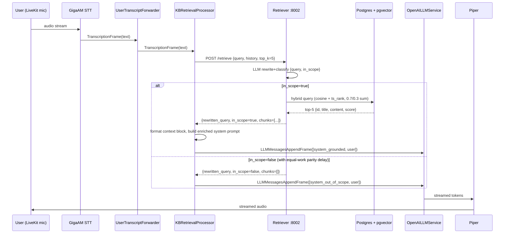

# feat: Helper/Guide NPC RAG retriever (MVP, Russian, conversations-only)

## Overview

Add a KB-grounded retrieval layer to the voice agent so Helper/Guide NPCs can answer game how-to questions in Russian from a curated corpus, without roleplay or game-client callbacks.

The change spans four places:

- **A new internal service** `services/retriever` on `:8002` exposing `POST /retrieve` with hybrid (pgvector cosine + Russian `tsvector`) search plus a one-call LLM query-rewriter and in-scope classifier.
- **A new Postgres extension + table** (`pgvector`, `kb_chunks`) managed by a standard Alembic migration, with a one-shot ingestion script that chunks KB source, embeds, extracts structured metadata, and seeds synthetic questions.
- **A new Pipecat `FrameProcessor`** (`KBRetrievalProcessor`) inserted between `UserTranscriptForwarder` and `user_agg` that intercepts each final user `TranscriptionFrame`, calls the retriever, and injects the enriched context into the LLM message list.
- **A grounded Russian system-prompt template** wired through `build_system_prompt` in `services/agent/overrides.py`.

Latency target `<800ms` first-audio-out stays; the retriever call is budgeted at ~200-500ms and sits inline on the turn (no speculative prefetch in the MVP — that is a deferred survivor, see origin §Survivor Ideas). Scope is intentionally narrow per user direction: implement exactly the architecture in the ideation §"Architecture to Implement", no survivor variants, no simplifications.

## Problem Frame

The voice agent today has no grounded knowledge about the game — the LLM answers from parametric memory, so it hallucinates commands, prices, quest locations, and NPC names. Helper/Guide NPCs are the shape where this matters most: their entire job is to give correct in-game how-do-I answers. For the Russian-only MVP, the operator curates a KB and the agent is constrained to answer from it, refusing gracefully when the question is out of scope.

See origin: `docs/ideation/2026-04-23-helper-guide-npc-rag-ideation.md` §"Architecture to Implement" — this plan implements those 8 numbered components verbatim, preserving the user's build order.

## Requirements Trace

- **R1.** A retriever service on `:8002` exposes `POST /retrieve` returning `{rewritten_query, in_scope, chunks: [{id, title, text, score}]}` for a user turn.
- **R2.** KB content is stored in Postgres with hybrid search: semantic (pgvector HNSW) + lexical (Russian `tsvector`) fused by weighted sum (0.7 semantic + 0.3 lexical, per origin sketch).
- **R3.** A one-shot LLM call produces `{query, in_scope}` as structured JSON; `in_scope=false` routes to a refusal path, `in_scope=true` runs retrieval.
- **R4.** A Pipecat `KBRetrievalProcessor` intercepts `TranscriptionFrame` between STT and the LLM context aggregator, calls the retriever, and injects retrieved chunks + rewritten query into the LLM messages.
- **R5.** The Russian system prompt constrains answers to retrieved context ("используя ТОЛЬКО информацию из контекста ниже … Не выдумывай команды, цены и места"), with clearly delimited context block.
- **R6.** Ingestion splits KB entries by H2/H3, embeds `title + "\n" + content`, extracts metadata (prices/commands/level reqs) into JSONB, generates 3-5 synthetic questions per chunk, and upserts by `(kb_entry_id, section)`.
- **R7.** An eval harness of ~50 hand-written Russian questions measures "right chunk in top 3" before the FrameProcessor is wired in.
- **R8.** Latency: first-audio-out stays `<800ms`; retriever budget ~200-500ms; no regression in barge-in responsiveness.
- **R9.** Scope limits: Helper/Guide NPCs only, Russian only, conversations only — no map geotagging, no callbacks to the game client.

## Scope Boundaries

- Russian language only — `services/agent/lang.py` already routes CJK→reject and everything else→RU; no multilingual work here.
- Helper/Guide NPC persona only — other NPC archetypes (tavern keeper, quest giver, etc.) are out of scope for this plan.
- Conversations only — no map geotagging, no writes back to the game client, no player-state queries.
- Inline retrieval on the turn — no speculative prefetch, no between-turn prefetch, no partial-transcript prefetch.
- One retriever backend — pgvector + Russian `tsvector`; no Qdrant/Weaviate/Elastic alternatives.

### Deferred to Separate Tasks

The origin ideation doc surfaced seven strong survivor ideas; per user direction they are **not** scoped into this plan. Preserved for future iteration:

- Two-phase speculative retrieval (pre-EOS partials + between-turn prefetch) — deferred post-MVP.
- `retrieval_traces` + `rag_configs` append-only log substrate — deferred; recommended as the first follow-up after the MVP lands so production behavior is measurable.
- Hunspell Russian stemmer in place of default snowball — deferred; revisit once `tsvector` recall is measured against snowball on the eval set.
- FAQ-pair unit of retrieval + 5-rung scope ladder + silence-gate refusal — deferred UX shape.
- Unified `kb_units` schema with `unit_type` discriminator + structured hits + shared scope tuple — deferred schema generalization.
- Versioned ingestion contract + content-hash embedding cache + atomic webhook cutover — deferred ingestion refinement.
- Inline-KB MVP (full KB in system prompt) — rejected by user during ideation; retriever path chosen instead.

## Context & Research

### Relevant Code and Patterns

- **Pipeline assembly:** `services/agent/pipeline.py` `build_task()` constructs the Pipecat `Pipeline(...)` with the order `[transport.input(), stt, user_transcript, user_agg, llm, assistant_transcript, tts, error_forwarder, transport.output(), assistant_agg]`. The KB processor inserts between `user_transcript` (UserTranscriptForwarder) and `user_agg` (LLMContextAggregatorPair.user_agg). See line 205-218.
- **FrameProcessor precedent:** `services/agent/transcript.py` — `UserTranscriptForwarder`, `AssistantTranscriptForwarder`, `ErrorFrameForwarder` all show the right subclassing contract, `asyncio.to_thread` idiom for blocking work, and `ErrorFrame` redaction pattern.
- **Heavy-model singleton loading:** `services/agent/models.py` — `load_gigaam()` trio is the reference pattern for preloading the sentence-transformer embedder at agent boot. The retriever service follows the same shape for its embedder.
- **Per-session config:** `services/agent/overrides.py` — `PerSessionOverrides` carries `npc_id`, `persona`, `context`, `language`, `llm_model` per room; `build_system_prompt(overrides)` composes the final prompt. The grounded Russian template extends this.
- **Alembic migration style:** `apps/api/migrations/versions/0003_transcripts.py` — revision id / down_revision / upgrade() / downgrade() shape; `postgresql.UUID(as_uuid=True)` for ids; `server_default=sa.text("gen_random_uuid()")`.
- **API service shape:** `apps/api/` (FastAPI + uv + Pydantic settings + Alembic + `routes/` + `tests/` + `Dockerfile` + `pyproject.toml`) is the pattern to mirror for the new retriever service.
- **Dockerfile.base split:** `services/agent/Dockerfile.base` carries CUDA + Python deps; `services/agent/Dockerfile` is a thin `FROM ${BASE_IMAGE}` + `COPY . /app`. The retriever service follows the same pattern so embedder/model deps rebuild cheaply.
- **HF cache volume:** `hf_cache_agent` / `torch_cache_agent` named volumes in `infra/docker-compose.yml` — the retriever gets its own `hf_cache_retriever` volume to avoid cross-UID cache corruption (see Qwen3 comment at line 202 of compose).
- **OpenAI-compatible LLM client:** `services/agent/pipeline.py` uses `OpenAILLMService`; the retriever's rewriter+classifier reuses the same env-var wiring (base URL + API key + model) so vLLM and Groq both work.

### Institutional Learnings

- `docs/solutions/security-issues/xff-spoof-and-shared-cache-eviction-in-ip-rate-limiter-2026-04-20.md` — keep any retriever-side caches (embedder pool, DB connection pool, query-hash cache) as isolated namespaces from the API's `_tenant_buckets`/`_ip_buckets`. Use `ipaddress.ip_network` with `settings.trusted_proxy_cidrs` if the retriever ever needs to parse `X-Forwarded-For`. **Timing channel:** the "in-scope vs out-of-scope" response must do equal work on both branches so a timing attacker can't enumerate KB membership.
- `docs/solutions/logic-errors/delete-sessions-missing-audio-seconds-2026-04-23.md` — when the ingestion pipeline introduces new write paths (upsert + version bump + soft-delete), happy-path tests must assert every writable column, not just status enums; prefer SQL-level idempotent `UPDATE ... WHERE version = $current` over Python `if` guards.
- `docs/solutions/tts-selection/silero-spike-findings.md` — Pipecat `FrameProcessor` must wrap every blocking call (DB query, HTTP call, embedder) in `asyncio.to_thread`; errors are redacted via `ErrorFrame` rather than leaking stack traces downstream; heavy models preload via singleton at agent boot; `asyncio.to_thread` work is **uncancellable**, so the retriever round-trip is the lower bound for barge-in responsiveness — budget accordingly.
- Docker build hygiene (learnings from `build-errors/*`): add `python -c "import pgvector; import httpx; import sentence_transformers"` (or equivalent) as a smoke layer inside `Dockerfile.base`. Lockfile clean ≠ runtime clean.

### External References

- **Ideation §External Context** already gathered the relevant prior art (VoiceAgentRAG, Stream RAG, BGE-M3 vs GigaEmbeddings, Postgres Russian FTS quirks, HNSW vs IVFFlat at small scale, RRF vs weighted sum). This plan consumes those findings; external research is not re-dispatched.
- pgvector docs: `CREATE EXTENSION vector;` + `CREATE INDEX ... USING hnsw (embedding vector_cosine_ops) WITH (m = 16, ef_construction = 200);`
- Pipecat: `pipecat.frames.frames.TranscriptionFrame`, `pipecat.processors.aggregators.llm_context.LLMContext` (already in use), `pipecat.frames.frames.LLMMessagesAppendFrame` (for context injection alongside `LLMContextAggregatorPair`).

## Key Technical Decisions

- **Embedder: BGE-M3.** The origin sketch listed "multilingual-e5-large OR bge-m3". Picking BGE-M3: (a) no `"query:"/"passage:"` prefix discipline — one fewer silent-recall-loss footgun, (b) stronger Russian retrieval on ruMTEB, (c) 8192-token context allows embedding larger chunks verbatim. 1024-dim vector matches the sketched schema.
- **Hybrid fusion: weighted sum (0.7 semantic + 0.3 lexical).** User's sketch explicitly asked for this over RRF for tunability on a small eval set. RRF is the deferred follow-up after eval data exists.
- **Russian stemmer: default snowball.** User's sketch explicitly endorsed Postgres's built-in `russian` text-search config. Hunspell is a deferred survivor.
- **Tenant scoping: add `tenant_id NOT NULL` from day one.** The existing `tenants` table and `sessions.tenant_id` make this the repo's invariant, not a variant. `kb_chunks.tenant_id` is required; NPC-level scoping (`npc_id` filter) is MVP-skipped because the MVP assumes one Helper/Guide NPC per tenant — add NPC scoping when multi-NPC lands.
- **LLM for rewriter+classifier: reuse existing OpenAI-compatible client.** The agent already ships a vLLM/Groq/OpenAI endpoint via `OpenAILLMService`; the retriever imports the same env contract (`LLM_BASE_URL`, `LLM_API_KEY`, `REWRITER_MODEL`) and uses the OpenAI JSON mode / structured outputs path. `REWRITER_MODEL` is configurable so ops can route to a cheaper/faster model than the main chat LLM.
- **Service boundary: standalone FastAPI service in `services/retriever/`, not embedded.** Matches the user's sketched architecture; the origin ideation's "retriever-as-library" alternative was rejected. Named under `services/` (not `apps/`) because it's internal and never user-facing.
- **FrameProcessor context injection: `LLMMessagesAppendFrame`.** The pipeline already uses `LLMContextAggregatorPair`. Appending messages into the aggregator's context is the Pipecat-idiomatic path; pushing raw `LLMMessagesFrame` would bypass the aggregator and break the existing user/assistant turn-boundary accounting.
- **Docker image layout: Dockerfile.base + thin app layer.** BGE-M3 ships as a `sentence-transformers` / `FlagEmbedding` install that resolves ~2 GB of model weights at runtime. Base layer carries the python deps; weights never baked — persisted via `hf_cache_retriever` named volume.
- **No new caching layer in MVP.** The origin ideation proposed stale-while-revalidate, speculative prefetch, and top-N pre-rendered Opus caches; all deferred. MVP runs retrieval inline on every turn.

## Open Questions

### Resolved During Planning

- Which embedder? → **BGE-M3** (see Key Technical Decisions).
- Fusion method? → **Weighted sum 0.7/0.3** (preserves user sketch; RRF deferred).
- Stemmer? → **Default `russian` snowball** (preserves user sketch; Hunspell deferred).
- Tenant scoping? → `tenant_id NOT NULL` on `kb_chunks`; NPC-level filter deferred.
- FrameProcessor frame type? → `LLMMessagesAppendFrame` into the existing `LLMContextAggregatorPair`.
- Service location? → `services/retriever/`.

### Deferred to Implementation

- Exact `retrieve` endpoint pagination / top-k default — start with the sketched `top_k=5`; tune against eval set.
- Exact HNSW `m` / `ef_construction` and `ef_search` values — start with pgvector defaults (`m=16`, `ef_construction=200`); tune only if eval shows recall problems.
- Synthetic-question prompt wording — iterate at eval time; not a planning-time decision.
- Exact metadata schema per `kb_entry` type — the ingestion script's metadata-extraction LLM prompt shapes this at implementation time.
- Timing-channel parity — the exact number of dummy milliseconds to add on the out-of-scope branch is measured, not predicted.
- Whether to store synthetic questions as separate `kb_chunks` rows (pointing back to the same `kb_entry_id`) or as a JSONB column on the source chunk — both work; the user's sketch says "store as additional rows" so that's the default, but the implementer may consolidate if it simplifies dedup.
- Barge-in behavior: when the user barges in while the retriever call is in flight, the call completes (uncancellable `asyncio.to_thread`) but the result is discarded. Exact discard mechanism (turn-id tagging vs. fire-and-forget coroutine cancellation) is a small implementation detail.

## Output Structure

    services/retriever/                          # NEW internal FastAPI service on :8002
        Dockerfile                               # thin FROM ${BASE_IMAGE} + COPY
        Dockerfile.base                          # heavy: python + pgvector client + sentence-transformers
        pyproject.toml
        uv.lock
        README.md                                # brief: what this service does + how to run
        main.py                                  # FastAPI app + lifespan (embedder preload)
        settings.py                              # Pydantic: DB URL, LLM URL/key/model, top_k defaults
        db.py                                    # asyncpg/SQLAlchemy pool
        embedder.py                              # BGE-M3 singleton load + encode() wrapper
        rewriter.py                              # one-call LLM rewrite+classify with structured output
        retrieve.py                              # hybrid SQL query + weighted-sum fusion
        routes/
            __init__.py
            retrieve.py                          # POST /retrieve handler
            health.py                            # GET /healthz
        tests/
            test_retrieve_endpoint.py
            test_rewriter.py
            test_hybrid_fusion.py
            test_health.py
            eval/
                ru_questions.jsonl               # 50 hand-written Russian eval queries
                run_eval.py                      # top-k recall measurement

    services/retriever/ingestion/                # one-shot / cron ingestion
        ingest.py                                # CLI: split, embed, extract, seed synthetic, upsert
        chunker.py                               # H2/H3 splitter
        metadata_extractor.py                    # one-shot LLM pass: prices/commands/levels → JSONB
        synthetic_questions.py                   # 3-5 synthetic questions per chunk
        tests/
            test_chunker.py
            test_metadata_extractor.py
            test_ingest_upsert.py

    services/agent/
        kb_retrieval.py                          # NEW: KBRetrievalProcessor FrameProcessor
        pipeline.py                              # MODIFY: insert KBRetrievalProcessor between user_transcript and user_agg
        overrides.py                             # MODIFY: build_system_prompt reads Helper/Guide template when persona matches
        prompts/
            helper_guide_ru.md                   # NEW: grounded Russian system prompt template
        tests/
            test_kb_retrieval.py                 # FrameProcessor unit tests

    apps/api/migrations/versions/
        0004_kb_chunks.py                        # NEW: CREATE EXTENSION vector + kb_chunks table + indexes

    infra/
        docker-compose.yml                       # MODIFY: add retriever service + hf_cache_retriever volume
        .env.example                             # MODIFY: document RETRIEVER_URL, LLM_REWRITER_MODEL, etc.

## High-Level Technical Design

> *This illustrates the intended approach and is directional guidance for review, not implementation specification. The implementing agent should treat it as context, not code to reproduce.*

### Request flow, one turn



### Schema shape (Alembic 0004)

```
kb_chunks(
  id           BIGSERIAL PK,
  tenant_id    UUID NOT NULL,
  kb_entry_id  TEXT NOT NULL,
  title        TEXT NOT NULL,
  section      TEXT,
  content      TEXT NOT NULL,
  content_tsv  tsvector GENERATED ALWAYS AS (to_tsvector('russian', title || ' ' || content)) STORED,
  embedding    vector(1024) NOT NULL,
  metadata     JSONB DEFAULT '{}',
  kind         TEXT NOT NULL DEFAULT 'source',  -- 'source' | 'synthetic_question'
  version      INT NOT NULL DEFAULT 1,
  updated_at   TIMESTAMPTZ DEFAULT NOW()
)
indexes:
  hnsw (embedding vector_cosine_ops)
  gin  (content_tsv)
  btree (tenant_id, kb_entry_id)
unique:
  (tenant_id, kb_entry_id, section, kind)  -- upsert key
```

### Hybrid fusion query (directional)

Two CTEs pulled in parallel (semantic and lexical), joined on `id`, fused as `0.7 * semantic + 0.3 * lexical`, ordered, limited to top 5. Both scores COALESCE to 0 for the half that didn't match. Matches the origin sketch query shape.

## Implementation Units

### - [ ] Unit 1: Alembic migration — pgvector + `kb_chunks`

**Goal:** Enable pgvector on PG18 and create the `kb_chunks` table with hybrid-search indexes.

**Requirements:** R2

**Dependencies:** None

**Files:**
- Create: `apps/api/migrations/versions/0004_kb_chunks.py`
- Modify: `apps/api/migrations/env.py` (only if MetaData autogeneration needs `pgvector` type registration — otherwise no change)
- Test: `apps/api/tests/test_migrations_kb_chunks.py`

**Approach:**
- `upgrade()` runs `CREATE EXTENSION IF NOT EXISTS vector;` first, then `CREATE TABLE kb_chunks (...)` with the column list from §High-Level Technical Design, then the three indexes (`hnsw`, `gin`, `btree`), then the `(tenant_id, kb_entry_id, section, kind)` unique constraint.
- `downgrade()` drops the table and the extension only if no other table depends on it (guard with `sa.text("DROP EXTENSION IF EXISTS vector")`). Document this is destructive.
- `tenant_id` references `tenants.id` with `ON DELETE CASCADE` — so deleting a tenant evaporates their KB atomically, matching the existing `session_transcripts` lifecycle.
- Use `revision="0004_kb_chunks"`, `down_revision="0003_transcripts"` to match the existing chain.

**Patterns to follow:**
- `apps/api/migrations/versions/0003_transcripts.py` (style, imports, `server_default`, FK + cascade).

**Test scenarios:**
- Happy path: `alembic upgrade head` on an empty PG18 creates the extension and table; `SELECT 1 FROM kb_chunks WHERE 1=0` succeeds; `\d kb_chunks` shows all three indexes.
- Happy path: `alembic downgrade -1` then `alembic upgrade head` round-trips cleanly.
- Edge case: running `upgrade()` twice is idempotent (first run creates, second run is no-op because of `IF NOT EXISTS`).
- Integration: inserting a row with a 1024-dim `vector` and querying with `<=>` returns a cosine distance.
- Integration: `to_tsvector('russian', ...)` on a Cyrillic title+content produces non-empty tsvector.

**Verification:**
- Migration applies cleanly on a fresh dev Postgres and in the docker-compose stack.
- `kb_chunks` is queryable with both `<=>` (cosine) and `@@` (tsvector) operators.

---

### - [ ] Unit 2: Ingestion pipeline — chunker + embedder + metadata extractor + synthetic questions + upsert

**Goal:** A one-shot CLI that takes KB source entries and populates `kb_chunks`, idempotently, with all five ingestion steps from the origin sketch.

**Requirements:** R2, R6

**Dependencies:** Unit 1

**Files:**
- Create: `services/retriever/pyproject.toml`, `services/retriever/uv.lock`
- Create: `services/retriever/ingestion/__init__.py`
- Create: `services/retriever/ingestion/chunker.py`
- Create: `services/retriever/ingestion/metadata_extractor.py`
- Create: `services/retriever/ingestion/synthetic_questions.py`
- Create: `services/retriever/ingestion/ingest.py` (CLI entry)
- Create: `services/retriever/embedder.py` (shared with Unit 3 — singleton BGE-M3 load + `encode(texts) -> list[vector]`)
- Create: `services/retriever/db.py` (shared with Unit 3 — asyncpg/SQLAlchemy async engine + pool + `upsert_chunks(rows)` helper)
- Create: `services/retriever/settings.py` (shared — Pydantic settings for DB URL, LLM URL/key/model, embedder model id)
- Test: `services/retriever/ingestion/tests/test_chunker.py`
- Test: `services/retriever/ingestion/tests/test_metadata_extractor.py`
- Test: `services/retriever/ingestion/tests/test_ingest_upsert.py`

**Approach:**
- `chunker.split_by_headings(markdown) -> list[Section]` splits on H2/H3; sections inherit `title = entry_title + " / " + section_name` per the origin sketch. If the source is flat prose, fall back to paragraph splitting with a 400-token soft cap.
- `metadata_extractor.extract(section) -> dict` runs one LLM call (OpenAI-compatible, `response_format=json_schema`) producing `{prices: [...], commands: [...], level_reqs: [...]}`. Empty arrays when nothing is found. Stored into `metadata` JSONB.
- `synthetic_questions.generate(section) -> list[str]` runs one LLM call producing 3-5 paraphrased question strings per chunk. These become additional `kb_chunks` rows with `kind='synthetic_question'` and `content=the_question_text`, with the **same** `(tenant_id, kb_entry_id, section)` triple pointing back to the source — retrieval then matches either the source chunk or any of its question siblings, boosting recall on paraphrases.
- `embedder.encode(texts)` runs through BGE-M3 via `sentence-transformers` (CPU at MVP is fine for offline ingestion; the singleton design lets a GPU worker pick it up later). Batch size 16-32 for ingestion throughput.
- `ingest.py run --source <path> --tenant-id <uuid>` reads the source directory, splits, embeds, extracts metadata, seeds synthetic questions, and upserts via `INSERT ... ON CONFLICT (tenant_id, kb_entry_id, section, kind) DO UPDATE SET ...` bumping `version`.
- Ingestion wraps DB writes in a transaction per `kb_entry_id` — partial failure on one entry does not half-update it.

**Patterns to follow:**
- `services/agent/models.py::load_gigaam` — singleton model loader contract.
- `apps/api/settings.py` — Pydantic `Field(min_length=...)` env-var validation at startup.
- `infra/docker-compose.yml` existing `hf_cache_*` volumes — the ingestion CLI writes to `hf_cache_retriever` when the embedder loads.

**Test scenarios:**
- Happy path (chunker): given a Markdown file with one H1, two H2s, and three H3s, `split_by_headings` returns 5 sections with `title = h1_text + " / " + section_name`.
- Happy path (metadata extractor): given a section mentioning "100 монет" and "/license", returns `{prices: [{amount: 100, currency: "coins"}], commands: ["/license"], level_reqs: []}`. (Shape directional, not literal — the LLM prompt defines exact keys.)
- Happy path (synthetic questions): given a section about "водительская лицензия", returns 3-5 question-shaped Russian strings; all 3-5 rows are inserted with `kind='synthetic_question'` and matching `kb_entry_id`.
- Happy path (ingest end-to-end): running `ingest.py run` twice on the same source updates rows in place (`version` increments, `updated_at` advances), no duplicate rows.
- Edge case: source entry with no Cyrillic content is still chunked but logged as a language mismatch warning (future multilingual hook).
- Edge case: metadata extractor LLM returns malformed JSON — ingestion continues with empty `metadata` and logs a warning; does not block the row.
- Error path: DB connection lost mid-ingest → transaction rolls back, no partial `kb_entry_id` in the table.
- Integration: after ingest, `SELECT count(*) FROM kb_chunks WHERE kb_entry_id = '<x>'` equals `1 + N_synthetic_questions` for the expected source sections.

**Verification:**
- Running the CLI against a fixture KB produces non-empty `kb_chunks` rows with valid embeddings, non-empty `content_tsv`, structured `metadata`, and matching synthetic-question rows.
- Re-running is idempotent.

---

### - [ ] Unit 3: Retriever service on `:8002` — hybrid endpoint + eval harness

**Goal:** A standalone FastAPI service exposing `POST /retrieve` that runs hybrid search against `kb_chunks`, plus a ~50-query Russian eval harness.

**Requirements:** R1, R2, R7, R8

**Dependencies:** Units 1 and 2

**Files:**
- Create: `services/retriever/main.py` (FastAPI app + lifespan: preload embedder + DB pool)
- Create: `services/retriever/retrieve.py` (hybrid SQL query, weighted-sum fusion, result shaping)
- Create: `services/retriever/routes/__init__.py`
- Create: `services/retriever/routes/retrieve.py` (POST /retrieve handler, Pydantic request/response)
- Create: `services/retriever/routes/health.py` (GET /healthz)
- Create: `services/retriever/Dockerfile.base` (Python + uv-installed deps + `python -c "import sentence_transformers; import pgvector; import httpx"` smoke layer)
- Create: `services/retriever/Dockerfile` (thin `FROM ${BASE_IMAGE}` + `COPY . /app`)
- Create: `services/retriever/tests/test_retrieve_endpoint.py`
- Create: `services/retriever/tests/test_hybrid_fusion.py`
- Create: `services/retriever/tests/test_health.py`
- Create: `services/retriever/tests/eval/ru_questions.jsonl` (50 hand-written Russian queries + expected `kb_entry_id`)
- Create: `services/retriever/tests/eval/run_eval.py` (recall@3 measurement CLI)

**Approach:**
- `POST /retrieve` accepts `{query: str, history: list[{role, text}], top_k: int = 5}` and returns `{rewritten_query, in_scope, chunks: [{id, title, content, score, metadata}]}`. **Unit 3 returns `rewritten_query = query` and `in_scope = true` unconditionally** — rewriter+classifier is Unit 4; this unit ships hybrid retrieval first and measures it.
- Hybrid query uses the origin sketch's two-CTE pattern: semantic CTE (`ORDER BY embedding <=> $1`, LIMIT 20), lexical CTE (`plainto_tsquery('russian', $2)`, LIMIT 20), outer join fuses `0.7 * semantic + 0.3 * lexical` and returns top 5. Embeddings produced at request time via `embedder.encode([query])`.
- Tenant scoping: request carries `tenant_id` (from agent → retriever header or body field); every SQL predicate includes `WHERE tenant_id = $n`.
- Embedder preloaded at lifespan startup (singleton, like `load_gigaam`); DB connection pool also initialized at lifespan. Both shut down on `lifespan` exit.
- Wrap SQL calls in `asyncio` idioms (asyncpg is natively async) — no `asyncio.to_thread` needed for DB. Embedding via `sentence-transformers` is CPU-blocking → wrap in `asyncio.to_thread` or use a process-pool executor. Document: the retriever is called from the uncancellable agent thread, so its total round-trip sets the barge-in floor.
- Healthcheck returns 200 only after embedder + DB pool are ready; compose healthcheck has `start_period: 300s` for first-boot model download (mirrors agent).
- Error handling: DB timeout or embedder exception returns 500 with a generic body (no stack), and the agent's `KBRetrievalProcessor` redacts via `ErrorFrame`.
- **Eval harness** (`tests/eval/run_eval.py`): iterates over `ru_questions.jsonl`, calls `POST /retrieve` for each, computes recall@1 and recall@3 against the expected `kb_entry_id`. Run once, commit baseline numbers to `tests/eval/baseline.md`.

**Execution note:** Implement the `/retrieve` endpoint first (against seeded `kb_chunks`), then write the 50 eval queries by hand against the fixture KB, then tune `m` / `ef_construction` / fusion weights only if recall@3 < 80%.

**Patterns to follow:**
- `apps/api/main.py` — FastAPI app shape, lifespan, error handler wiring.
- `apps/api/settings.py` — Pydantic settings with `Field(min_length=...)` on DB URL / LLM key.
- `apps/api/db.py` — async engine/pool setup.
- `services/agent/Dockerfile.base` + `services/agent/Dockerfile` — exact split pattern.
- `services/agent/gigaam_stt.py` lines 155-177 — `asyncio.to_thread` wrapping + exception redaction.

**Test scenarios:**
- Happy path: `POST /retrieve` with a query that has an exact BM25 match returns that chunk as top-1 with high `score`.
- Happy path: `POST /retrieve` with a paraphrase returns the semantic-nearest chunk in top 3 (tested against an eval query whose expected entry uses different wording than the source).
- Edge case: empty query string → 422 validation error.
- Edge case: `top_k > 50` → clamped to 50 (prevent runaway result sets).
- Edge case: no chunks match either side → returns `chunks: []`, not a 404.
- Error path: DB pool exhausted / timeout → 500 with redacted body; logged internally.
- Error path: embedder throws → 500 with redacted body.
- Integration: tenant isolation — query with `tenant_id=A` does not return chunks from `tenant_id=B`, even when content is identical. Assert zero leakage.
- Integration: `ts_rank_cd` with `plainto_tsquery('russian', ...)` actually matches inflected forms ("квест" query → "квестов" content row), so lexical side isn't dead weight.
- Health: `GET /healthz` returns 503 during startup (pool not ready) and 200 once embedder + pool are healthy.
- Eval harness: `run_eval.py` reports recall@3 ≥ 80% on the 50-query set. If not, tune before Unit 4.

**Verification:**
- `docker compose up retriever` reaches healthy.
- `curl -X POST http://localhost:8002/retrieve -d '{"query":"...", "top_k":5}'` returns a JSON body shaped per the spec.
- Eval harness reports a baseline recall@3 that the team is happy with.
- Tenant-isolation test is green.

---

### - [ ] Unit 4: Query rewriter + in-scope classifier

**Goal:** Add the one-call LLM rewriter+classifier to the retriever so `rewritten_query` and `in_scope` are real, not stubbed.

**Requirements:** R3

**Dependencies:** Unit 3

**Files:**
- Create: `services/retriever/rewriter.py` (single `async rewrite_and_classify(query, history) -> RewriteResult` function)
- Modify: `services/retriever/routes/retrieve.py` (call rewriter before hybrid search; short-circuit retrieval on `in_scope=false`)
- Modify: `services/retriever/settings.py` (add `LLM_BASE_URL`, `LLM_API_KEY`, `REWRITER_MODEL` settings)
- Create: `services/retriever/tests/test_rewriter.py`
- Modify: `services/retriever/tests/test_retrieve_endpoint.py` (extend for in-scope / out-of-scope branches)

**Approach:**
- One chat completion against the existing OpenAI-compatible endpoint with `response_format={"type":"json_object"}` (or `json_schema` if the configured backend supports it — Groq and vLLM both do in 2026). System prompt instructs: given the last 1-2 turns of history and the current raw STT transcript, emit strict JSON `{"query": "<standalone Russian search query>", "in_scope": true|false}`. Keep the output under 200 tokens.
- `REWRITER_MODEL` env var lets ops route to a smaller/faster model than the chat LLM — e.g., Llama 3.1 8B on Groq for sub-50ms TTFT.
- If the model returns malformed JSON, default to `{rewritten_query=query, in_scope=true}` and log a warning (fail-open on rewriter — better a bad retrieval than a stuck turn).
- In `routes/retrieve.py`: call rewriter → if `in_scope=false`, skip the hybrid query and return `chunks=[]` **after a timing-parity sleep** that matches the p50 hybrid-query latency (learning from xff-spoof: equal work on both branches). If `in_scope=true`, pass `rewritten_query` to `retrieve.hybrid_search()`.
- Configurable: `REWRITER_ENABLED` env var (default true) lets ops disable the rewriter entirely if it regresses quality against eval.

**Patterns to follow:**
- `services/agent/pipeline.py` `OpenAILLMService(base_url=..., api_key=..., model=...)` — same env contract.
- `apps/api/rate_limit.py` — how `settings.trusted_proxy_cidrs` is threaded (for the timing-parity pattern's general shape).

**Test scenarios:**
- Happy path (rewriter): given history `[{role:"assistant", text:"..."}]` and query `"а где это?"`, returns `{query: "<expanded standalone question>", in_scope: true}`.
- Happy path (classifier): clearly game-help query → `in_scope=true`; clearly roleplay/chitchat → `in_scope=false`.
- Edge case: empty history + single-word query → returns a usable rewritten query (not an empty string).
- Edge case: non-Russian query (English typed) → `in_scope=false` in the MVP (scope is Russian only per R9).
- Error path: LLM endpoint returns 500 → rewriter fails open: `{rewritten_query=query, in_scope=true}` + log warning. No 500 propagates to the caller.
- Error path: LLM returns malformed JSON → same fail-open behavior.
- Integration: out-of-scope request returns `chunks=[]` and a latency within ±20% of the in-scope p50 — timing parity holds.
- Integration: with `REWRITER_ENABLED=false`, the endpoint behaves exactly as Unit 3 (stubbed rewriter).

**Verification:**
- 50-query eval harness re-run with rewriter enabled shows no recall@3 regression (and ideally a small gain on paraphrased/followup queries).
- Manual timing test: out-of-scope and in-scope requests have indistinguishable latency to an external timer.

---

### - [ ] Unit 5: Pipecat `KBRetrievalProcessor` FrameProcessor

**Goal:** Insert the retriever into the voice pipeline between `UserTranscriptForwarder` and `user_agg`, so each final user transcript is enriched with retrieved context before reaching the LLM.

**Requirements:** R4, R8, R9

**Dependencies:** Unit 4

**Files:**
- Create: `services/agent/kb_retrieval.py` (`KBRetrievalProcessor` subclass of `FrameProcessor`)
- Modify: `services/agent/pipeline.py` (instantiate + insert between `user_transcript` and `user_agg`; pass retriever URL + tenant_id from `PerSessionOverrides`)
- Modify: `services/agent/env.py` (add `RETRIEVER_URL` env var with default `http://retriever:8002`)
- Modify: `services/agent/pyproject.toml` (add `httpx` if not already a dep)
- Create: `services/agent/tests/test_kb_retrieval.py`

**Approach:**
- Subclass `FrameProcessor`. In `process_frame(frame, direction)`:
  - Forward non-TranscriptionFrame frames untouched (`await self.push_frame(frame, direction)`).
  - On a **final** `TranscriptionFrame` (not `InterimTranscriptionFrame` — interim frames are untouched), call `POST /retrieve` with the transcript text, a short rolling history (last 3 turns kept in `self._history`), and `top_k=5`. Wrap the `httpx.post(...)` in `asyncio.to_thread` if the client is sync, or use the native async client — either works, the key is that the agent loop is not blocked.
  - On success, build a `LLMMessagesAppendFrame` containing `[{"role": "system", "content": enriched_system_prompt_with_chunks}]` and push downstream; the existing `LLMContextAggregatorPair.user_agg` picks it up alongside the user turn.
  - On `in_scope=false`, inject the out-of-scope system steer instead of the grounded context.
  - On retriever timeout or error, push an `ErrorFrame("retrieval failed")` and **do not** block the turn — let the LLM answer without context (degrade gracefully, matching `gigaam_stt.py` redaction pattern at lines 171-177).
  - `history` is bounded to the last 3 user+assistant turns via slicing, accumulated from observed `TranscriptionFrame` + `LLMFullResponseEndFrame` events.
- Retriever URL and tenant_id come from env + `PerSessionOverrides` respectively; the processor is instantiated in `build_task()` and receives them via constructor.
- Configurable per-session: if `overrides.persona` does not indicate a Helper/Guide NPC (inspect `persona.archetype` or similar — add a tight `is_helper_guide_npc(persona)` predicate), the processor short-circuits and forwards frames untouched. This preserves scope boundary R9 ("Helper/Guide NPCs only") without needing a global enable flag.

**Execution note:** Instrument latency breakdown (rewriter ms + hybrid-query ms + network ms) via structured log lines so Unit 7's voice test can confirm the <800ms budget.

**Patterns to follow:**
- `services/agent/transcript.py` — subclassing contract, `await super().process_frame(frame, direction)` at the top of `process_frame`, push-through for non-target frames.
- `services/agent/gigaam_stt.py` lines 155-177 — `asyncio.to_thread` + exception redaction + `ErrorFrame` on failure.
- `services/agent/pipeline.py` line 205 — exact insertion point in the `Pipeline([...])` list.

**Test scenarios:**
- Happy path: a `TranscriptionFrame` with an in-scope Russian query triggers a retriever call and a `LLMMessagesAppendFrame` with a system message containing the top chunks' content.
- Happy path: an `InterimTranscriptionFrame` is forwarded untouched — no retriever call.
- Happy path: non-Helper/Guide persona bypasses the processor entirely (forward untouched).
- Edge case: history accumulator keeps only the last 3 turns across many frames.
- Error path: retriever returns 500 → processor pushes an `ErrorFrame` downstream and forwards the original `TranscriptionFrame` so the LLM still answers (degraded, un-grounded).
- Error path: retriever timeout (configurable, default 600ms) → same graceful degradation; no 5s hang.
- Error path: retriever returns `in_scope=false` → processor injects the out-of-scope system steer (short "stay in-domain" nudge), not a refusal TTS text.
- Integration: with the full pipeline wired, a user utterance produces an LLM call whose message list contains the injected grounded system prompt AND the user's turn — in that order.
- Integration: barge-in during a retriever call — the uncancellable `asyncio.to_thread` completes, but the resulting `LLMMessagesAppendFrame` is discarded because the turn has advanced (verify via turn-id tagging or frame-time comparison).

**Verification:**
- Unit tests pass with a mocked retriever HTTP client.
- Local `docker compose up` with a seeded KB: a test room receiving a user utterance in Russian produces an LLM response grounded in the retrieved chunks (check via logs or the transcript sink).

---

### - [ ] Unit 6: Russian grounded system prompt + persona wiring

**Goal:** Ship the grounded Russian system-prompt template from the origin sketch and wire it through `build_system_prompt` so Helper/Guide NPCs use it automatically.

**Requirements:** R5, R9

**Dependencies:** Unit 5

**Files:**
- Create: `services/agent/prompts/__init__.py`
- Create: `services/agent/prompts/helper_guide_ru.md` (the origin-sketched system prompt template with a clearly-delimited context block)
- Create: `services/agent/prompts/helper_guide_ru_out_of_scope.md` (short in-persona "I can only help with game questions" steer)
- Modify: `services/agent/overrides.py` (extend `build_system_prompt(overrides)` to select the Helper/Guide template when `overrides.persona` matches; keep the existing default for other personas)
- Create: `services/agent/tests/test_prompts.py`

**Approach:**
- Template is the origin sketch verbatim: "Ты — помощник-гид в игре Arizona RP. Отвечай на вопрос игрока, используя ТОЛЬКО информацию из контекста ниже. Если в контексте нет ответа — скажи, что не знаешь, и предложи спросить администратора или посмотреть на форуме. Отвечай кратко: 1-3 предложения. Не выдумывай команды, цены и места. Отвечай на русском языке."
- Context block is delimited with `---` fences and rendered as `[Заголовок: <title>]\n<content>\n` per chunk. The Unit 5 processor is what injects the actual block; this unit ships the *template* that receives it.
- `build_system_prompt` selects between `helper_guide_ru.md` (Helper/Guide persona) and the existing default. The selection predicate is the same `is_helper_guide_npc(persona)` from Unit 5 — centralize it in `overrides.py` so Unit 5 imports it.
- Out-of-scope steer: a short (~2 sentence) in-persona Russian redirect that Unit 5's `in_scope=false` branch injects. Does not say "Извините, я не могу" as a canned TTS line — it's a system nudge that lets the LLM write a graceful in-character redirect.

**Patterns to follow:**
- `services/agent/overrides.py` existing `build_system_prompt` composition order (persona + voice rules + language rules).

**Test scenarios:**
- Happy path: `build_system_prompt({"npc_id": "helper_1", "persona": {"archetype": "helper_guide"}, ...})` returns a prompt containing the Arizona RP helper-guide opener and the context-block delimiters.
- Happy path: for a non-helper persona, the prompt remains unchanged from the current behavior (regression guard for other NPC types).
- Edge case: empty context block still renders well (the template degrades to "no context available" wording without breaking).
- Edge case: template file missing on disk → clear startup error (fail fast), not silent fallback.
- Integration: the Unit 5 processor's output message content matches the template plus injected chunks — end-to-end prompt-composition test.

**Verification:**
- `build_system_prompt` returns the grounded Russian template for Helper/Guide personas and the unchanged template otherwise.
- Template renders readable Russian with proper Unicode in logs.

---

### - [ ] Unit 7: End-to-end voice test + ops hooks (compose, healthcheck, import smoke)

**Goal:** Wire the retriever service into the shared stack, confirm the full voice path (`mic → STT → KB retrieve → LLM → TTS → speaker`) works in Russian, and verify the <800ms budget.

**Requirements:** R1, R4, R5, R8, R9

**Dependencies:** Units 1-6

**Files:**
- Modify: `infra/docker-compose.yml` (add `retriever` service block + `hf_cache_retriever` volume + healthcheck + depends_on wiring + `RETRIEVER_URL` env var on the `agent` service)
- Modify: `infra/.env.example` (document `RETRIEVER_URL`, `LLM_BASE_URL`, `LLM_API_KEY`, `REWRITER_MODEL`, `REWRITER_ENABLED`, `LLM_REWRITER_TIMEOUT_MS`)
- Modify: `services/retriever/Dockerfile.base` (add `python -c "import pgvector; import sentence_transformers; import httpx"` smoke layer)
- Modify: `services/agent/Dockerfile.base` (add `python -c "import httpx"` to the existing import smoke if not already present)
- Create: `infra/README-retriever.md` (one-pager: what the service does, how to ingest a fixture KB, how to run the eval harness)
- Create: `services/retriever/tests/test_integration_voice.py` (optional — gated on docker-compose, mock-friendly)

**Approach:**
- Compose block mirrors the `agent` service at infra/docker-compose.yml:312: image tag derived from `project-800ms-retriever:local`, Dockerfile pointing at the thin `Dockerfile` with `BASE_IMAGE=project-800ms-retriever-base:local`, volume mount `hf_cache_retriever:/home/appuser/.cache/huggingface`, depends_on postgres, healthcheck `start_period: 300s` for first-boot embedder download, internal port 8002 (not exposed to host by default).
- Agent service gains `RETRIEVER_URL=http://retriever:8002` env var and `depends_on` the retriever.
- `hf_cache_retriever` is a **new** named volume — do **not** share with `hf_cache_agent` / `hf_cache_vllm` / `hf_cache_qwen3` (see compose line 202 comment: different UIDs inside each image corrupt the cache).
- README captures the one-time "build base image" incantation (mirrors the agent's heavy base image rebuild), the ingestion CLI invocation, and the eval-harness command.
- E2E test: bring up the full stack with a fixture KB already ingested; dial a test room; send a pre-recorded Russian utterance via LiveKit test client; assert the assistant response references a term from the retrieved chunk (ground-truth keyword check against the expected KB chunk). Gate this behind an env flag so CI doesn't need the full GPU stack.
- Latency test: the agent logs the retriever round-trip ms on every turn (from Unit 5's instrumentation); the test asserts p50 < 400ms and first-audio-out p50 < 800ms on the target hardware.

**Patterns to follow:**
- `infra/docker-compose.yml` existing `agent` block (lines 312-450) — exact structure for the retriever service block.
- `infra/docker-compose.yml` `hf_cache_*` volume pattern (lines 450-454).
- Repo-wide Dockerfile.base `python -c "import X"` smoke precedent from existing services.

**Test scenarios:**
- Happy path: `docker compose up` brings all services healthy within the `start_period` budget; `/healthz` 200s.
- Happy path: a scripted Russian voice turn receives an LLM answer whose text contains a substring from the seeded KB chunk (ground-truth keyword check).
- Happy path: first-audio-out p50 ≤ 800ms across 10 sequential turns on the target hardware.
- Edge case: retriever brought down mid-session → agent continues to serve degraded (un-grounded) answers with an `ErrorFrame` logged; recovers when retriever comes back up.
- Edge case: retriever healthcheck fails on boot → agent starts but logs a clear warning; turns serve un-grounded until retriever is healthy.
- Error path: ingestion not yet run (empty `kb_chunks`) → retriever returns `chunks=[]`; agent degrades gracefully, no crashes.
- Integration: barge-in during an in-flight retriever call — the user's next utterance is processed with the retriever's stale result discarded and a fresh call fired.
- Integration: tenant-isolation end-to-end — an agent session dispatched for tenant A receives only tenant A's chunks (regression guard against the xff-spoof / cross-tenant leak class).

**Verification:**
- `docker compose up --build` reaches healthy end-to-end with an ingested fixture KB.
- A test Russian voice turn produces a grounded, brief answer that cites the KB content (keyword assertion in the test, qualitative listen in manual testing).
- Latency numbers captured in `docs/solutions/best-practices/` as a new baseline doc (per the repo's same-day post-mortem precedent).

**Execution note:** Before landing this unit, re-run the 50-query eval harness end-to-end against the deployed retriever container (not just the unit-tested code path) to confirm no docker-compose-time regression.

---

## System-Wide Impact

- **Interaction graph:** The Pipecat pipeline gains one processor between `user_transcript` and `user_agg`; the agent gains an outbound HTTP client calling `:8002`; the retriever adds a new outbound HTTP client to the LLM endpoint (rewriter); the API remains unchanged.
- **Error propagation:** Retriever failures (5xx, timeout, malformed JSON) are redacted to `ErrorFrame` in the agent and surfaced to the LiveKit data channel by the existing `ErrorFrameForwarder`. The LLM still answers, un-grounded, so the voice turn never hangs.
- **State lifecycle risks:** The `kb_chunks` upsert must be idempotent (per learning from DELETE/webhook dual-writer incident). Version-bump-on-upsert is the invariant; ingestion re-runs must never produce duplicate rows.
- **API surface parity:** The existing API service (`apps/api/`) is unchanged. If a future plan adds admin endpoints (`/v1/kb/chunks`, `/v1/npcs/{id}/kb`), those live in `apps/api/routes/` and reuse `enforce_tenant_rate_limit` — out of scope here.
- **Integration coverage:** Tenant isolation spans the Alembic migration, the retriever SQL predicate, and the agent's `tenant_id` pass-through. This is an integration concern, not a unit-test concern — Unit 3's tenant-isolation integration test and Unit 7's E2E tenant-isolation assertion are the load-bearing checks.
- **Unchanged invariants:** The existing `/v1/sessions` endpoint, the DELETE + `room_finished` webhook dual lifecycle, the `PerSessionOverrides` contract, the `LLMContextAggregatorPair` shape, the Piper TTS chain, and the GigaAM hallucination-floor (<300ms / <2 tokens) all remain exactly as they are today. The KB retriever is an additive layer between STT and LLM; it does not modify STT, TTS, the session lifecycle, or the persona plumbing beyond the Helper/Guide branch in `build_system_prompt`.

## Risks & Dependencies

| Risk | Mitigation |
|------|------------|
| Retriever adds >500ms → <800ms budget blown | Log per-turn latency breakdown (Unit 5); Unit 7 gates on p50 < 800ms first-audio; if missed, tune rewriter model choice or HNSW `ef_search` or drop rewriter per `REWRITER_ENABLED=false` before considering speculative prefetch (deferred survivor #2) |
| Russian snowball stemmer under-recalls on inflected nouns | Eval harness (Unit 3) measures recall@3; if <80%, ship Hunspell stemmer from survivor #4 as a targeted fast-follow |
| BGE-M3 CPU inference too slow on the retriever host | `REWRITER_MODEL` / `EMBED_MODEL` env knobs let ops swap to a smaller multilingual-e5 base; or mount a GPU into the retriever container (non-MVP) |
| Memory poisoning via KB-source tampering (operator uploads malicious content) | Out of scope for MVP — ingestion is operator-trusted. Document in README. Defense-in-depth via approval workflow is in the user-memory ideation doc (not this plan) |
| Prompt injection via Russian roleplay framing | OWASP LLM #1 — the grounded system prompt ("используя ТОЛЬКО") + in-scope classifier are the MVP defense; Llama Guard 3 post-filter is a deferred follow-up |
| Cross-tenant KB leak | `tenant_id NOT NULL` + mandatory `WHERE tenant_id = $n` predicate + explicit integration tests in Units 3 and 7 |
| Ingestion replay cost explosion (re-embedding all content on every run) | Version-bump-on-change in ingestion (Unit 2); survivor #7's content-hash embedding cache is the deferred permanent fix; MVP accepts the cost for a static fixture KB |
| BGE-M3 model download at first boot exceeds healthcheck `start_period` | `start_period: 300s` mirrors the existing agent pattern; `hf_cache_retriever` volume persists the download across restarts after first boot |
| Rewriter LLM endpoint flakiness blocks every turn | Rewriter fails open (Unit 4); `LLM_REWRITER_TIMEOUT_MS` bounds the wait; `REWRITER_ENABLED=false` is a global off-switch |
| Barge-in during retriever call produces ghost context on next turn | Uncancellable `asyncio.to_thread` completes but result is discarded (Unit 5 integration test); this is a known bound, not a bug |
| Docker build failures from new python deps | `python -c "import X"` smoke layer in `Dockerfile.base` catches lockfile-clean-but-runtime-broken deps at build time, not at first boot (repo precedent) |

## Documentation / Operational Notes

- New README at `infra/README-retriever.md` documents: service purpose, base-image build command (one-time, mirrors the agent), ingestion CLI invocation, eval-harness command, env-var reference.
- `infra/.env.example` gains entries for `RETRIEVER_URL`, `LLM_BASE_URL` / `LLM_API_KEY` / `REWRITER_MODEL` / `REWRITER_ENABLED` / `LLM_REWRITER_TIMEOUT_MS`.
- After Unit 7, write a `docs/solutions/best-practices/rag-mvp-latency-baseline-2026-04-XX.md` doc capturing measured p50/p95 for retriever round-trip, first-audio-out, and recall@3 on the seeded KB — matches the repo's same-day-post-mortem precedent and establishes a baseline for the deferred `retrieval_traces` follow-up.
- The first production RAG incident that surfaces (bad answer, stale KB, rewriter regression) gets a `docs/solutions/` entry per the xff-spoof / DELETE-audio-seconds cadence. No retrospective debt.

## Sources & References

- **Origin document:** [docs/ideation/2026-04-23-helper-guide-npc-rag-ideation.md](../ideation/2026-04-23-helper-guide-npc-rag-ideation.md)
- Related ideation (converges on shared schema in future): [docs/ideation/2026-04-23-rag-memory-system-ideation.md](../ideation/2026-04-23-rag-memory-system-ideation.md)
- Related code: `services/agent/pipeline.py:205-218` (insertion point), `services/agent/transcript.py` (FrameProcessor precedent), `services/agent/models.py::load_gigaam` (singleton pattern), `apps/api/migrations/versions/0003_transcripts.py` (migration style), `infra/docker-compose.yml:312-450` (agent service block as compose template), `infra/docker-compose.yml:450-454` (hf_cache volumes).
- Institutional learnings: `docs/solutions/security-issues/xff-spoof-and-shared-cache-eviction-in-ip-rate-limiter-2026-04-20.md`, `docs/solutions/logic-errors/delete-sessions-missing-audio-seconds-2026-04-23.md`, `docs/solutions/tts-selection/silero-spike-findings.md`.
- External references (via origin ideation §External Context): pgvector HNSW tuning guidance, Postgres `russian` text-search config, BGE-M3 model card, `LLMMessagesAppendFrame` + `LLMContextAggregatorPair` Pipecat docs.
